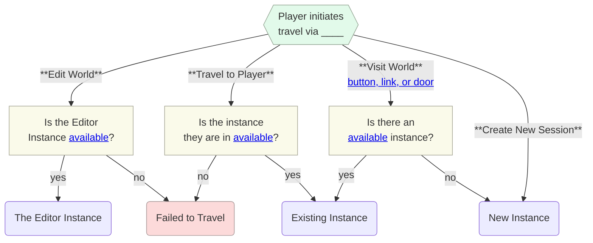
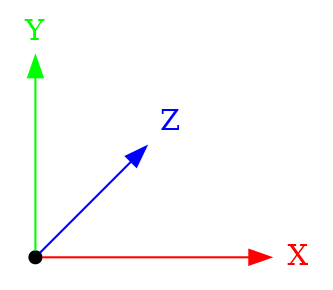
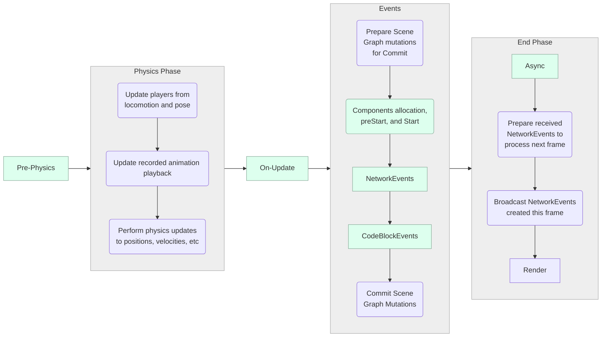
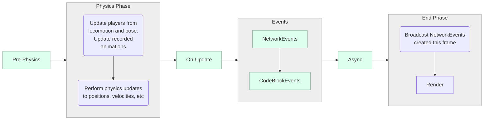
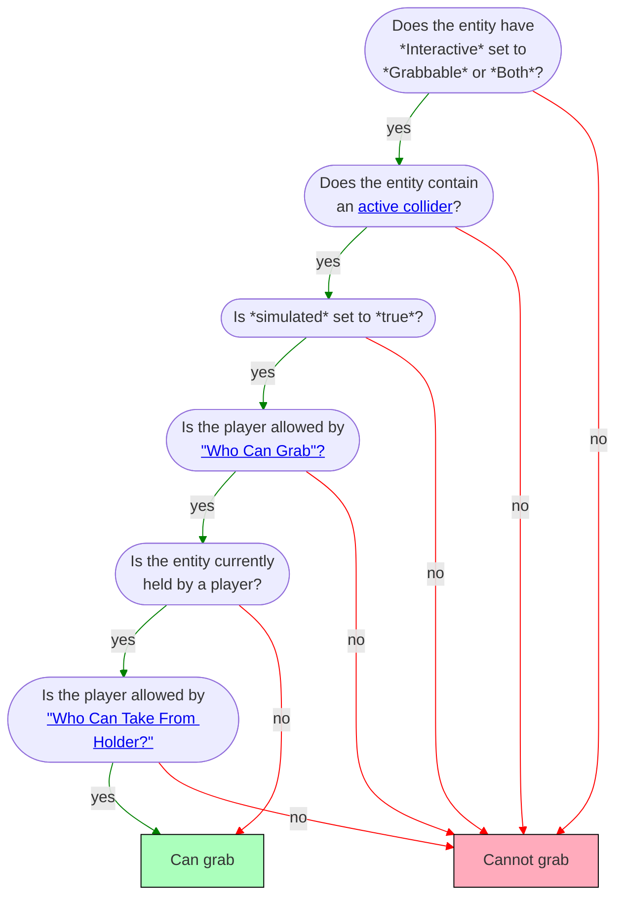
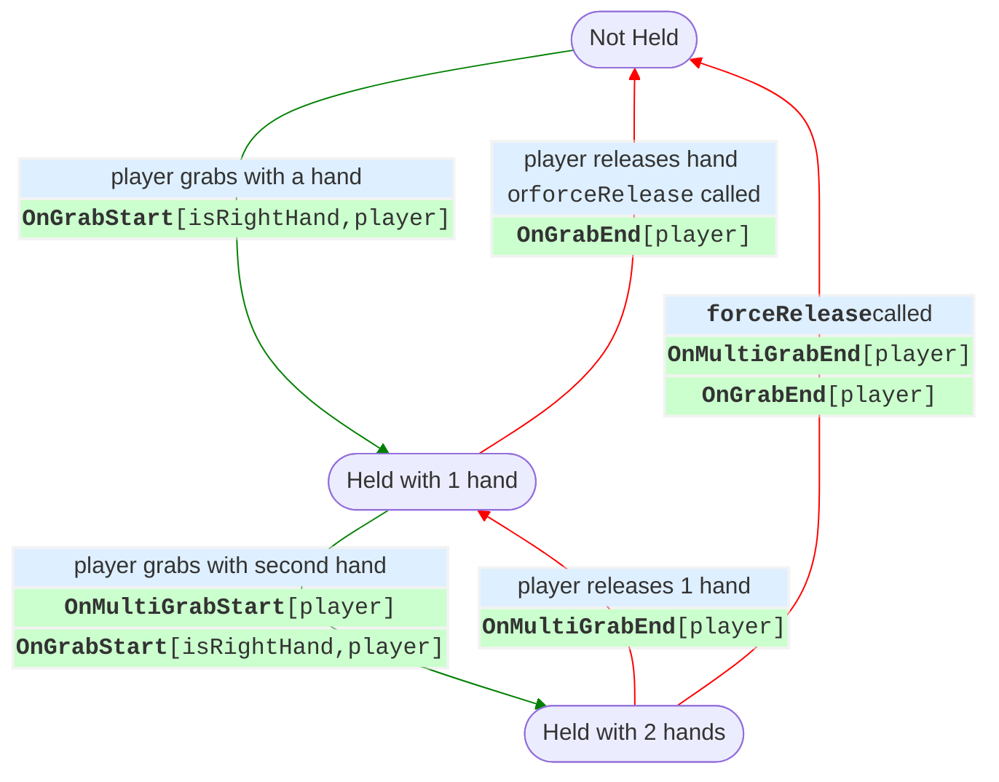
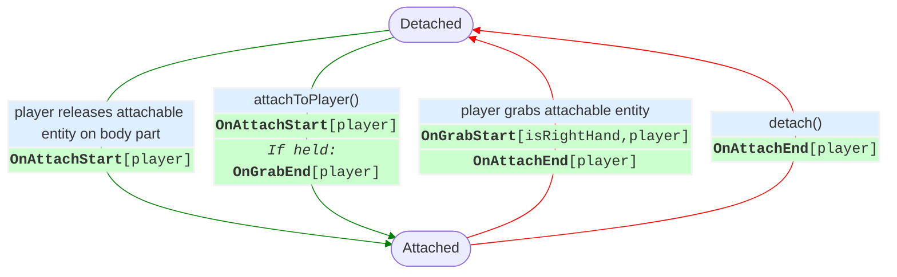

# Horizon Technical Specification {ignore=true}

<div class="print-note">This is an in-development (Jan '25) <b>community-written</b> document. For questions contact <i>wafflecopters</i>.</div>

Current main assignments:
  1. **EARLY** DRAFT READY: scene graph, grabbables, players,
  1. wafflecopters - scripting
  1. tellous - attachables (& holstering?)
  1. pigeon - PPV
  1. shards632 - networking
  1. physics - TODO (will get easier after scripting and network are done)
  1. UIGizmo, Camera, Player Inputs, Spawning - **tentative**, time may run out

<!-- @import "[TOC]" {cmd="toc" depthFrom=1 depthTo=6 orderedList=true} -->

<!-- code_chunk_output -->

1. [Overview](#overview)
2. [Worlds](#worlds)
    1. [Creating a World](#creating-a-world)
    2. [Metadata and Publishing](#metadata-and-publishing)
    3. [Editor Roles](#editor-roles)
    4. [World Snapshot](#world-snapshot)
    5. [World Backups](#world-backups)
3. [Instances](#instances)
    1. [Instance Lifetime](#instance-lifetime)
    2. [Instance Types](#instance-types)
        1. [Visitation Modes: Edit, Play, and Publish](#visitation-modes-edit-play-and-publish)
    3. [Available Instances](#available-instances)
        1. [Open and Closed Instances](#open-and-closed-instances)
    4. [Instance Selection](#instance-selection)
    5. [Travel, Doors, and Links](#travel-doors-and-links)
4. [Scene Graph](#scene-graph)
    1. [Hierarchy](#hierarchy)
        1. [Ancestors](#ancestors)
        2. [Empty Object and Groups](#empty-object-and-groups)
    2. [Coordinates System](#coordinates-system)
    3. [Transforms](#transforms)
        1. [Position](#position)
        2. [Rotation](#rotation)
        3. [Scale](#scale)
        4. [Offsets - Move, Rotate, and Scale](#offsets---move-rotate-and-scale)
        5. [Transform Property](#transform-property)
        6. [Local Transforms](#local-transforms)
        7. [Pivot Points](#pivot-points)
5. [Entities](#entities)
    1. [Overview](#overview-1)
    2. [Static Entities](#static-entities)
    3. [Dynamic Entities](#dynamic-entities)
        1. [Animated Entities](#animated-entities)
        2. [Interactive Entities](#interactive-entities)
    4. [Common Properties](#common-properties)
        1. [Simulated](#simulated)
        2. [Tags](#tags)
    5. [Gizmos](#gizmos)
        1. [Custom UI Gizmo](#custom-ui-gizmo)
        2. [Debug Console Gizmo](#debug-console-gizmo)
        3. [Door Gizmo](#door-gizmo)
        4. [Dynamic Light Gizmo](#dynamic-light-gizmo)
        5. [Environment Gizmo](#environment-gizmo)
        6. [ParticleFx Gizmo](#particlefx-gizmo)
            1. [Playing a Particle Effect](#playing-a-particle-effect)
            2. [Stopping a Particle Effect](#stopping-a-particle-effect)
        7. [TrailFx Gizmo](#trailfx-gizmo)
        8. [Projectile Launcher Gizmo](#projectile-launcher-gizmo)
        9. [Quests Gizmo](#quests-gizmo)
        10. [Raycast Gizmo](#raycast-gizmo)
        11. [Script Gizmo](#script-gizmo)
        12. [Snap Destination Gizmo](#snap-destination-gizmo)
        13. [Sound Gizmo](#sound-gizmo)
        14. [Sound Recorder Gizmo](#sound-recorder-gizmo)
        15. [Spawn Point Gizmo](#spawn-point-gizmo)
        16. [Text Gizmo](#text-gizmo)
        17. [Trigger Gizmo](#trigger-gizmo)
        18. [World Leaderboard Gizmo](#world-leaderboard-gizmo)
        19. [In World Purchase Gizmo](#in-world-purchase-gizmo)
6. [Camera](#camera)
7. [Custom Model Import](#custom-model-import)
    1. [Overview](#overview-2)
    2. [SubD vs Custom Models](#subd-vs-custom-models)
    3. [Assets](#assets)
        1. [Uploads](#uploads)
        2. [Errors](#errors)
        3. [Asset Templates](#asset-templates)
        4. [Textures](#textures)
        5. [Materials](#materials)
    4. [Performance](#performance)
        1. [Draw Calls](#draw-calls)
        2. [Vertices, Polygons, and Entities](#vertices-polygons-and-entities)
        3. [Memory](#memory)
    5. [Horizon Lighting](#horizon-lighting)
    6. [General Tips](#general-tips)
8. [Text Importing / Text Assets](#text-importing--text-assets)
9. [Scripting](#scripting)
    1. [Creating and Editing Scripts](#creating-and-editing-scripts)
        1. [Syncing Scripts](#syncing-scripts)
        2. [Scripts in Source Control](#scripts-in-source-control)
    2. [Horizon Properties](#horizon-properties)
    3. [Types](#types)
        1. [In-Place Mutation](#in-place-mutation)
        2. [Color](#color)
        3. [Vec3](#vec3)
        4. [Quaternion](#quaternion)
        5. [Entity Subtypes](#entity-subtypes)
            1. [Entity as() method](#entity-as-method)
    4. [Files](#files)
    5. [Components](#components)
        1. [Component Class](#component-class)
        2. [Props (and wiring)](#props-and-wiring)
        3. [Lifecycle](#lifecycle)
        4. [Sending and Receiving Events](#sending-and-receiving-events)
        5. [Converting Between Components and Entities](#converting-between-components-and-entities)
        6. [Subclasses](#subclasses)
    6. [Async (Timers)](#async-timers)
    7. [Local Scripts and Ownership](#local-scripts-and-ownership)
    8. [PrePhysics vs OnUpdate Updates](#prephysics-vs-onupdate-updates)
    9. [Events (Sending and Receiving)](#events-sending-and-receiving)
        1. [Code Block Event](#code-block-event)
        2. [Local Events](#local-events)
        3. [Network Events](#network-events)
        4. [Broadcast events](#broadcast-events)
    10. [Frame Sequence](#frame-sequence)
        1. [PrePhysics Phase](#prephysics-phase)
        2. [Physics Phase](#physics-phase)
        3. [Events Phase](#events-phase)
        4. [OnUpdate Phase](#onupdate-phase)
10. [Network](#network)
    1. [Clients (Devices and the Server)](#clients-devices-and-the-server)
    2. [Ownership](#ownership)
    3. [Ownership Transfer](#ownership-transfer)
        1. [Auto-Transfers](#auto-transfers)
    4. [Network Events](#network-events-1)
    5. [Authority and Reconciliation](#authority-and-reconciliation)
11. [Physics](#physics)
    1. [Overview](#overview-3)
    2. [Creating a Physical Entity](#creating-a-physical-entity)
    3. [Gravity](#gravity)
    4. [Collisions and Triggers](#collisions-and-triggers)
        1. [Collidability](#collidability)
        2. [Controlling Collisions](#controlling-collisions)
        3. [Triggers](#triggers)
    5. [PrePhysics vs Defaults Scripts](#prephysics-vs-defaults-scripts)
    6. [Simulated vs Locked Entities](#simulated-vs-locked-entities)
    7. [PhysicalEntity Class](#physicalentity-class)
    8. [Projectiles](#projectiles)
    9. [Gravity](#gravity-1)
    10. [Velocity, Acceleration, Force, Torque](#velocity-acceleration-force-torque)
    11. [Properties: Mass, Drag, Center-of-Mass](#properties-mass-drag-center-of-mass)
    12. [Player Physics](#player-physics)
12. [Players](#players)
    1. [Identifying Players](#identifying-players)
        1. [Player ID](#player-id)
        2. [Player Indices](#player-indices)
        3. [Listing All Players](#listing-all-players)
        4. [Server Player](#server-player)
        5. [Local Player](#local-player)
    2. [Player Events and Actions](#player-events-and-actions)
        1. [Entering and Exiting a World](#entering-and-exiting-a-world)
        2. [AFK](#afk)
    3. [Pose (Position and Body Parts)](#pose-position-and-body-parts)
13. [Grabbing and Holding Entities](#grabbing-and-holding-entities)
    1. [Creating a Grabbable Entity](#creating-a-grabbable-entity)
    2. [Can Grab](#can-grab)
        1. [Setting "Who Can Grab?"](#setting-who-can-grab)
        2. [Setting "Who Can Take From Holder?"](#setting-who-can-take-from-holder)
        3. [Grab Distance](#grab-distance)
    3. [Grabbing Entities](#grabbing-entities)
        1. [Grab Lock](#grab-lock)
        2. [Force Holding](#force-holding)
    4. [Releasing Entities](#releasing-entities)
        1. [Manual release](#manual-release)
        2. [Force release](#force-release)
    5. [Grab Sequence and Events](#grab-sequence-and-events)
        1. [Hand-off (Switching Hands or Players)](#hand-off-switching-hands-or-players)
        2. [Moving Held Entities](#moving-held-entities)
            1. [Moving a Held Entity Locally in Relation to the Hand](#moving-a-held-entity-locally-in-relation-to-the-hand)
            2. [Moving a Held Entity Globally in Relation to the World](#moving-a-held-entity-globally-in-relation-to-the-world)
14. [Attaching Entities](#attaching-entities)
    1. [Creating an Attachable](#creating-an-attachable)
    2. [Attachable By](#attachable-by)
    3. [Avatar Attachable](#avatar-attachable)
        1. [Scripted Attach](#scripted-attach)
        2. [Sticky](#sticky)
            1. [Stick To](#stick-to)
        3. [Anchor](#anchor)
            1. [Anchor To](#anchor-to)
            2. [Socket Attachment](#socket-attachment)
            3. [Auto Scale to Anchor](#auto-scale-to-anchor)
    4. [Attach to 2D screen](#attach-to-2d-screen)
15. [Holstering Entities](#holstering-entities)
16. [Player Input](#player-input)
17. [Persistence](#persistence)
    1. [Overview](#overview-4)
    2. [Leaderboards](#leaderboards)
    3. [Quests](#quests)
    4. [In-World Purchases (IWP)](#in-world-purchases-iwp)
    5. [Player Persistent Variables (PPV)](#player-persistent-variables-ppv)
18. [Spawning](#spawning)
    1. [Assets](#assets-1)
    2. [Simple Spawning](#simple-spawning)
    3. [Spawn Controller](#spawn-controller)
    4. [Sublevels](#sublevels)
19. [Custom UI](#custom-ui)
    1. [Bindings](#bindings)
20. ["Cross Screens" - Mobile vs PC vs VR](#cross-screens---mobile-vs-pc-vs-vr)
21. [Performance Optimization](#performance-optimization)
    1. [Physics](#physics-1)
    2. [Gizmos](#gizmos-1)
    3. [Bridge calls explanation](#bridge-calls-explanation)
    4. [Draw-call specification](#draw-call-specification)
    5. [Perfetto hints](#perfetto-hints)
    6. [Memory](#memory-1)
22. [List of all desktop editor shortcuts](#list-of-all-desktop-editor-shortcuts)
23. [Common Problems and Troubleshooting](#common-problems-and-troubleshooting)
24. [Glossary](#glossary)

<!-- /code_chunk_output -->

<div style="page-break-after: always;"></div>

# Overview

Meta Horizon Worlds (called "Horizon" for the rest of this document) is a Metaverse content platform where people can find and create 3D immersive content to play, explore, and socialize in. Horizon calls each experience a **world**. The content can be accessed on:

**Supported platforms**: mobile, web, Windows PCs, and VR.

Use the Horizon creation tools you can create team-vs-team shooter games, fantasy fighting games, social deception games, hang out spaces and clubs, art exhibits, simulation games, battle royale games, dungeon crawlers, obstacle courses, puzzle games, talk shows, adventure games, stories, party games, improv clubs, and whatever else you can imagine.

The tools support many features for managing and scripting players, physics, 3D mesh import, projectiles, purchases, grabbable items, wearable items, player inputs, lights, UI, NPCs, and more.

**Desktop Editor**: on Windows the Horizon executable can be launched in "Edit" mode (TODO - explain) which opens app in a set of tools where you can create and edit worlds.

**VR Editor**: in Quest VR devices the Meta Horizon Worlds app contain an edit mode that allows for creating and editing worlds inside of VR. It offers a natural and intuitive experience where you can place object directly with your hands and immerse yourself in your creations. The VR editor does not provide access to all tools that the desktop has.

**TypeScript and Code Blocks**. Horizon uses [TypeScript](https://www.typescriptlang.org/) as its scripting language. TypeScript scripts can only be edited in the Desktop Editor. Horizon also has a custom block-based scripting system (where you write scripts by combining blocks together) that it calls **Code Blocks**. Code Block Scripts can only be edited in the VR Editor.

# Worlds

You use the Desktop Editor to edit worlds, adding content and scripts to build out your ideas. The [publishing menu](#metadata-and-publishing) enables you to configure worlds settings and publish the world when ready. Worlds are saved in "files" called [world snapshots](#world-snapshot) which allow [rollback](#world-backups). A published world may be running many [instances](#instances) at once.

## Creating a World

<mark>TODO</mark>

## Metadata and Publishing

<mark>TODO</mark>

Publish World "box"
  Status: unpublished
  Name
  Description
  World rating (a flow that result in: <mark>TODO</mark>)
  Comfort rating: Not Rated, Comfortable, Moderate, Intense
  (World) Tags (select N from list)
  Mute Assist (boolean)
  Visible to public (boolean)
  Members-only world (boolean)
  Boolean (boolean)
  Available Through Web and Mobile
  Compatible with Web and Mobile

Player Settings
  VOIP: Global vs Local
  <a name="maximum-player-count">Maximum Player Count</a> (4 to 32)
  Suggested Minimum Player Count (1 up to Max)
  Emotes (boolean)
  Emotes Audio (boolean)
  Can Hands Collide With Physics Objects
  Can Hands Collide With Static Objects
  Custom Player Movement
  Generate Instant Replays
  Frame Budget Boost (Early Access) -- (Default, On, Off)
  Spawn Nearby (boolean)
  Footsteps Volume
  Footsteps Min Distance
  Footsteps Max Distance
  Hide Action by Default (boolean)
    -- mobile only setting, can be overridden by setting icon in Properties
Disable Dynamic LOD Toggles on Avatar (makes it easier to increase player count)
Enable Max Quality Avatar


Name, description, comfort setting, player count, etc.


## Editor Roles

The **owner** is the person who [created the world](#creating-a-world). Once a world is created, there is no way to change the owner. Other people, called **collaborators**, can than be added to (and removed from) the world via the Collaborators menu. When adding a collaborator, you choose whether they are an editor or tester.

| Role | Can travel to [editor instances](#instance-lifetime)? | Can enter [play mode](#visitation-modes-edit-play-and-publish), edit [scene](#scene-graph), and edit [scripts](#scripting)? | Can [publish](#metadata-and-publishing) the world? | Can edit [persistence](#persistence) settings (create and edit [leaderboards](#leaderboards), [quests](#quests), and [PPVs](#player-persistent-variables-ppv))? | Can assign [editor roles](#editor-roles)? |
|---|---|---|---|---|---|
| *Owner*  | ✅ | ✅ | ✅ | ✅ | ✅ |
| *Editor* | ✅ | ✅ | ❌ | ❌ | ❌ |
| *Tester* |  ✅ | ❌ | ❌ | ❌ | ❌ |

## World Snapshot

When you create a new world, Horizon creates a new "file" on their servers which contains all the information and data for the world. Horizon calls this a **world snapshot**. Every time you update the world, a new snapshot is created. You can manage all the saves snapshots via the [backups](#world-backups) feature.

!!! info **The** world snapshot
    Whenever this document refers to **the world snapshot** it is referring to the specific snapshot that you have loaded the world from (which is the last one saved, unless you did a rollback).

## World Backups

The editor regularly "auto saves" the world, creating a new [world snapshot](#world-snapshot) that is calls a **backup**. You can manually create a snapshot as a via the "Save Backup" option.

The list of all previous saved snapshots are viewable in the "Backups" menu. This menu allows you to see the list of backups, see when background were created, modify the name and description, or to **restore** a backup to be the current snapshot.

For instance, before starting a major change to the world, you could create a backup, and then if you run into issues, you could restore that "safe" backup back to when the world was "unchanged". You can also look back into backups to investigate when a certain bug appeared, or to go back and make an [asset](#assets) or copy a [script](#scripting) that you have since modified or deleted.

!!! tip Source Control
    Currently there is no way to put a whole world into an external source control system, such as git, but it is possible to [put the scripts into source control](#scripts-in-source-control).

# Instances

Horizon maybe have multiple *copies* of a world running at the same time. For example if the <a href="#maximum-player-count">maximum player count</a> is set to 20 and there are 100 people "in the world" then they would be spread out across *at least* 5 separate copies. These copies are called **instances**.

!!! info Horizon sometimes refers to Instances as "Sessions"
    In all technical documentation, Horizon uses the word *instance*. Given that this is a somewhat technical term, it refers to them as **sessions** within the user-facing side of the product. For example, a person can "create a new session".

## Instance Lifetime
**Creation**: When a player travels to a world (to play it or edit it), Horizon [finds or creates an instance](#instance-selection) of the right [type](#instance-types).

**Longevity**: The instance then remains running as long as players stay in it. Even when all players leave, and the instance becomes empty, it may stay running for some time, in case any players try to return or new players arrive.

**Destruction**: When there are no players in an instance it will be destroyed, after some timeout threshold. In rare instances a server error may also cause an instance to be destroyed (which will send all players in it back to the app-launch state).

!!! warning Destroyed instances are permanently gone and so is their data.
    When an instance is destroyed there is no way for players to get back that specific instance. Any data they had "acquired" in that instance is permanently lost. You can **use [Horizon persistence](#persistence) to track data across instances and visits**.

## Instance Types

There are two types of instances: **published instances** and **editor instances**. The editing tools, for modifying a world, are only available inside of an *editor instance*. There is no way to turn one into the other; when Horizon [starts up a new instances](#instance-selection), based on how the player is traveling, and then the type never changes, for as long as the instance is [alive](#instance-lifetime).

| Instance Type  | How do you travel to one? | Can you open the editing tools? | How many instances are allowed? |
|---|---|---|---|
|  *Published*  | Use the "Visit World" button, or [travel](#travel-doors-and-links) to a friend, travel via a door. | No | No limit |
| *Editor* | Use the "Edit World" button if you are the [world owner, editor, or a tester](#editor-roles). | Yes, if you are the [owner or a editor](#editor-roles). | 1 |

### Visitation Modes: Edit, Play, and Publish

"Visiting" a world in Horizon is done in one of three modes: edit, play, and publish. In a [published instance](#instance-types), all players are always in "publish mode". In an [editor instance](#instance-types), the creator and editors can switch back and forth between edit and play modes; testers are always in play mode.

| Mode  |  Description | Instance Type | Required Role |
|---|---|---|---|
| *Edit* | Experience the world **as an editor** where you can modify the world.  | Editor Instance | Editor |
| *Play* | Experience the world **as a player** from within the editable instance. | Editor Instance | Editor or Tester |
| *Publish*  | Experience the world **as a player** in a published instance. | Published Instance | n/a |

!!! info Debug Console Gizmo Visibility
  The [Debug Console Gizmo](#debug-console-gizmo) has setting to control which visitation mode(s) it is visible in.

## Available Instances

A player can only travel to an instance if that instance is **available for the player**. Availability is determined by three criteria, all of which must be met:

1. **[Isn't at maximum player count](#maximum-player-count)**: a player can only travel to a world if there as at least one [index](#player-indices) available. If the capacity is set to 20 and there are 19 people there, then 1 more can travel to the world. It is then unavailable for all players until at one player leaves.
1. **Is Safe**: Horizon has an undisclosed, and evolving, set of rules for what it deems *safe*, regarding travel. These rules may include: which players have blocked one another (and how recently), if the traveling player has recently been voted out of that instance, if the instance has a moderated event running, and more.
1. **[Instance is Open](#open-and-closed-instances)**: all [published instances](#instance-types) exist as either *open* or *closed*. An **open instance** can be joined by an player (if the above criteria are met). A **closed instance** can only be joined by players who are explicitly invited by players already in the instance.

### Open and Closed Instances

**New instances default to open.**  When a [new instance is created](#instance-selection) via the "Travel" button it is **open**.

**Player can create closed instances.** When a player explicitly creates a new instance, via "Create New Session", they can choose whether the instance is open (allowing anyone to join) or closed (allowing only invited-players to join).

**Openness can be changed with scripting.** You can change whether or not the current instance is open via TypeScript with
```ts
this.world.matchmaking.allowPlayerJoin(isOpen)
```
which returns a `Promise<void>` to signal when the change has taken effect.

<mark>TODO: when calling `allowPlayerJoin(false)`, can players join by invite or is the instance actually LOCKED vs Closed?</mark>

## Instance Selection

When a player travels to a world, Horizon will determine which instance to send them to (if there are multiple) or create a new instance if needed (if all are full, none exist, or the player specifically created a new one).

!!! info The Editor Instance
    There is only ever (at most) one **editor instance** of a given world. When that one instance is full, no other editors can load the world to edit.



## Travel, Doors, and Links

<mark>TODO:</mark>

* Doors act like an in-experience Hyperlink
* Travel to friend
* Instruction how to get an actual link...

# Scene Graph

**Maximum bounds**: Worlds exist in [a cube that is 10,000 meters in each direction from the origin](#world-max-bounds).

TODO: Nerd comment: why graph instead of tree

## Hierarchy

Any entity can be set as the child of another entity. For example, you might make a robot's forearm a Mesh Entity that is a child of the upper arm Mesh Entity. Or you might put a steering wheel inside a car. The main reasons to create parent-child relationships are:

1. To have the transform of one entity impact another (e.g. moving a car also moves the steering wheel within it).
2. To create "layers" or "folders" in the editor (e.g. putting all trees in a ["collection"](#empty-object-and-groups) to make them easier to manage).

When an entity has no parent it is called a **root entity**.

### Ancestors

We call the collection of an entity's parent, grandparent, great-grandparent, etc the entity's **ancestors**. If the entity has no parent, we say it has 0 ancestors. If it has just a parent and then grandparent, it would have 2.

We call the children, and their children, and their children, etc of an entity its **descendants**.

### Empty Object and Groups

Empty Objects and Groups are two methods of "collection" entities together. They are similar in most regards, with only a few differences:

| Collection Type | [Pivots](#pivot-points) | [Interactive Entity](#interactive-entities) Children | [Projectile Launcher](#projectiles) | [Child Count](#hierarchy) |
|---|---|---|---|---|
| Group | Always at the **center of all their children**. Meaning that moving one child will move the [pivot point](#pivot-points). | Children have their **interaction disabled**. | [Projectile collisions](#projectiles) happen **on the group**. | 1+
| Empty Object | The **center of the Empty Object** is always the [pivot point](#pivot-points). | Children **can be [Interactive Entities](#interactive-entities)**, if the Empty Object's `Motion` is `None`. | [Projectile collisions](#projectiles) happen **on a child**. | 0+ |

Empty Objects and Groups behave identically in regards to collisions and triggers in all cases other than projectiles launched from the projectile gizmo.

<mark>TODO - explain how collisions and triggers both do the algorithm of "start with the colliding leaf object and walk up the ancestor chain until you find the first with a matching tag and then immediately stop".</mark>

## Coordinates System

**Axes**. Following standard convention, the editor uses *red* for the *<span style="color:red">x-axis</span>*, *green* for the *<span style="color:green">y-axis</span>*, and *blue* for the *<span style="color:blue">z-axis</span>* when displaying "manipulation handles" to move, rotate, or scale an entity.

**Y-up**. The positive-y axis is *up*.

**Left-handed**. The coordinate system is *left-handed*, meaning that if position the camera so that the positive y-axis is pointing up and the positive x-axis is pointing right then the positive z-axis points forward.



<a name="local-coordinates">**Local coordinates**</a>. Every [entity](#entities) and every [player and player body part](#pose-position-and-body-parts) has a set of [local axes](#local-transforms) called: **right**, **up**, and **forward** which have an origin at the [pivot point](#pivot-points), if an entity, and at the center of the body part if it is a body part (example: player center is the hips; head center is literally the center of the head). Local coordinates are used for moving entities around in the Desktop editor (if enabled) and are used when interacting with [local transforms](#local-transforms).

!!! example Local Coordinates Example
    The *forward* axis of *a player head* is always pointing away from their face (parallel to their nose), its *right* axis is always point "out" their right ear, and its *up* axis is pointing out from the top of the skull. When the entity or player body part moves, the origin of these axes move; likewise the axes rotate along with the entity (so that the *right* axis always points out from the right ear).

    ```graphviz {align="center"}
    digraph {
      layout=neato

      O [pos="0,0!" shape=box3d width=0.5 label=""]
      X [pos="1.75,0!" width=0 height=0 shape=none fontcolor=red label=right]
      Y [pos="0,1.5!" width=0 height=0 shape=none fontcolor=green label=up]
      Z [pos="0.9,0.9!" width=0 height=0 shape=none fontcolor=blue label=forward]

      O -> X [color="red"]
      O -> Y [color="green"]
      O -> Z [color="blue"]
    }
    ```

**Meters**. Distances and positions in Horizon are referenced using meters. For example, the position `(0, 1, 0)` is 1 meter (roughly 3.28 feet) up from the center of the world. Avatars in Horizon are approximately 1.8 meter tall (5 feet 11 inches).

**Origin**. The editor has the origin `(0,0,0)` at the center of the grid. The origin cannot be moved.

## Transforms

Entities have three transform properties: position, rotation, and scale. You can use the properties panel or the "manipulation handles" to manipulate these properties. Editing these values determines how entities are transformed when a new instance starts. **Within the Horizon editor you can only configure initial position, rotation, and scale**. If you want these values to change while the world is running, you will need to modifying the values using scripting.

In the desktop editor you can switch quickly between transform tools via the keyboard.
| Manipulation Tool  |  Keyboard Shortcut |
|---|---|
| Move | W |
| Rotate | E |
| Scale | R |

!!! note No Arbitrary Matrix Transforms
    Horizon does not currently allow matrix transforms. You can achieve some skew effects by rotating an entity inside a non-uniformly scaled one. Arbitrary matrix transforms are not exposed to the developer.

### Position

Positions are specified as 3-dimensional vectors, represented as the `Vec3` type in TypeScript. In the editor these are written as a "triple" such as `(0, 0, 0)`.

The `position` property on an entity determines where in 3D space the [pivot point](#pivots) of the entity is, in relation to the origin of the world. Often the pivot is just the center of the entity, and so typically the position of an entity is where its center point is.

!!! example Setting a position
    Position is a [read-write property](#horizon-properties) on the `Entity` class. To get the current position of an entity, do:

    ```td
    entity.position.get()
    ```

    To move an entity to be 3 meters up from the origin and 4 meters forward, do:
    ```ts
    entity.position.set(new Vec3(0, 3, 4))
    ```

Setting the `position` property is not influenced by the position of any [ancestors](#ancestors).
See [local transforms](#local-transforms) for setting position relative to a parent entity.

!!! danger <a name="world-max-bounds">An entity position cannot have a value outside of `[-10,000, 10,000]`</a>
    When an entity moves (via `position.set` or via physics) to a location where any of its x-, y-, or z-values are outside the range `[-10,000, 10,000]`, then instead, the **entity will be automatically moved to the location it had at world start** (or at spawn-time if it was spawn). If it is a physics entity then it will also have its velocity cleared out.

     **Players do not auto-move / respawn when they are too far away from the origin**.

     !!! bug Entities can be spawned farther than 10,000 away from the origin.
        It is a bug that entities can be spawned outside the bounds of the world.


### Rotation

Rotations are specified using a mathematical object called a `Quaternion`. Whenever you see the word "Quaternion" you can just think it means "rotation". This isn't mathematically true but is sufficient for nearly all uses.

Rotations in the editor are specified using [Euler Angles](https://en.wikipedia.org/wiki/Euler_angles) which are a robust way of specifying yaw, pitch, and roll. The default **Euler Order** order in Horizon is **YXZ** meaning that entity does a *yaw*, then a *pitch*, and then a *roll* (when specifying Euler Angles). Euler angles are specified in **degrees**.

!!! tip Rotations are tricky!
    Rotations, Quaternions, Euler Angles, etc are all rather tricky and subtle concepts. It will take a lot of time to build an intuition for them. Be patient and don't worry if rotations seem complex (they are)!

The `rotation` property on an entity determines how much the entity is rotated around its [pivot point](#pivots). This rotation is specified *globally*, meaning that it is measured with respect to the world. A zero-rotation will have an entity's up-axis align with the world's y-axis, it's right-axis align with the world's x-axis, etc.

!!! example Setting a rotation
    Rotation is a [read-write property](#horizon-properties) on the `Entity` class. To get the current rotation of an entity, do:

    ```td
    entity.rotation.get()
    ```

    To rotate an entity so that it yaws 45 degrees and then rolls 90 degrees, do:
    ```ts
    entity.rotation.set(Quaternion.fromEuler(new Vec3(0, 90, 45)))
    ```

!!! tip Default Rotation ("Not rotated")
    If you want an entity to be "not rotated", set its rotation to be `(0, 0, 0)` in the editor. In Typescript you can use any of these lines (they all do the same thing):

    ```ts
    entity.rotation.set(Quaternion.fromEuler(new Vec3(0, 0, 0)))

    entity.rotation.set(Quaternion.fromEuler(Vec3.zero))

    entity.rotation.set(Quaternion.one)
    ```

Setting the `rotation` property is not influenced by the rotation of any [ancestors](#ancestors).
See [local transforms](#local-transforms) for setting rotation relative to a parent entity.

### Scale

Scales are specified as 3-dimensional vectors, represented as the `Vec3` type in TypeScript. In the editor these are written as a "triple" such as `(0, 0, 0)`.

**Inherent Size**: All entities have their own inherent size. For instance, a SubD cube is inherently 1 meter long on each side. Mesh assets have a size based on how they were authored. The inherent size of an entity is the size it is when it is *unscaled*.

The `scale` property determines the fraction an entity should be of its inherent size. For instance, a SubD cube is inherently 1 meter long on each side. If you set its scale to be `(1, 0.5, 2)` then the cube will be 1 meter long on its right-axis, 0.5 meters long on its up-axis, and 2 meters long on its forward-axis. In this example, the object has been "shrunk" along its up-axis, and "expanded" along its forward-axis.

!!! example Setting a scale
    Scale is a [read-write property](#horizion-properties) on the `Entity` class. To get the current scale of an entity, do:

    ```td
    entity.scale.get()
    ```

    To scale an entity so that it is 3 times bigger on its up axis (than its inherent size), do:
    ```ts
    entity.scale.set(new Vec3(1, 3, 1))
    ```

    Since the default scale is `(1,1,1)`, you can set any part of a scale to `1` to leave the entity "un-scaled" along that axis.

Setting the `scale` property is not influenced by the rotation of any [ancestors](#ancestors).
See [local transforms](#local-transforms) for setting scale relative to a parent entity.

!!! danger Mesh Primitives Have Unexpected Inherent Sizes
    The builtin mesh primitives have an inherent scale of 150 meters on each side (as of Feb 2025). Thus if you wanted to use a builtin mesh cube and have it be 1 meter long on each side, you would need to give it a scale of (1/150, 1/150, 1/150). This is a longstanding bug.

### Offsets - Move, Rotate, and Scale

When you want to set the position of an entity in relation to the current position we call this **offsetting** the position. There is no builtin API for doing this (as of Feb 2025) but it can be accomplished easily with the pattern of *get-modify-set*.

!!! example Offsetting position and scale
    To move an entity up 2 meters from its current location you can do:
    ```ts
    const offset = new Vec3(0, 2, 0)

    const pos = entity.position.get()
    const newPos = pos.add(offset)
    entity.position.set(pos)
    ```
    Offsetting scale works similarly.

!!! example Offsetting rotation
    <mark>TODO - Probably want to mention how the rotation is counter-clockwise when facing towards the positive direction of the axis</mark>

    To rotate an entity 90 degrees around the world's y-axis, from its current rotation, you can do:
    ```ts
    const offset = Quaternion.fromEuler(new Vec3(0, 90, 0))

    const rot = entity.rotation.get()
    const newRot = offset.mul(rot)
    entity.rotation.set(newRot)
    ```
    Note that `mul()` is used to combine rotations.

    If instead you wanted to rotate an entity 90 degrees around its own up-axis you would do:
    ```ts
    const offset = Quaternion.fromEuler(new Vec3(0, 90, 0))

    const rot = entity.rotation.get()
    const newRot = rot.mul(offset)
    entity.rotation.set(newRot)
    ```
    where the order of the Quaternion multiplication has been flipped. See [Quaternions](#quaternion) for more explanation.

### Transform Property

Each entity has a transform property that can be accessed via `entity.transform`.

```ts
class Entity {
  readonly transform: Transform

  // ...
}
```

Position, rotation, and scale can all be accessed through a `Transform`. The following two lines behave identically.

```
entity.position.set(p)
entity.transform.position.set(p)
```

Additionally, the `Transform` object can be used to access **local** position, rotation, and scale. See the next section for more information.

### Local Transforms

Entities have a `localPosition`, `localRotation`, and `localScale` that can be accessed via the transforms (e.g. `entity.transform.localPosition.get()`). These properties specify values in relation to a parent entity (or to the world if there is no parent), specified in the parent's [local coordinates](#local-coordinates).

Throughout this doc, other than this section, we omit the word *global*. When you see "position" it means "global position".

!!! example Local Position Example
    Let `parent` be an entity that has not been rotated nor scaled with `child` as one of its children.

    If `parent`'s **global position** is `(3, 0, 0)` and `child`'s **global position** is `(8, 1, 0)` then `child`'s **local position** will be `(5, 1, 0)`. The `child`'s local position is how much it is moved from its parent.

    Note: if the `parent` were rotated or scaled then you can't just "subtract the positions".

!!! note Global values "cascade down" the hierarchy.
    An entity's global position/rotation/scale influences the global position/rotation/scale of its children (which then cascades to their child too!). If you have a plate on a table on a boat  and the boat moves globally then so do the table and the plate; if the table moves then so does the plate (and everything on it!)

!!! warning Local values exist in the transformed [local coordinate system](#local-coordinates) of the parent.
    Rotating and/or scaling an entity causing it axes to rotate and scaled as well. We call these the *transformed axes*.

    A child with local position of `(0, 6, 0)` is moved 6 units **from the global position** of its parent **along the parent's transformed up-axis**. If there is no parent then this is just 6 meters up the world's y-axis.

### Pivot Points

The transformation origin point of an entity is called its **pivot point**. It rotates around its pivot point, it scales around its pivot point, and when you move an entity its pivot point end ups at the position specified.

1. **Mesh entities** have their pivot points specified when they are authored (e.g. in Blender)
1. **Empty objects** have their pivot points at the center of the gizmo (the grey cube)
1. **Group entities** compute their pivot point to be at the center of their "bounding box" **in edit mode**. For example if you move a child in a group in edit mode then when click off the group it will recompute its pivot point to be at the center of all of its children. *This only happens in edit mode. The pivot of a group doesn't auto-change when the world is running (even if its children move around).*
1. **All other entities** (e.g. door, text gizmo, box collider gizmo, etc) have a builtin pivot point (usually at their center).

!!! warning In the desktop editor the manipulator handles don't always render at the pivot points!
    The desktop editor lets you choose to put the "manipulator handlers" at either the `Center` or `Pivot` of entities. Check that dropdown if you aren't seeing the pivots as you expect. This dropdown has no effect on how the world *runs* and is simply there to help with *editing*.

# Entities

## Overview

Every "thing" in the Horizon scene is an _entity_ (an grabbable item, a mesh, a light, a particle effect, a sound, a group of other entities, etc).

!!! info Note Entity and Object mean the same thing (except in TypeScript)
    Horizon calls these **objects** in the Desktop Editor and VR Tools but calls them **entities** in TypeScript. This document tries to consistently call them entities, except when quoting places where Horizon explicitly uses the word "object", but may accidentally call them objects on occasion.

    In TypeScript `Object` is a builtin for managing data, whereas `Entity` is a Horizon-specific class.

Gizmos, as, ...

## Static Entities

## Dynamic Entities

### Animated Entities

### Interactive Entities

When an entity's `Motion` is set to `Interactive` in the Properties panel it can be used for [grabbing](#grabbing-entities), [physics](#physics), or both. We call these **interactive entities**.

!!! warning Be careful putting Interactive Entities inside of hierarchies. Interactivity may be disabled!
    If you want to have an interactive entity be within a hierarchy (e.g. child of another entity) then all of its [ancestors](#ancestors) should be *Empty Objects* or *Mesh Entities*. All ancestors should have `Motion` set to `None`.

    If `Motion` is `Animated` or `Interactive` on any of its [ancestors](#ancestors) then interactivity will be disabled.

    If any of its ancestors are a [Group Entity](#empty-object-and-groups) then interactivity will be disabled.

    If there are any ancestors other than Mesh Entities, Empty Objects, and Group Entities then it is undefined whether or not interaction is disabled.

<mark>TODO - GrabbableEntity, PhysicalEntity classes (which should be mentioned in grabbing and physics sections too)</mark>

## Common Properties

- Motion and Interaction (Animated, Grabbable, Physics, Both)
- Parents and Children
- Visible and Collidable
    - These 2 toggle independently
- Transform (position, rotation, scale, forward, up, right)

### Simulated
When false the only way to move and rotated is `position.set` and `rotation.set`. The physics system is disabled, grabbing is disabled (any avatar interactions), etc.

When simulated is set to false, an attached stays detached.

"Simulated=false is like setting Motion=None."

### Tags

Getting entities with tags.

Tag uses:
  * Triggers
  * Collisions

## Gizmos

There are Mesh Entity, Group Entity, Empty Object, Box/Capsule/Sphere Collider, and a bunch of *Gizmos*. <mark>TODO is it "Box collider" or "Box collider Gizmo"? In scripting they are *all Entities*.</mark>

- [Custom UI Gizmo](#custom-ui-gizmo)
- [Debug Console Gizmo](#debug-console-gizmo)
- [Door Gizmo](#door-gizmo)
- [Dynamic Light Gizmo](#dynamic-light-gizmo)
- [Environment Gizmo](#environment-gizmo)
- [ParticleFx Gizmo](#particlefx-gizmo)
- [TrailFx Gizmo](#trailfx-gizmo)
- [Projectile Launcher Gizmo](#projectile-launcher-gizmo)
- [Quests Gizmo](#quests-gizmo)
- [Raycast Gizmo](#raycast-gizmo)
- [Script Gizmo](#script-gizmo)
- [Snap Destination Gizmo](#snap-destination-gizmo)
- [Sound Gizmo](#sound-gizmo)
- [Sound Recorder Gizmo](#sound-recorder-gizmo)
- [Spawn Point Gizmo](#spawn-point-gizmo)
- [Text Gizmo](#text-gizmo)
- [Trigger Gizmo](#trigger-gizmo)
- [World Leaderboard Gizmo](#world-leaderboard-gizmo)

### Custom UI Gizmo
See details in [Custom UI](#custom-ui)

### Debug Console Gizmo

<mark>TODO</mark>
Visibility: control which [visitation mode](#visitation-modes-edit-play-and-publish) the gizmo is visible in.

### Door Gizmo
Place in a world to allow players to traverse to other worlds easily

Search for any public worlds in Horizon Worlds

Is very costly to performance if overused due to expensive VFXs

Cannot be transformed. Give it a parent (such as a group), and transform the parent instead, if you want to transform it.

!!! info You can not change or stop the default door animation or sound.

### Dynamic Light Gizmo
Lights that can be attached to animated or interactive objects

Is very costly to performance if overused due to light/shadow per frame processing.

```ts
class DynamicLightGizmo {
  enabled: HorizonProperty<boolean>;
  intensity: HorizonProperty<number>; // [0, 10]
  falloffDistance: HorizonProperty<number>; // [0, 100] meters?
  spread: HorizonProperty<number>; // [0, 100] percent?
}
```

Max of 20 allowed at once.

### Environment Gizmo
Changes the skybox, lighting, and world voice settings

Multiple allowed in world. Only one can be active at a time.

No current TS APIs (no TS entity).

!!! info You can use asset spawning to change the environment dynamically.

### ParticleFx Gizmo

The particle gizmo allows you to play builtin effects such as a smoke burst, water spray, muzzle flare, camp fire, and so much more.

Particle gizmos are created in two ways:
1. Instantiate the `ParticleFx` gizmo in the editor (via the Gizmos tab).
2. Instantiate one of the pre-made effects in the "VFX" section of the "Assets" tab.

!!! warning Effects are performance intensive.
    Be careful about having too many effects running all at same time. Effects use CPU and can easily impact frame-rate (FPS) if too many are running. Performance cost varies by effect. Be sure to test your perf as you develop.

In TypeScript, the ParticleFX gizmo is referenced via the `ParticleGizmo` Entity [subclass](#entity-subtypes) (see [as](#entity-as-method)) which has methods for playing the effect and stopping it.

#### Playing a Particle Effect

Call the method

```ts
// Particle Gizmo
play(options?: ParticleFXPlayOptions): void;
```

to make a particle effect start playing. If the effect is set to `looping` in the Property panel then it will play forever (a campfire will burn, a muzzle flare with repeat) unless stopped.

You can specify options when calling `play()`:

```ts
type ParticleFXPlayOptions = {
    fromStart?: boolean;
    players?: Array<Player>;
    oneShot?: boolean;
};
```

| Option  | Type | Meaning  | Default Value |
|---|---|---|---|
| fromStart  | `boolean`  | This is only used if the effect is already playing. Intuitively, `true` means "play the effect from its beginning" and `false` means "elongate the ongoing effect".<br><br>In practice, it is more subtle. Effects have limited resources (CPU) and so when you play the effect while it is already playing, the resources have to be split between the current "play" and the new on. The `fromStart` parameter controls how to "overlap" the new run with the current one. When `true` it will optimize available resources to playing it again. When `false` it will optimize available resources to letting the first effect finish. You can think of this parameter as controlling which of the two get the bigger "oomph". | <mark>TODO</mark> |
| players | `Array<Players>` | The players that will see the effect play. | [All players in the world](#listing-all-players) |
| oneShot | `boolean` | `true` will play the effect once. `false` will play it looping. This overrides the setting in the Property panel. | <mark>TODO</mark> |


#### Stopping a Particle Effect

Call the method

```ts
// Particle Gizmo
stop(options?: ParticleFXStopOptions): void;
```

to make a particle effect stop playing. The effect will end quickly yet smoothly; it does not just vanish. For example: in a fire the flame will burn out, in a water burst the flow will stop, in a muzzle flare it will simply finish the flare animation, etc.

You can specify options when calling `stop()`:

```ts
type ParticleFXStopOptions = {
    players?: Array<Player>;
};
```

| Option  | Type | Meaning  | Default Value |
|---|---|---|---|
| players | `Array<Players>` | The players that will see the effect stop. | [All players in the world](#listing-all-players) |

### TrailFx Gizmo
Lines that follow the object when moved

Can have a flat or tapered end

Is very costly to performance if overused due to per frame rendering

Same API as [particle gizmo](#particlefx-gizmo)

!!! info Using stop on TrailFX will derender the Trail.

### Projectile Launcher Gizmo
A turnkey way to launch small objects

```ts
type LaunchProjectileOptions = {
    speed: number; // m/s ; default is 20 m/s
    duration?: number; // max lifetime in sec; default +Infinity
};

class ProjectileLauncherGizmo extends Entity {
  launch(options?: LaunchProjectileOptions): void;
}
```

```ts
// Code block events
OnProjectileLaunched: CodeBlockEvent<[launcher: Entity]>;
OnProjectileHitPlayer: CodeBlockEvent<[playerHit: Player, position: Vec3, normal: Vec3, headshot: boolean]>;
OnProjectileHitObject: CodeBlockEvent<[objectHit: Entity, position: Vec3, normal: Vec3]>;
OnProjectileHitWorld: CodeBlockEvent<[position: Vec3, normal: Vec3]>;
OnProjectileExpired: CodeBlockEvent<[position: Vec3, rotation: Quaternion, velocity: Vec3]>;
```

### Quests Gizmo

[Quests](#quests)

### Raycast Gizmo
Invisible laser that can be activated in a script to collide with players and/or objects.

Retrieves hit object/player, collision point, and collision normal

```ts
enum RaycastTargetType {
  Player = 0,
  Entity = 1,
  Static = 2
}
type BaseRaycastHit = {
  distance: number; // meters
  hitPoint: Vec3;
  normal: Vec3;
};
type StaticRaycastHit = BaseRaycastHit & {
  targetType: RaycastTargetType.Static;
};
type EntityRaycastHit = BaseRaycastHit & {
  targetType: RaycastTargetType.Entity;
  target: Entity;
};
type PlayerRaycastHit = BaseRaycastHit & {
  targetType: RaycastTargetType.Player;
  target: Player;
};

type RaycastHit = StaticRaycastHit | EntityRaycastHit | PlayerRaycastHit;

enum LayerType {
  Player = 0,
  Objects = 1,
  Both = 2
}

class RaycastGizmo extends Entity {
  raycast(origin: Vec3, direction: Vec3, options?: {
    layerType?: LayerType;
    maxDistance?: number;
  }): RaycastHit | null;
}
```

### Script Gizmo
See FBS or [Script API](#scripting)

### Snap Destination Gizmo
This can be added to a world to help visitors with locomotion easily move into a designated spot

Can be used to attach scripts that manage or communicate with other objects

No TS type.

### Sound Gizmo
AI gen
Many premade sound effects, loops, songs, atmospheric sounds.

Can be stopped and started via scripts

Max distance (in meters) is how far away from the gizmo you can stand before you can no longer hear it
Min distance (in meters) is how close you must be to hear the audio at its max volume

Is very costly to performance if overused due to memory cost of storing audio data and CPU cost of spatial audio processing. General guidance is 10 max audio graphs in scene. Mitigated by spawning in/out.

`CodeBlockEvents.OnAudioCompleted<[]>`

```ts
enum AudibilityMode {
  AudibleTo = 0,
  InaudibleTo = 1
}

type AudioOptions = {
  fade: number; // Duration sec
  players?: Array<Player>;
  audibilityMode?: AudibilityMode;
};

class AudioGizmo extends Entity {
  volume: WritableHorizonProperty<number, AudioOptions>; // [0, 1]
  pitch: WritableHorizonProperty<number>; // semitones [-12, 12]

  play(audioOptions?: AudioOptions): void;
  pause(audioOptions?: AudioOptions): void;
  stop(audioOptions?: AudioOptions): void;
}
```

### Sound Recorder Gizmo
Used to record custom audio

Can be stopped and started via scripts

Max distance is how far away from the gizmo you can stand before you can no longer hear it
Min distance is how close you must be to hear the audio at its max volume

Distance in in meters

Is very costly to performance if overused

API is same as previous section [audio gizmo](#audio-gizmo)

!!! info  Each recording can be up to 20 minutes long.

### Spawn Point Gizmo
Use as a predetermined location to send the player when using the “Teleport player” code block

Attach a script with an object variable to a trigger
Open the spawn point properties panel, and drag the reference pill to the object variable on the trigger’s properties panel

```ts
class SpawnPointGizmo extends Entity {
  gravity: HorizonProperty<number>; // m/s^2 in [0, 9.81]
  speed: HorizonProperty<number>; // [0, 45] in m/s
  teleportPlayer(player: Player): void;
}
```

### Text Gizmo
- all supported commands
    - <mark>TODO: import https://www.horizonhub.info/reference/textGizmo</mark>

A way to display numbers and common English letters
Font size can automatically scale when auto fit is on, or set manually when auto fit is off.

Can be used for clever texturing

Is very costly to performance if overused due to draw call cost and lack of batching when rendering

```ts
class TextGizmo extends Entity {
  text: HorizonProperty<string>;
}
```

### Trigger Gizmo
Designated area that causes an event to fire in the code

Player Enter
Player Exit

(Triggered by object with tag)
Object Enter
Object Exit

<mark>TODO - Enable And disable trigger and note about costly to performance.</mark>

Two _secret_ `CodeBlockEvents`: `empty[player/object]` and `occupied[player/object]`

```ts
class TriggerGizmo extends Entity {
  enabled: WritableHorizonProperty<boolean>;
}
```

```ts
OnPlayerEnterTrigger: CodeBlockEvent<[enteredBy: Player]>;
OnPlayerExitTrigger: CodeBlockEvent<[exitedBy: Player]>;
OnEntityEnterTrigger: CodeBlockEvent<[enteredBy: Entity]>;
OnEntityExitTrigger: CodeBlockEvent<[enteredBy: Entity]>;
```

### World Leaderboard Gizmo

[Leaderboards](#leaderboards)

### In World Purchase Gizmo

[In World Purchases](#in-world-purchases-iwp)

# Camera
!!! note Scratch notes
    XS only

    Local Only
    Local Camera

    - Spawn point camera options
    - Turnkey modes (1st and 3rd person)
    - Granular modes? (Fixed, Attach, Orbit, Pan)
    - Collision (enable/disable)
    - Disabling perspective switch

# Custom Model Import

## Overview

Assets, imports, templates, updates.

## SubD vs Custom Models

## Assets

### Uploads

- Explain collection of FBXs and PNGs.
- Each FBX will be a new asset.
- Texture rules
- Suffix rules
- Pivots
- Limits
- Colliders

### Errors

List and explanation of all possible errors

### Asset Templates

E.g. only root-level properties and scripts are maintained in an update.
You CAN nest.

### Textures

- Formats: `png`s; Horizon will ingest any valid png and convert it as necessary to its own internal representation
- Any size is allowed but power-of-2 is better for perf
- Does Horizon de-dupe textures for download?
- Horizon does not currently support mipmaps
- Materials can be emissive insofar as they are "unlit" but they don't contribute to the light probes
- Horizon used packed textures for different material attributes; see [Materials](#materials)
- Can we verify that Horizon uses ASTC 2.0 (Adaptive Scalable Texture Compression)

### Materials

!!! note No post-processing
    Current Horizon has no post-process rendering options which makes things like bloom, motion blur, sepia, etc impossible.

## Performance

### Draw Calls

<mark>**Challenge question (for the doc)**: are draw calls really ever the primary issue? Is this information truly used and needed by 1p and 2p? A lot of Horizon's behavior is "like other 3D engines". What specific things (about Horizon) do we actually need to document, assuming that someone is technically savvy (enough) already?</mark>

- Do not rely on Horizon to do any draw call batching. Meaning each instantiated asset is at least 1 draw call.
- Hypothesis / guess: UI Gizmos are rendered into textures on the _CPU_ and then rendered as single quads with a texture on the GPU (don't know about batching...). What about name tags?

- Theory: 1 draw call per avatar, 1 draw call per UI Gizmo, 1+ draw calls per instantiated asset, 1 draw call per FX/trail gizmo that is running, 1 draw call per emotes (per player that is emoting), 1+ draw call per NPC
  - In build mode: 1 draw call per gizmo

| Element                                          | Draw Call                 | Notes                    |
| ------------------------------------------------ | ------------------------- | ------------------------ |
| Player                                           | 3+ each                   | Avatar, name tag, emotes |
| Entities                                         | 1+ each                   | Per instantiated asset   |
| UI Gizmo                                         | 1 each                    | back-face / occlusion?   |
| Particle / Trail Gizmo                           | 1 each                    | occlusion-culled?        |
| Text Gizmo                                       | 1 each                    | THESE MAY BE BATCHED!    |
| Door Gizmo                                       | 1 each                    | occlusion-culled?        |
| Leaderboard / Quests / Media Board / Purchase UI | 1 each                    | occlusion-culled?        |
| Mirror Gizmo                                     | 2x total draw call count? | ... REALLY?!...          |
| Pop-ups                                          | 1 per visible             | occluded?                |
| Projectile Launcher                              | 1 per visible             |

!!! info There are draw calls outside a creator's control
    Things like the sky, personal UI, the wrist UI, teleport visuals, onscreen controls, and many other elements may add to the "base number" of draw-calls.

!!! tip Group entities with the same materials together into an asset when possible
    If you have 50 bricks with the same material all in 1 asset Horizon will batch that to be 1 draw call. If those are instead a single brick duplicated 50 times then that will be at least 50 draw calls.

    If you have an asset with 25 bricks of material A and 25 of material B then this will be 2 draw calls. If instead they were all duplicated then there would be 50 draw calls.

!!! warning Multi-material assets increase draw call count
    If an asset has multiple materials or material textures then the draw call count will increase by the number of them.

### Vertices, Polygons, and Entities

...

### Memory

...

## Horizon Lighting

GI overview and tips.

## General Tips

Triangulate. Normals direction.
Workflows / advice for greyboxing.

# Text Importing / Text Assets

# Scripting

Creating scripting entities in Horizon involves creating [`Components`](#components) classes that you attach to `Entities` in the Desktop editor. In these classes you can specify [properties](#props-and-wiring) that will appear in the Property panel in the Desktop editor.

In the classes you can send and receive [events](#events-sending-and-receiving) to perform actions in the world. The majority of code will interact with the core game types: [Entity](#entities), [Player](#players), and [Asset](#assets), as well as use the core data types: [Vec3](#vec3) (for position and scale), [Color](#color), and [Quaternion](#quaternion) (for rotations).

## Creating and Editing Scripts

### Syncing Scripts

### Scripts in Source Control

Script directory: "auto-sync directory"

https://developers.meta.com/horizon-worlds/learn/documentation/typescript/recommended-version-control-strategies

## Horizon Properties

```ts
interface ReadableHorizonProperty<T> {
    get(): T;
}
```

```ts
interface WritableHorizonProperty<T, U = never> {
    set(value: T, ...values: [U?]): void;
}

// Example use of the `U`
 volume: WritableHorizonProperty<number, AudioOptions>
 myGizmo.volume.set(9, {})
```

```ts
class  HorizonProperty<T> implements ReadableHorizonProperty<T>, WritableHorizonProperty<T> {
    get(): T;
    set(value: T): void;
```

Note: getting a property returns a copy of

The following code is RISKY.... (you should clone pos before mutate because anyone else who get the position this frame will get a wrong value... mention the per-frame bridge cache).

```ts
// RISKY!
const p = entity.position.get()
p.x += 10
entity.position.set(p)

// OK #1
const p = entity.position.get().clone()
p.x += 10
entity.position.set(p)

// OK #2
const p = entity.position.get()
entity.position.set(new Vec3(p.x, p.y += 10, p.z))
```

## Types

Player, Asset, Entity can be compared by equality. Vec3, Quaternion, Color can be compared approximately; these classes have mutable and immutable versions. There is a special `as` method on Entities.

Put a note here that directly modifying keys (such as `v.x += 4` on a Vec3) risks property coherence if it came from a `.get()` and link to the [Horizon Properties](#horizon-properties).

Accessor mutations beware!

### In-Place Mutation

.*inPlace() methods

### Color

### Vec3

### Quaternion

- Euler Angles default: YXZ

### Entity Subtypes

#### Entity as() method

## Files

## Components

### Component Class

1. extend Component
1. typeof "Name" for generic
1. static propsDefinition
1. start()
1. Component.register
1. [optional] preStart()
1. [optional] initializeUI()
1. [optional] dispose

### Props (and wiring)

Props definition uses an untyped object (be careful).
Keys are prop names. Values are of the form {type: PropsTypes[...], defaultValue?: ... }

Vec3, Quaternion, Color, number, string, boolean have auto-defaults

Entity, Asset are nullable

Player doesn't make sense to use

Array types are unsupported.

### Lifecycle

Is anything other than props unavailable in property initializers?

**DO NOT** implement the constructor, use property initializers instead.

Avoid using anything other than "plain old data" before preStart.

|   | Props | Can send to events |
|---|---|---|
| class property initializers | ❌ are empty | ❌ receiver unlikely listening |
| preStart() | ✅ props are available | ❌ receiver unlikely listening |
| start() | ✅ props are available | ✅ |
| after start, but not disposed | ✅ props are available | ✅ |
| dispose() | ? | ? |
| after dispose() | ? | ? |

Construction, preStart, start, dispose

### Sending and Receiving Events

a few notes but link to the events section

### Converting Between Components and Entities

### Subclasses

## Async (Timers)

## Local Scripts and Ownership

a few sentences and link to Networking

## PrePhysics vs OnUpdate Updates

a few sentences and link to Physics

## Events (Sending and Receiving)

### Code Block Event

### Local Events

### Network Events

### Broadcast events

Mention coalescence

## Frame Sequence

<mark>TODO: where in the frame are spawned components allocated</mark>
<mark>TODO: does first frame</mark>
NOTE: a prephysics handler in code blocks scripts runs before start

`async` runs AFTER default.

> On Frame N during PrePhysics:
>  moving object into a trigger
>
> On Frame N+1 during Events:
>  triggerEnter is handled
>
> I think the rule is as simple as:
>
> Any CODE BLOCK EVENT generated in a frame is process the next frame, no exceptions.

FULL

SIMPLER



Proved: preStart and start run in "frame -1". Code blocks "start" event is handled in frame "0" (after frame 0's prePhysics and default).

Proved: async runs at end of frame. An interval / timeout of 0ms (or some other tiny value) is allowed to run many times per frame (but is capped via some max time - meaning that the async phase will deplete the timer queue only for so long).

Proved: creating an async function ANYWHERE in a frame (EVEN during that frame's async phase) is eligible to be run during that frame's async phase (as long as it's delay is small enough and we haven't hit the "budget").

Proved: creating a timeout / interval in start() with timeout of 0ms will run in that frame before prePhysics.

Proved: 0ms is the default time when omitted.

Proved: a single async timeout that takes too long gets killed with an error in the console. Throwing (and the associated error allocation) take so much CPU time that basically no other async handlers will run this frame.

Proved: if `sendCodeBlockEvent` is called 2048 times (or more) in a frame you get an error (and none of the events are processed that frame). Note 2047 times is allowed; 2048 is not. There is a bug where the thrown error implies that 2048 is allowed (it's not!).

Proved: code block event handlers will eventually timeout but it seems to be upward of some 10s of seconds. Even if each event takes a long time, Horizon will do its best to process the entire queue every frame. It never punts events to a future frame. Meaning... it may stall the JS thread for 10s+ (frame isn't stuck, just JS thread) to process all the events.

Proved: each code block event handler is wrapped in a try.

### PrePhysics Phase

### Physics Phase

### Events Phase

### OnUpdate Phase

# Network

## Clients (Devices and the Server)

## Ownership

!!! danger Ownership does not cascade to children
    When you transfer ownership of an entity the ownership is _not_ automatically transferred for the children (nor their children). If you want children to be transferred as well then you must manually transfer ownership of everything you care about.

    !!! example
        ```ts
        anEntity.owner.set(newOwner)
        anEntity.children.get().forEach(c => c.owner.set(newOwner))
        ```
        This transfers ownership of an entity and its children but not their children. Rather than just recursively transferring everything, instead consider what needs to actually be transferred (many entities are not scripted)!

## Ownership Transfer

- API overview of `transferOwnership` and `receiveOwnership` and `SerializableState`.
- Full-details sequencing diagrams.
- Clarify how scripts are instantiated per-owner as part of entity transfer.

### Auto-Transfers

Collisions and Grabbables

## Network Events

## Authority and Reconciliation

What happens if two scripts are setting an entity's position at the "same time"?

# Physics

Setting player position (locally) in Prephysics results in that position being used during Physics in the same frame. If not local you are waiting on a network send. In that frame's physics phase the position may then further be updated. If you update a position of a player (locally) in PrePhysics then that position will be reported for the rest of the frame (even though there is a new physics-based position, which will start being reported at the start of the next frame).

Player positions are committed to the scene graph after prePhysics (and used in physics), onUpdate, codeBlockEvent (and likely not after network events)
    NOT async

  When set position of player (locally) in async: the value is used in that frame's physics calculation to get a new physics value is not seen until prePhysics of the next frame; in the meantime, the new (scene graph position) that you just is seen the rest of the frame.

Note: player position refers to the location in the world of the "navel" (it is the hip joint in the skeleton)

Setting a player's position will require a network trip from server to player since player's are authoritative over their own position and pose.

## Overview

High-level framing of what Horizon is capable of. Example: there are no constraints (no hinges, springs, connecting rods, etc)

## Creating a Physical Entity

....

## Gravity

## Collisions and Triggers

- Colliding with dynamic vs static.
- Colliding with player vs entities.
- Collider gizmo.
- Can control if ownership transfer on collision (see [Network](#network)!)

- collision events: need to change "Collision Events From" since the default value is `Nothing`. You need to set a `Object Tag` or you won't get any events either.

<mark>TODO</mark>: CodeBlockEvents
```ts
/**
 * The event that is triggered when a player collides with something.
 */
OnPlayerCollision: CodeBlockEvent<[collidedWith: Player, collisionAt: Vec3, normal: Vec3, relativeVelocity: Vec3, localColliderName: string, OtherColliderName: string]>;
/**
 * The event that is triggered when an entity collides with something.
 */
OnEntityCollision: CodeBlockEvent<[collidedWith: Entity, collisionAt: Vec3, normal: Vec3, relativeVelocity: Vec3, localColliderName: string, OtherColliderName: string]>;
```

### Collidability

Mesh entities an collider gizmos have **colliders** that are used by the physics system (for collisions, trigger detection, grabbing, avatars standing, etc).

A **collider is active** when the following true

1. Its entity has `collidable` set `true`
1. Its `parent` (and all their parents) have `collidable` set to `true`
1. It is not occluded by other colliders in the world. *Occlusion is typically from a specific direction*. Example: if you want to grab an object but it is behind a wall then the wall's collider will occlude the object (from the vantage point of the player trying to grab it).

and is otherwise ignored by the physics system. For example if the floor's collider is inactive an avatar will fall through it. If a grabbable entity's collider is inactive you cannot grab it.

!!! info In order for a group to be seen by the physics system it must have at least one active collider within it (however deep).
    For example if all the colliders in a group are inactive then that group cannot be grabbed, it will not been seen by any triggers, it cannot be stood on, etc.

### Controlling Collisions

- Turn collidable on / off
- Control can collide with players, entities, or both

### Triggers

Trigger detection is done at the _collider_ level. When a collider enters/leaves a trigger then (if it is an entity-detecting trigger) Horizon starts with the entity and traverse up the ancestor chain until it finds the first entity with a matching tag, send it the event, and then STOPS the traversal.

This means that whenever it seems both a parent and a child could get a trigger event at the same time then the child always gets it first.

## PrePhysics vs Defaults Scripts

## Simulated vs Locked Entities

## PhysicalEntity Class

```ts
export declare class PhysicalEntity extends Entity {
    /**
     * Gets a string representation of the entity.
     * @returns The human readable string representation of this entity.
     */
    toString(): string;
    /**
     * Whether the entity has a gravity effect on it.
     * If `true`, gravity has an effect, otherwise gravity does not have an effect.
     */
    gravityEnabled: WritableHorizonProperty<boolean>;
    /**
     * `true` if the physics system is blocked from interacting with the entity; `false` otherwise.
     */
    locked: HorizonProperty<boolean>;
    /**
     * The velocity of an object in world space, in meters per second.
     */
    velocity: ReadableHorizonProperty<Vec3>;
    /**
     * The angular velocity of an object in world space.
     */
    angularVelocity: ReadableHorizonProperty<Vec3>;
    /**
     * Applies a force at a world space point. Adds to the current velocity.
     * @param vector - The force vector.
     * @param mode - The amount of force to apply.
     */
    applyForce(vector: Vec3, mode: PhysicsForceMode): void;
    /**
     * Applies a local force at a world space point. Adds to the current velocity.
     * @param vector - The force vector.
     * @param mode - The amount of force to apply.
     */
    applyLocalForce(vector: Vec3, mode: PhysicsForceMode): void;
    /**
     * Applies a force at a world space point using a specified position as the center of force.
     * @param vector - The force vector.
     * @param position - The position of the center of the force vector.
     * @param mode - The amount of force to apply.
     */
    applyForceAtPosition(vector: Vec3, position: Vec3, mode: PhysicsForceMode): void;
    /**
     * Applies torque to the entity.
     * @param vector - The force vector.
     */
    applyTorque(vector: Vec3): void;
    /**
     * Applies a local torque to the entity.
     * @param vector - The force vector.
     */
    applyLocalTorque(vector: Vec3): void;
    /**
     * Sets the velocity of an entity to zero.
     */
    zeroVelocity(): void;
    /**
     * Pushes a physical entity toward a target position as if it's attached to a spring.
     * This should be called every frame and requires the physical entity's motion type to be interactive.
     *
     * @param position - The target position, or 'origin' of the spring
     * @param options - Additional optional arguments to control the spring's behavior.
     *
     * @example
     * ```
     * var physEnt = this.props.obj1.as(hz.PhysicalEntity);
     * this.connectLocalBroadcastEvent(hz.World.onUpdate, (data: { deltaTime: number }) => {
     *  physEnt.springPushTowardPosition(this.props.obj2.position.get(), {stiffness: 5, damping: 0.2});
     * })
     * ```
     */
    springPushTowardPosition(position: Vec3, options?: Partial<SpringOptions>): void;
    /**
     * Spins a physical entity toward a target rotation as if it's attached to a spring.
     * This should be called every frame and requires the physical entity's motion type to be interactive.
     *
     * @param rotation - The target quaternion rotation.
     * @param options - Additional optional arguments to control the spring's behavior.
     *
     * @example
     * ```
     * var physEnt = this.props.obj1.as(hz.PhysicalEntity);
     * this.connectLocalBroadcastEvent(hz.World.onUpdate, (data: { deltaTime: number }) => {
     *  physEnt.springSpinTowardRotation(this.props.obj2.rotation.get(), {stiffness: 10, damping: 0.5, axisIndependent: false});
     * })
     * ```
     */
    springSpinTowardRotation(rotation: Quaternion, options?: Partial<SpringOptions>): void;
}
```

## Projectiles

## Gravity

## Velocity, Acceleration, Force, Torque

Note: `zeroVelocity` clears out positional and rotational velocity.

## Properties: Mass, Drag, Center-of-Mass

## Player Physics

Velocity, locomotion speed, jump speed

# Players

The `Player` class represents a person in an instance. Each world has a [maximum player count](#maximum-player-count) that controls the maximum number of players allowed in each [instance](#instances). The count is configured in [world settings](#metadata-and-publishing).

`Player` instances are allocated by the system; you should never attempt to allocate them. `Player` instances can be compared referentially `aPlayer === bPlayer` which is the same as `aPlayer.id === bPlayer.id`.

There is a special "Server `Player`" instance that represents the [server](#server-player). It's primary use is in checking or setting which player "owns" an entity (it's the "server player" if none of the human players do). The server player does not count against the <a href="#maximum-player-count">maximum player count</a> being reached.

Each `Player` has an `id` and an `index` which serve different purposes (see below). From a `Player` instance you can access `PlayerBodyBart`s, e.g. `aPlayer.leftHand` or get their name `aPlayer.name.get()`. There are many `CodeBlockEvents` associated with players (such as entering/exiting a world, grabbing entities, and much). All aspects of players are described in detail in the next sections.

## Identifying Players

Players in Horizon all have a global "account id". There is no way to access this id directly, although Horizon uses it under the hood for persistence (player variables, leaderboards, and quests). Within an instance players can be referenced by the `id` or the `index` they are assigned on entry. Player `index`es are reused when players leave; `id`s are not.

### Player ID

Each `Player` instance has a `readonly id: number` property.

!!! info Entering an instance assigns a new ID (for that instance)
    When a person enters an instance they are assigned an `id` that has not yet been used in that instance. If they leave the instance and later return, they will get yet another `id`.

!!! danger IDs are per-instance. Do not persist them.
    The `id` that a player gets in one instance of a world has nothing to do with the `id` they might get in another instance. If a person gets assigned `id` 42 in one instance then the moment they leave that instance you should no longer associate them with the `id`.

!!! warning IDs should be used rarely
    Since you can compare two `Player` instances directly with `===` and `!==` there is little reason to use the `id` property. You can even use `Player` instances as keys in a `Map`. If you have a reason to use the `id` field, be mindful that the association between a person and their `id` only exists until they leave that instance.

### Player Indices

The `Player` class has the property

```ts
index: ReadonlyHorizonProperty<number>;
```

which you access via

```ts
aPlayer.index.get();
```

.

When a player enters a world they are also assigned an `index`. The `index` will be a number between `0` and `n-1`, where `n` is the maximum number of players allowed in an instance. When a player enters an instance they are assigned an `index` value that is not currently used by any other player. When they leave that value becomes available again.

For example: if three players arrive in an instance they may be assigned `index` values of `0`, `1`, and `2`. If they player with `index` `1` leaves then the next player that arrives may get index `1` again.

You can read a player's index with

```ts
player.index.get()
```

and use
```ts
world.getPlayerFromIndex(index) // Player | null
```

to find out which player currently, if any, has a given index.

!!! danger Do not rely on the order indices are assigned
    There are no guarantees that a player gets the _smallest_ available `index`. Any available value maybe be assigned to a new player.

!!! example Example: per-player entities
    A common use of `index`es is managing per-player entities. For instance, if you want every player to have a shield when they spawn in. Then you could have an array of shield `Entity`s and when a player enters the world, assign them the shield from that array that matches their `index`.

### Listing All Players

The `World` class has the method:

```ts
getPlayers() : Player[]
```

which returns the current list of players in the world. Note that the order of this array should not be relied upon. The order may change between calls and there is no relation to the `index` property described above.

!!! note
    `getPlayers` does not include the server player.

<mark>TODO</mark>: relation to enter and exit

### Server Player

There is a special instance of the `Player` class that represents the _server_. It has an `id` but no meaningful `index`. All `Player` APIs work for the server player, but return default values (example: the location will return the origin; name will return the empty string).

The server player does not count as one of the human players: it does not get assigned an `index` and it does not count toward the <a href="#maximum-player-count">maximum player count</a> being reached.

The `World` class has the method

```ts
getServerPlayer(): Player
```

which can be used to access it. The primary use cases are

1. transferring ownership back to the server:

```ts
anEntity.owner.set(world.getServerPlayer());
```

2. checking if an entity is owned by the server:

```ts
if (anEntity.owner.get() === world.getServerPlayer()) {
  /* ... */
}
```

3. checking if a script is running locally or not:

```ts
if (world.getLocalPlayer() === world.getServerPlayer()) {
  /* ... */
}
```

### Local Player

Every script is run on an execution client associated with a `Player` (see [Network](#network) for more info). If the script is set to _default_ mode, then it is always running on the server. If the script is set to _local_ then is can be transferred to and from the servers and the local devices of players.

If a script is running locally on a human-player's device then that player is the _local player_ for that script. If the script is running on the server then the _server player_ is the _local player_ for that script.

The `World` class has the method

```ts
getLocalPlayer() : Player
```

for determining which `Player`'s device the current script is running one. This method with return a human-player in the world or the _server player_.

## Player Events and Actions

### Entering and Exiting a World

### AFK

```ts
// CodeBlockEvents
/**
 * The event that is triggered when a player goes AFK (opens the Oculus menu, takes their headset off, etc)
 */
OnPlayerEnterAFK: CodeBlockEvent<[player: Player]>;
/**
 * The event that is triggered when a player comes back from being AFK.
 */
OnPlayerExitAFK: CodeBlockEvent<[player: Player]>;
```

## Pose (Position and Body Parts)

# Grabbing and Holding Entities

## Creating a Grabbable Entity

Select an entity and then in the Properties panel set its `Motion` to `Interactive` and `Interaction` to `Grabbable` or `Both`. The entity _must_ be a root entity or it will not actually be allowed to be grabbed. Ensure that `collidable` is `true` and that (if it is a group) there is an [active collider](#collidability) within it.

!!! danger Grabbables cannot be inside dynamic objects
    A grabbable entity must be a [root entity](#root-entities) (it can only have [Static Objects](#dynamic-vs-static-entities) in its ancestor chain).

!!! warning Entities must be collidable to be grabbed!
    If a grabbable entity is not `collidable` then it cannot be grabbed. If it is a group and none of the colliders within it are active then it cannot be grabbed, even if the root is collidable!

## Can Grab

For an entity to be grabbable it needs:

1. To be a grabbable entity
   1. `Motion` to be `Interactive`
   1. `Interaction` to be `Grabbable` or `Both`
   1. [All ancestors, if any, are Meshes and Empty Objects with Motion set to None](#interactive-entities).
1. To be currently grabbable
   1. `simulated` set to `true`
   1. At least one [active collider](#collidability) within it (which is not occluded from the perspective of the player)
1. To be grabbable by this player
   1. Match the rules of ["Who Can Grab"](#setting-who-can-grab)
   1. If it is currently held, match the rules of ["Who Can Take From Holder"](#setting-who-can-take-from-holder)



!!! bug Entities with grab anchors can be grabbed even when collidable is set to false.
    There is currently a bug where when an entity has a grab anchor it can still be grabbed even when collidable is set to false. If you want to make an entity, with a grab anchor, "disappear" you should move it far away (instead of just setting visibility and collidability to false).

### Setting "Who Can Grab?"

`Interactive` entities have a setting in the Property panel called "Who Can Grab?" with the following options controlling who can grab the entity.

|                        | Behavior                                                                                                                                                                                 |
| ---------------------- | ---------------------------------------------------------------------------------------------------------------------------------------------------------------------------------------- |
| **Anyone**             | Any player is eligible to grab the entity.                                                                                                                                               |
| **First To Grab Only** | If the entity has never been grabbed then any player is eligible to grab it. Once it is grabbed then only that player can ever grab it again (unless the grabbing is reset - see below). |
| **Script Assignee(s)** | A player is only eligible to grab the entity if they are in the list of allowed players.                                                                                                 |

Use the API

```ts
// GrabbableEntity
setWhoCanGrab(players: Player[]): void;
```

to change the list of players that are allowed to grab the entity. Until you call the API the first time it behaves as (<mark>TODO</mark> - everyone? no one?).

!!! note setWhoCanGrab does not auto-update
    There is no way to have it auto-update when new players join the instance (example: everyone except one player can grab the entity). If you want to include a newly-joined player in the list then you must call the API again.

    There is no way to set an entity back to its "default behavior" (before the API is first called - <mark>TODO</mark> verify).

### Setting "Who Can Take From Holder?"

`Interactive` entities have a setting in the Property panel called "Who Can Taken From Holder?" with the following options controlling what can happen to the entity while it is held.

| Setting      | Can the holder grab it out of their own hand using their other hand? | Can another player take it from the player that is holding it? |
| ------------ | -------------------------------------------------------------------- | -------------------------------------------------------------- |
| **No One**   | No                                                                   | No                                                             |
| **Only You** | Yes                                                                  | No                                                             |
| **Anyone**   | Yes                                                                  | Yes (_if_ the person can grab the entity)                      |

### Grab Distance

!!! warning Grab distance varies between platforms
    For example mobile players can grab entities when much farther away than VR players

!!! tip Controlling grab-distance
    You cannot explicitly control from how far away an entity can be grabbed; however you can use a trigger to control grabbability (for example: make an entity grabbable by a specific play when they are in that trigger).

## Grabbing Entities

When a VR player grabs an entity is stays grabbed until they release the trigger. The entity is only held as long as they are holding the entity.

A screen-based player uses an onscreen button to grab and then (later) a different onscreen button to release.

### Grab Lock

When an entity is [grabbable](#creating-a-grabbable-entity) there is a setting its Properties called `Grab Lock`. When it is enabled a VR player no longer needs to keep the trigger (on their VR controller) pressed to hold the entity (which gets tiring after a while!). When `Grab lock` is enabled a VR player presses (and releases) the trigger to grab. When they release the trigger the entity _stays held_. When they later again press and release the trigger again, the entity is released.

### Force Holding

An entity can be forced into the hand of a player used the TypeScript API:

```ts
// GrabbableEntity
forceHold(player: Player, hand: Handedness, allowRelease: boolean): void;
```

It allows you to specify which player to have hold it, which hand they should hold it in, and whether or not that can _manually_ release it. If `allowRelease` is `false` then the entity can only be released by [force release](#force-release) or by [distance-based release](#distance-based-release). When `allowRelease` is set to `true` a VR player can release the entity by pressing the trigger on their VR controller; a screen-based player can release it using the onscreen release button.

!!! example Giving players a weapon when the game starts
    A common use case for force-holding is a game where every player has a sword, for example. When the round starts, you given all players a weapon by force-holding it. If you don't want them to let go then set `allowRelease` to `false`. Then you can [force release](#force-release) the entities at the end of the game.

    !!! danger A force-held item can be released "accidentally"
        Even if an entity is force-held with `allowRelease` set to `false`, it is possible for the entity to be released by [distance-based release](#distance-based-release). If you want to ensure that players are always holding an entity during a game, then you should listen for the [grab-release](#grab-sequence-and-events) event and have the player force-hold the entity again.

## Releasing Entities

### Manual release

If an entity was manually grabbed or it was [force-held](#force-holding) with `allowRelease` set to `true`, then a player can manually release it. If an entity was [force-held](#force-holding) with `allowRelease` set to `false` then a player will not be able to manually release the entity and instead must wait on it (eventually) being done for them.

### Force release

A held entity can be forced out of a player's hand at any time by calling

```ts
entity.forceRelease();
```

on the held object. If the entity was **force held** then this is how you remove the entity from their hand.

!!! info Some actions automatically force release.
    There are a number of ways in which a grabbable entity can be "automatically" force released:
    1. **`Simulated` is set to `false`** - the entity is force released and then remains ungrabbable until `simulated` is set to `true` again.
    1. **Entity is [attached](#attaching-entities).** When an entity is attached to a player it is forced released (after attaching to the player, meaning that it is momentarily held *and* attached at the same time).
    1. **Entity moves too far away from player** - either via scripting, animation, or physics "knocking it out of the hand".
    1. **Player moves too far away entity** - either via scripting, physics, or player movement input "walking away while grabbing physics locked object".

    !!! info Disabling collidability does *not* cause a force release.


!!! danger Despawning a held object does not send a grab release event!
    This is a bug that may be fixed in the future. Be mindful of despawning assets that contain grabbable entities (you may need to clean up manually).

## Grab Sequence and Events

There are a number of events associated with grabbing and holding. The diagram below shows how the state of an entity changes with user-actions (highlighted in blue). Actions have associated `CodeBlockEvent`s that are sent. If a box contains multiple events then they are sent in the top-down order shown.



### Hand-off (Switching Hands or Players)

When an entity is transferred from one hand to another or from one player to another then the entity is _fully released_ by the first player before being grabbed by the second player. This means there is a moment where the entity is held by no one. An entity is never held by 2 players (not even momentarily); and if it is not a multi-grab entity then it is never held by 2 hands (not even momentarily).

!!! warning `OnGrabEnd` is sent during a "hand-off".
    The `OnGrabEnd` event may mean that an entity is about to grabbed by a different hand or player.

### Moving Held Entities

Normally the position and rotation of a held object is determined by the position and orientation of the player hand that is holding it (during the [physics stage](#frame-sequence) of the frame).

It is some times useful to invert that and instead have __the position and rotation of the held entity influence the position and rotation of the hand that is holding it__.

This can be achieved due to the fact that
```ts
player.leftHand.position.get()
```
returns where the _player's hand is __supposed__ to be_, but not where the _avatar's_ hand is. That means that you can move a held entity, which will move the avatar hand holding it, but can still check where the hand is supposed to be (if you hadn't moved it).

There are two approaches for moving a held entity:

#### Moving a Held Entity Locally in Relation to the Hand
In a gun-recoil animation you want the player hand to be able to move freely, yet have the gun apply an additional local rotation "on top of it". If you set the position / rotation of the entity when a user takes an action (such as firing the gun) then that change will only last for one frame (which might be ok for a quick recoil effect) because the entity's position / rotation will be immediately updated the next frame from the avatar's hand.

If you want a multi-frame or ongoing effect then you need to set the position / rotation of the entity repeatedly in an [OnUpdate](#onupdate-phase) handler. In summary: **every frame in which you want the entity change from where the avatar want it, you must set it yourself**.

#### Moving a Held Entity Globally in Relation to the World
When building a lever, for example, you want the avatar hand to "lock onto" the lever. In this case you want to completely control the position of the avatar hand. To do this,  set `locked` to `true` on the grabbable entity. This will prevent the entity from being moved by physics or by the avatar. Then you can move the entity by setting its `position` and `rotation`. The avatar hand will then be moved to match.

In this lever example, you could get `player.leftHand.position.get()` every frame to identify where the avatar's hand is _supposed_ to be, constrain that position to a "valid position" and then rotate the level according. This is an advanced use case that likely requires trigonometry.

Note that if the grabbed entity gets too far away from the avatar hand you will get a [force release](#force-release).

Here is a simple example of a grabbable entity that is constrained to move along the y-axis (you can only move it up and down).

![[ horizonScripts/axisYConstrainedGrabbable.ts ]]

# Attaching Entities
Entites can be attached to players.
Entity must be an [interactive entity](#interactive-entities) and have an [active collider](#collidability).
Entity must have `Avatar Attachable` set to `Sticky` or `Anchor` in properties panel.

## Creating an Attachable

## Attachable By
This setting defines the permissions of who the entity can attach to.

| Attachable By | Description |
|---|---|
| *Owner* | Only the person holding the attachable entity is permitted to attach it to themselves.|
| *Everyone* | Anyone holding the attachable entity is permitted to attach it to themselves or anyone else.|

## Avatar Attachable
Attaching an entity to player can be done by the following:

| Attach Method | Description |
|---|---|
| *Release on body part* | Upon releasing the held entity, the entity checks if collision has occured between the active collider and the body part of the [Attachable By](#attachable-by) permitted player.|
| *Script* | See attachables API.|

<mark>TODO</mark> - Explain what happens when multiple attached



!!! info Transitioning between Held and Attached results in being both at the same time.
    An entity goes *from being held to being attached* when `attachToPlayer` is called. An entity goes *from being attached to held* when a player [grabs](#can-grab) or when `forceGrab` is called. In both of these cases the entity is **momentarily held and attached at the same time**.

    **Events ordering**:
    * From Held to Attached: the `OnAttachStart` is sent and then `OnGrabEnd`.
    * From Attached to Held: the `OnGrabStart` is sent and then `OnAttachEnd`.

### Scripted Attach

<mark>TODO<mark>

### Sticky
Whereas attachable entities may have their `Motion` set to `Animated`, `Sticky` entites work best when set to `Grabbable`. Upon releasing the held entity, it will attach to where the collision occurs between the active collider and the [Attachable By](#attachable-by) permitted player.

#### Stick To
The following is a list of player body parts that the attachable entity may stick to.


| Body Part Setting | Sets the stickiness to |
|---|---|
| *Any* | Both head and torso|
| *Head* | Anywhere on the player's head|
| *Torso* | Anywhere on the player's torso|

!!! warning Using code to attach a sticky entity does not place the entity at the center of the body part.
    Wherever the entity is located upon calling `attachToPlayer()` will be where the entity will begin to follow the body part.

    Set `Avatar Attachable` to [Anchor](#anchor) to reposition the entity to the body part when doing a scripted attach.

### Anchor
When attached, an anchored entity will position its [pivot point](#pivot-points) at a specified anchor position.

The anchor position is a body part specified in [Anchor To](#anchor-to). Anchor position can be altered by setting a offset values in [Socket Attachment](#socket-attachment).

By default an anchored entity's [rotation](#rotation) is as follows:
    - Z+ pointing from the center to the player's head towards the player's facing direction
    - Y+ pointing from the center of the player's head towards the top player's head.

!!! note Once attached, the entity will be affixed to the body part defined in `Anchor To` until [detached](#detach) from player.

<mark>TODO</mark> - Explain detach via a grab by a ["Who Can Grab?"](#setting-who-can-grab) permitted player and detach via [code](#detach).

#### Anchor To
The following is a list of player body parts that the attachable entity may anchor to.

| Body Part Setting | Sets the attachment point to |
|---|---|
| *Head* | center of the player's head.|
| *Torso* | center of the player's torso. |
| *Left/Right Hip* | the side (left or right) of the player's waist. |

!!! warning As of 1/15, `Left Hip` or `Right Hip` are not available as a `AttachablePlayerAnchor`
    Use `socketAttachmentPosition.set()` and `socketAttachmentRotation.set()` with `AttachablePlayerAnchor.Torso` to get around this.

#### Socket Attachment
Allows you to set a position and rotation offset from the selected anchor

Can be set in properties panel.
Can be overridden programatically.


#### Auto Scale to Anchor

## Attach to 2D screen

# Holstering Entities

# Player Input

# Persistence

## Overview

- Cloning a world
- World persistence does not exists

## Leaderboards

- Overview
  - Kind of data allowed
  - Player opt-out
- Creation
- Using the Gizmo
- APIs
- Resetting
  - Weekly / Monthly

  <mark>TODO</mark>- Can be moved to dedicated quest reference
Used to track score and compare/compete against friends and other visitors

Must be created in Leaderboards tab in creator menu

Can be used to gain insight about how your experience is being used

No TS type, but you can set with `world.leaderboards.setScoreForPlayer`:

```ts
/**
 * Sets the leaderboard score for a player.
 * @param leaderboardName - The name of the leader board.
 * @param player - The player for whom the score is updated.
 * @param score - The new score.
 * @param override - If `true`, overrides the previous score; otherwise the previous score is retained.
 */
setScoreForPlayer(leaderboardName: string, player: Player, score: number, override: boolean): void;
```

## Quests

- Overview
  - Tracked
- Creation
- Using the Gizmo
  - Which are visible
- APIs
- Resetting

<mark>TODO</mark>- Can be moved to dedicated quest reference
Exactly like achievements on Steam, Xbox, Playstation. Quests help direct visitors around your experience

Must be created in Quest tab in creator menu

Simple means you can complete the quest through an achievement event

Tracked means you can set a player persistent variable to a specified number to complete it

```ts
class AchievementsGizmo extends Entity {
    /**
     * Displays the achievements.
     *
     * @param achievementScriptIDs - List of achievement script IDs.
     */
    displayAchievements(achievementScriptIDs: Array<string>): void;
}
```
```ts
// CodeBlockEvents
    /**
     * The event that is triggered when an achievement is completed.
     */
    OnAchievementComplete: CodeBlockEvent<[player: Player, scriptId: string]>;
```

## In-World Purchases (IWP)

- Overview
- Creation
  - Types (consumables, durables)
- Using the Gizmo
- APIs
  - Events are broadcast `CodeBlockEvent`s and can be subscribed to from anywhere (except maybe local?)
- Test Purchases
  - Owner & editors can but Testers cannot (will be charged)

## Player Persistent Variables (PPV)

- Overview
  - Variable Groups
  - Types: `number` and JSON-serializable `object`.
- Creation
- Read / Write
- Resetting

# Spawning

## Assets

## Simple Spawning

## Spawn Controller

## Sublevels

# Custom UI

## Bindings
Technical overview (what _T_ is allowed, set, derive, and notes on preventing memory growth - e.g. don't keep deriving)

# "Cross Screens" - Mobile vs PC vs VR

# Performance Optimization

## Physics

Colliders, triggers,

## Gizmos

- pool FX, sounds,
- limit mirror (1) and dynamic lights (20)

## Bridge calls explanation

## Draw-call specification

## Perfetto hints

## Memory

- UIGizmos have an option to enable mipmaps; this will increase visual quality but also increase memory use

# List of all desktop editor shortcuts

e.g. alt-click to orbit

# Common Problems and Troubleshooting
- stop, reset, play (don't just hit escape)
- leave and come back
- let the instance die

# Glossary

*[ancestor]: An entity's parent, grandparent, great-grandparent, etc.

# OPEN QUESTIONS - <mark>TODO</mark> {ignore=true}

NOTE: force-hold can take a number of frames to send the grabEvent (saw 13 frames in a test - which is about 250ms, or 1/4s)

- does despawn cause grab "release"?

- does "attach" cause "release"?
**Yes, this triggers a release. On both in VR attach and programatic attach**
**Demo code**
![[ horizonScripts/testAttachReleaseEvent.ts ]]
- does ownership transfer while held send any events?
- When do entity.owner vs world.getLocalPlayer() change - it seems that in `transferOwnership` that the former has already changed but not the latter?
  \*inside of `playerExit` callback is the player still in the array? Right after?
- What is the initial behavior for "Script Assignee(s)" for grabbing? Can you ever reset it back?
- Does simulation=false disable a collision (e.g. can something still hit it or go through a trigger)? The answer should be yes!
- When Attachable By is set to owner, can I programatically attach the entity to anyone in the world? Can I attach to one player, detach, then attach to another player?