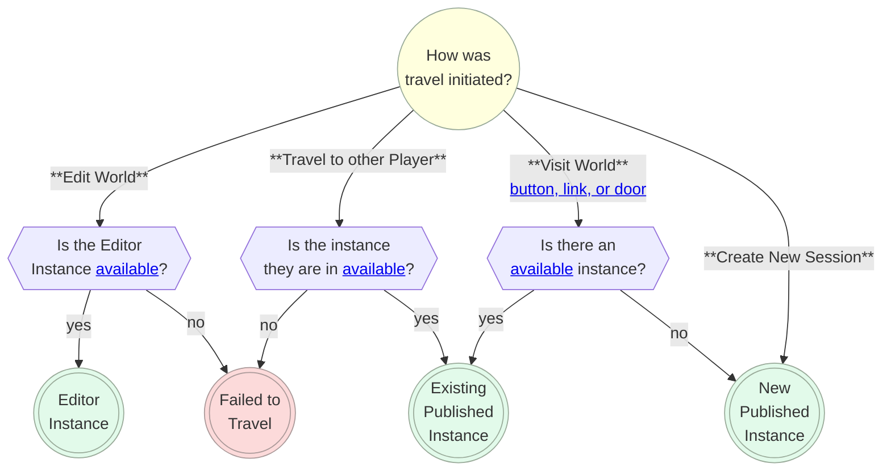
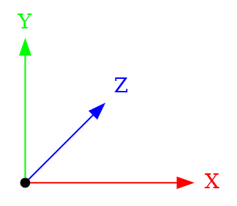
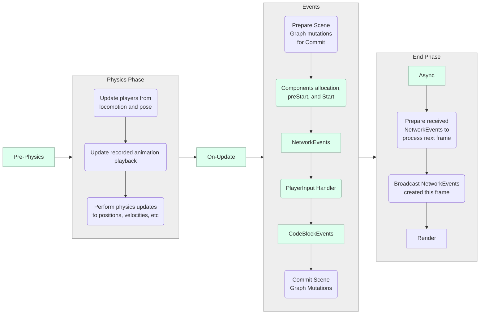
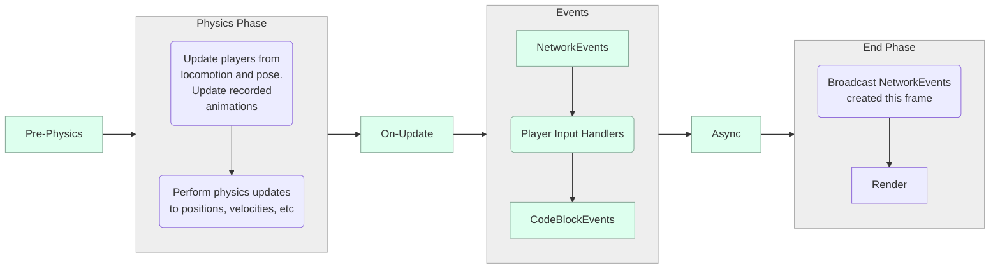
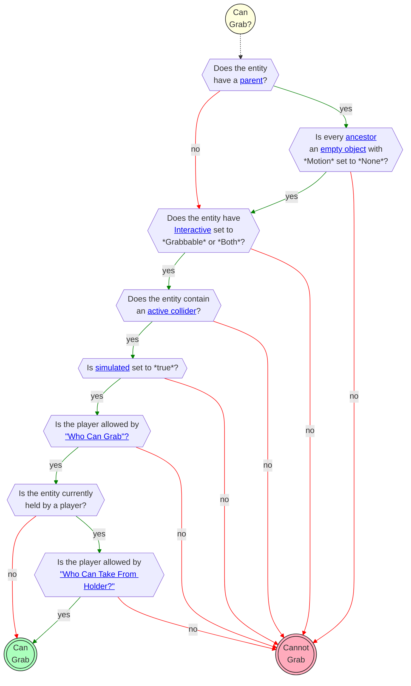
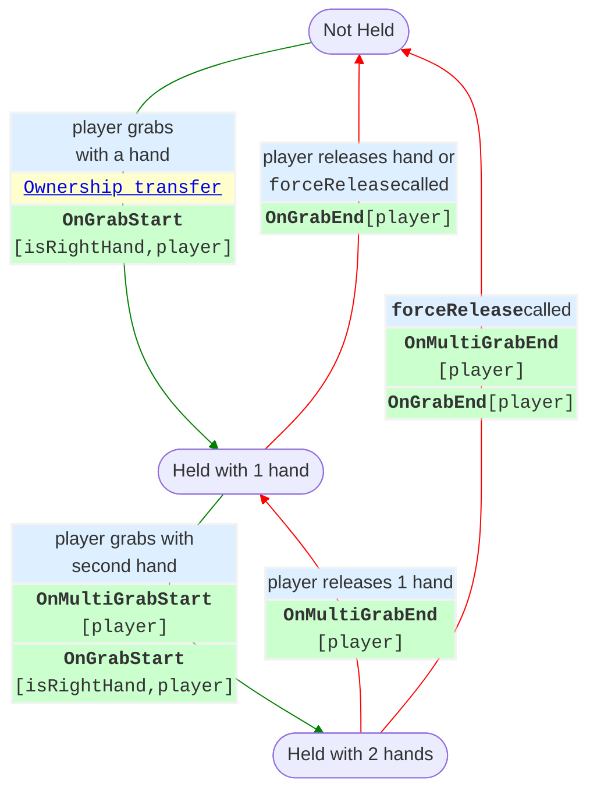
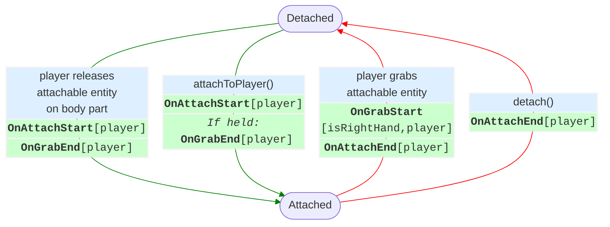

# Meta Horizon Worlds Technical Specification {ignore=true}

> This is an in-development (Jan '25) <b>community-written</b> document.
> For questions contact <i>wafflecopters</i>.

**Created by the Horizon Community**. Written by wafflecopters (Ari Grant) with contributions from PigeonNo12, Shards632, and Tellous and help from HomeMed, SeeingBlue, and UnravelWinter.

<!-- @import "[TOC]" {cmd="toc" depthFrom=1 depthTo=6 orderedList=true} -->

<!-- code_chunk_output -->

1. [Overview](#overview)
2. [Worlds](#worlds)
    1. [Creating a World](#creating-a-world)
    2. [Metadata and Publishing](#metadata-and-publishing)
    3. [Editor Roles](#editor-roles)
    4. [World Snapshot](#world-snapshot)
    5. [World Backups](#world-backups)
3. [Instances](#instances)
    1. [Instance Lifetime](#instance-lifetime)
    2. [Instance Types](#instance-types)
        1. [Visitation Modes: Edit, Play, and Publish](#visitation-modes-edit-play-and-publish)
    3. [Available Instances](#available-instances)
        1. [Open and Closed Instances](#open-and-closed-instances)
    4. [Instance Selection](#instance-selection)
    5. [Travel, Doors, and Links](#travel-doors-and-links)
4. [Scene Graph](#scene-graph)
    1. [Hierarchy](#hierarchy)
        1. [Ancestors](#ancestors)
        2. [Empty Object and Groups](#empty-object-and-groups)
    2. [Coordinate System](#coordinate-system)
    3. [Transforms](#transforms)
        1. [Position](#position)
        2. [Rotation](#rotation)
        3. [Scale](#scale)
        4. [Offsets - Move, Rotate, and Scale](#offsets---move-rotate-and-scale)
        5. [Transform Property](#transform-property)
        6. [Local Transforms](#local-transforms)
        7. [Pivot Points](#pivot-points)
        8. [Transform Relative To](#transform-relative-to)
5. [Entities](#entities)
    1. [Entity Types](#entity-types)
        1. [Static vs Dynamic Entities](#static-vs-dynamic-entities)
        2. [Intrinsic Entity Types](#intrinsic-entity-types)
        3. [Behavior Entity Types](#behavior-entity-types)
        4. [Entity as() method](#entity-as-method)
        5. [Animated Entities](#animated-entities)
        6. [Interactive Entities](#interactive-entities)
    2. [Entity Properties](#entity-properties)
        1. [Simulated](#simulated)
        2. [Tags](#tags)
        3. [Entity Visibility](#entity-visibility)
    3. [Scene Graph Elements](#scene-graph-elements)
        1. [Custom UI Gizmo](#custom-ui-gizmo)
        2. [Debug Console Gizmo](#debug-console-gizmo)
        3. [Door Gizmo](#door-gizmo)
                1. [Purpose](#purpose)
                1. [Manual Properties](#manual-properties)
                2. [Typescript API](#typescript-api)
        4. [NPC Gizmo](#npc-gizmo)
            1. [Overview](#overview-1)
            2. [Manual Properties](#manual-properties-1)
            3. [Typescript API](#typescript-api-1)
        5. [In-World Item Gizmo](#in-world-item-gizmo)
        6. [Dynamic Light Gizmo](#dynamic-light-gizmo)
                1. [Purpose](#purpose-1)
                1. [Manual Properties](#manual-properties-2)
                2. [Typescript API](#typescript-api-2)
        7. [Environment Gizmo](#environment-gizmo)
                1. [Purpose](#purpose-2)
                1. [Manual Properties](#manual-properties-3)
                2. [Typescript API](#typescript-api-3)
        8. [ParticleFx Gizmo](#particlefx-gizmo)
            1. [Overview](#overview-2)
            2. [Playing and Stopping a Particle Effect](#playing-and-stopping-a-particle-effect)
        9. [TrailFx Gizmo](#trailfx-gizmo)
        10. [Projectile Launcher Gizmo](#projectile-launcher-gizmo)
        11. [Quests Gizmo](#quests-gizmo)
        12. [Raycast Gizmo](#raycast-gizmo)
        13. [Script Gizmo](#script-gizmo)
        14. [Snap Destination Gizmo](#snap-destination-gizmo)
        15. [Sound Gizmo](#sound-gizmo)
        16. [Sound Recorder Gizmo](#sound-recorder-gizmo)
        17. [Spawn Point Gizmo](#spawn-point-gizmo)
        18. [Text Gizmo](#text-gizmo)
            1. [Limitations](#limitations)
            2. [Text Gizmo Markup](#text-gizmo-markup)
            3. [Text Gizmo Tags](#text-gizmo-tags)
                1. [Text Gizmo Tag Parameters](#text-gizmo-tag-parameters)
            4. [Supported Text Gizmo Tags](#supported-text-gizmo-tags)
        19. [Trigger Gizmo](#trigger-gizmo)
        20. [World Leaderboard Gizmo](#world-leaderboard-gizmo)
        21. [In World Purchase Gizmo](#in-world-purchase-gizmo)
6. [Assets](#assets)
    1. [Asset Types](#asset-types)
        1. [Mesh Asset](#mesh-asset)
        2. [Text Asset](#text-asset)
        3. [Image Asset (Textures)](#image-asset-textures)
        4. [Asset Template](#asset-template)
7. [Custom Model Import](#custom-model-import)
    1. [Overview](#overview-3)
    2. [SubD vs Custom Models](#subd-vs-custom-models)
        1. [Uploads](#uploads)
        2. [Errors](#errors)
        3. [Tinting](#tinting)
        4. [Textures](#textures)
        5. [Materials](#materials)
    3. [Performance](#performance)
        1. [Draw Calls](#draw-calls)
        2. [Vertices, Polygons, and Entities](#vertices-polygons-and-entities)
        3. [Memory](#memory)
    4. [Horizon Lighting](#horizon-lighting)
    5. [General Tips](#general-tips)
8. [Scripting](#scripting)
    1. [Creating and Editing Scripts](#creating-and-editing-scripts)
        1. [Syncing Scripts](#syncing-scripts)
        2. [Scripts in Source Control](#scripts-in-source-control)
    2. [Horizon Properties](#horizon-properties)
        1. [Horizon Property Subtleties](#horizon-property-subtleties)
    3. [Types](#types)
        1. [Copying vs Mutating Methods](#copying-vs-mutating-methods)
        2. [Color](#color)
        3. [Vec3](#vec3)
        4. [Quaternion](#quaternion)
    4. [World Class](#world-class)
    5. [Files](#files)
    6. [Components](#components)
        1. [Component Class](#component-class)
        2. [Attaching Components to Entities](#attaching-components-to-entities)
        3. [Lifecycle](#lifecycle)
            1. [Auto-Restart on Script Edit](#auto-restart-on-script-edit)
        4. [Sending and Receiving Events](#sending-and-receiving-events)
        5. [Converting Between Components and Entities](#converting-between-components-and-entities)
        6. [Subclasses](#subclasses)
    7. [Async (Timers)](#async-timers)
    8. [Local Scripts and Ownership](#local-scripts-and-ownership)
    9. [PrePhysics vs OnUpdate Updates](#prephysics-vs-onupdate-updates)
    10. [Events (Sending and Receiving)](#events-sending-and-receiving)
        1. [Code Block Event](#code-block-event)
            1. [System Events](#system-events)
        2. [Local Events](#local-events)
        3. [Network Events](#network-events)
        4. [Broadcast events](#broadcast-events)
    11. [Frame Sequence](#frame-sequence)
            1. [PrePhysics Phase](#prephysics-phase)
            1. [Physics Phase](#physics-phase)
            2. [OnUpdate Phase](#onupdate-phase)
        2. [Scripting Phase](#scripting-phase)
            1. [Component Initialization](#component-initialization)
            2. [Network Events Handling](#network-events-handling)
            3. [Code Block Events Handing](#code-block-events-handing)
            4. [Committing Scene Graph Mutations](#committing-scene-graph-mutations)
        3. [End Phase](#end-phase)
            1. [Async Handling](#async-handling)
            2. [Network Sync](#network-sync)
        4. [Render](#render)
    12. [Script File Execution](#script-file-execution)
9. [Network](#network)
    1. [Clients (Devices and the Server)](#clients-devices-and-the-server)
    2. [Ownership](#ownership)
    3. [Ownership Transfer](#ownership-transfer)
        1. [Auto-Transfers](#auto-transfers)
    4. [Networking and Events](#networking-and-events)
    5. [Authority and Reconciliation](#authority-and-reconciliation)
10. [Collision Detection](#collision-detection)
    1. [Colliders](#colliders)
    2. [Trigger Entry and Exit](#trigger-entry-and-exit)
        1. [Collidability](#collidability)
        2. [Controlling Collisions](#controlling-collisions)
        3. [Triggers](#triggers)
11. [Physics](#physics)
    1. [Overview](#overview-4)
    2. [Units](#units)
    3. [Creating a Physical Entity](#creating-a-physical-entity)
    4. [PrePhysics vs Defaults Scripts](#prephysics-vs-defaults-scripts)
    5. [Simulated vs Locked Entities](#simulated-vs-locked-entities)
    6. [PhysicalEntity Class](#physicalentity-class)
    7. [Projectiles](#projectiles)
    8. [Applying Forces and Torque](#applying-forces-and-torque)
    9. [Player Physics](#player-physics)
12. [Players](#players)
    1. [Identifying Players](#identifying-players)
        1. [Player ID](#player-id)
        2. [Player Indices](#player-indices)
        3. [Listing All Players](#listing-all-players)
        4. [Server Player](#server-player)
        5. [Local Player](#local-player)
    2. [Player Events and Actions](#player-events-and-actions)
        1. [Entering and Exiting a World](#entering-and-exiting-a-world)
        2. [AFK](#afk)
    3. [Pose (Position and Body Parts)](#pose-position-and-body-parts)
    4. [VOIP Settings](#voip-settings)
13. [Grabbing and Holding Entities](#grabbing-and-holding-entities)
    1. [Creating a Grabbable Entity](#creating-a-grabbable-entity)
    2. [Can Grab](#can-grab)
        1. [Setting "Who Can Grab?"](#setting-who-can-grab)
        2. [Setting "Who Can Take From Holder?"](#setting-who-can-take-from-holder)
        3. [Grab Distance](#grab-distance)
    3. [Grabbing Entities](#grabbing-entities)
        1. [Grab Lock](#grab-lock)
        2. [Force Holding](#force-holding)
    4. [Releasing Entities](#releasing-entities)
        1. [Manual release](#manual-release)
        2. [Force release](#force-release)
    5. [Grab Sequence and Events](#grab-sequence-and-events)
        1. [Hand-off (Switching Hands or Players)](#hand-off-switching-hands-or-players)
        2. [Moving Held Entities](#moving-held-entities)
            1. [Moving a Held Entity Locally in Relation to the Hand](#moving-a-held-entity-locally-in-relation-to-the-hand)
            2. [Moving a Held Entity Globally in Relation to the World](#moving-a-held-entity-globally-in-relation-to-the-world)
        3. [Grabbables and Ownership](#grabbables-and-ownership)
14. [Attaching Entities](#attaching-entities)
    1. [Creating an Attachable](#creating-an-attachable)
    2. [Attachable By](#attachable-by)
    3. [Avatar Attachable](#avatar-attachable)
        1. [Scripted Attach](#scripted-attach)
        2. [Sticky](#sticky)
            1. [Stick To](#stick-to)
        3. [Anchor](#anchor)
            1. [Anchor To](#anchor-to)
            2. [Socket Attachment](#socket-attachment)
            3. [Auto Scale to Anchor](#auto-scale-to-anchor)
    4. [Attach to 2D screen](#attach-to-2d-screen)
15. [Holstering Entities](#holstering-entities)
16. [Player Input](#player-input)
    1. [Actions on Held Items](#actions-on-held-items)
    2. [Onscreen Controls](#onscreen-controls)
17. [Persistence](#persistence)
    1. [Overview](#overview-5)
    2. [Leaderboards](#leaderboards)
    3. [Quests](#quests)
    4. [In-World Purchases (IWP)](#in-world-purchases-iwp)
    5. [Player Persistent Variables (PPV)](#player-persistent-variables-ppv)
18. [Spawning](#spawning)
    1. [Simple Spawning](#simple-spawning)
    2. [Despawning](#despawning)
    3. [Advanced Controller](#advanced-controller)
    4. [Sublevels](#sublevels)
19. [Tooltips and Popups](#tooltips-and-popups)
20. [Custom UI](#custom-ui)
    1. [Bindings](#bindings)
    2. [View Types](#view-types)
        1. [View](#view)
        2. [Image](#image)
        3. [Pressable](#pressable)
        4. [Dynamic List](#dynamic-list)
        5. [ScrollView](#scrollview)
    3. [Animated Bindings](#animated-bindings)
21. [Cross Screens - Mobile vs PC vs VR](#cross-screens---mobile-vs-pc-vs-vr)
    1. [Camera](#camera)
22. [Performance Optimization](#performance-optimization)
    1. [Physics Performance](#physics-performance)
    2. [Gizmos](#gizmos)
    3. [Bridge calls explanation](#bridge-calls-explanation)
    4. [Draw-call specification](#draw-call-specification)
    5. [Perfetto hints](#perfetto-hints)
    6. [Memory](#memory-1)
23. [List of all desktop editor shortcuts](#list-of-all-desktop-editor-shortcuts)
24. [Common Problems and Troubleshooting](#common-problems-and-troubleshooting)
25. [Glossary](#glossary)

<!-- /code_chunk_output -->

<div style="page-break-after: always;"></div>

![[ Test.md ]]

# Overview

Meta Horizon Worlds (called "Horizon" for the rest of this document) is a Metaverse content platform where people can find and create 3D immersive content to play, explore, and socialize in. Horizon calls each experience a **world**. The content can be accessed on:

**Supported platforms**: mobile, web, Windows PCs, and VR.

Use the Horizon creation tools you can create team-vs-team shooter games, fantasy fighting games, social deception games, hang out spaces and clubs, art exhibits, simulation games, battle royale games, dungeon crawlers, obstacle courses, puzzle games, talk shows, adventure games, stories, party games, improv clubs, and whatever else you can imagine.

The tools support many features for managing and scripting players, physics, 3D mesh import, projectiles, purchases, grabbable items, wearable items, player inputs, lights, UI, NPCs, and more.

**Desktop Editor**: on Windows the Horizon executable can be launched in "Edit" mode (TODO - explain) which opens app in a set of tools where you can create and edit worlds.

**VR Editor**: in Quest VR devices the Meta Horizon Worlds app contain an edit mode that allows for creating and editing worlds inside of VR. It offers a natural and intuitive experience where you can place object directly with your hands and immerse yourself in your creations. The VR editor does not provide access to all tools that the desktop has.

**TypeScript and Code Blocks**. Horizon uses [TypeScript](https://www.typescriptlang.org/) as its scripting language. TypeScript scripts can only be edited in the Desktop Editor. Horizon also has a custom block-based scripting system (where you write scripts by combining blocks together) that it calls **Code Blocks**. Code Block Scripts can only be edited in the VR Editor.

# Worlds

You use the Desktop Editor to edit worlds, adding content and scripts to build out your ideas. The [publishing menu](#metadata-and-publishing) enables you to configure worlds settings and publish the world when ready. Worlds are saved in "files" called [world snapshots](#world-snapshot) which allow [rollback](#world-backups). A published world may be running many [instances](#instances) at once.

## Creating a World

<mark>TODO</mark>

## Metadata and Publishing

Let's *NOT* document all of what is below. These are here for reference to see which ones we want to document.

<mark>TODO</mark>

Publish World "box"
  Status: unpublished
  Name
  Description
  World rating (a flow that result in: <mark>TODO</mark>)
  Comfort rating: Not Rated, Comfortable, Moderate, Intense
  (World) Tags (select N from list)
  Mute Assist (boolean)
  Visible to public (boolean)
  Members-only world (boolean)
  Boolean (boolean)
  Available Through Web and Mobile
  Compatible with Web and Mobile

Player Settings
  VOIP: Global vs Local
  <a name="maximum-player-count">Maximum Player Count</a> (4 to 32)
  Suggested Minimum Player Count (1 up to Max)
  Emotes (boolean)
  Emotes Audio (boolean)
  Can Hands Collide With Physics Objects
  Can Hands Collide With Static Objects
  Custom Player Movement
  Generate Instant Replays
  Frame Budget Boost (Early Access) -- (Default, On, Off)
  Spawn Nearby (boolean)
  Footsteps Volume
  Footsteps Min Distance
  Footsteps Max Distance
  Hide Action by Default (boolean)
    -- mobile only setting, can be overridden by setting icon in Properties
Disable Dynamic LOD Toggles on Avatar (makes it easier to increase player count)
Enable Max Quality Avatar


Name, description, comfort setting, player count, etc.


## Editor Roles

The **owner** is the person who [created the world](#creating-a-world). Once a world is created, there is no way to change the owner. Other people, called **collaborators**, can than be added to (and removed from) the world via the Collaborators menu. When adding a collaborator, you choose whether they are an editor or tester.

| Role | Can travel to [editor instances](#instance-lifetime)? | Can enter [build mode](#visitation-modes-edit-play-and-publish), edit [scene](#scene-graph), and edit [scripts](#scripting)? | Can [publish](#metadata-and-publishing) the world? | Can edit [persistence](#persistence) settings (create and edit [leaderboards](#leaderboards), [quests](#quests), and [PPVs](#player-persistent-variables-ppv))? | Can assign [editor roles](#editor-roles)? |
|---|---|---|---|---|---|
| *Owner*  | ✅ | ✅ | ✅ | ✅ | ✅ |
| *Editor* | ✅ | ✅ | ❌ | ❌ (Exception: editing Quests *are* allowed) | ❌ |
| *Tester* |  ✅ | ❌ | ❌ | ❌ | ❌ |

## World Snapshot

When you create a new world, Horizon creates a new "file" on their servers which contains all the information and data for the world. Horizon calls this a **world snapshot**. Every time you update the world, a new snapshot is created. You can manage all the saves snapshots via the [backups](#world-backups) feature.

!!! info **The** world snapshot
    Whenever this document refers to **the world snapshot** it is referring to the specific snapshot that you have loaded the world from (which is the last one saved, unless you did a rollback).

## World Backups

The editor regularly "auto saves" the world, creating a new [world snapshot](#world-snapshot) that is calls a **backup**. You can manually create a snapshot as a via the "Save Backup" option.

The list of all previous saved snapshots are viewable in the "Backups" menu. This menu allows you to see the list of backups, see when background were created, modify the name and description, or to **restore** a backup to be the current snapshot.

For instance, before starting a major change to the world, you could create a backup, and then if you run into issues, you could restore that "safe" backup back to when the world was "unchanged". You can also look back into backups to investigate when a certain bug appeared, or to go back and make an [asset](#assets) or copy a [script](#scripting) that you have since modified or deleted.

!!! tip Source Control
    Currently there is no way to put a whole world into an external source control system, such as git, but it is possible to [put the scripts into source control](#scripts-in-source-control).

# Instances

Horizon maybe have multiple *copies* of a world running at the same time. For example if the <a href="#maximum-player-count">maximum player count</a> is set to 20 and there are 100 people "in the world" then they would be spread out across *at least* 5 separate copies. These copies are called **instances**.

!!! info Horizon sometimes refers to Instances as "Sessions"
    In all technical documentation, Horizon uses the word *instance*. Given that this is a somewhat technical term, it refers to them as **sessions** within the user-facing side of the product. For example, a person can "create a new session".

## Instance Lifetime
**Creation**: When a player travels to a world (to play it or edit it), Horizon [finds or creates an instance](#instance-selection) of the right [type](#instance-types).

**Longevity**: The instance then remains running as long as players stay in it. Even when all players leave, and the instance becomes empty, it may stay running for some time, in case any players try to return or new players arrive.

**Destruction**: When there are no players in an instance it will be destroyed, after some timeout threshold. In rare instances a server error may also cause an instance to be destroyed (which will send all players in it back to the app-launch state).

!!! warning Destroyed instances are permanently gone and so is their data.
    When an instance is destroyed there is no way for players to get back that specific instance. Any data they had "acquired" in that instance is permanently lost. You can **use [Horizon persistence](#persistence) to track data across instances and visits**.

## Instance Types

There are two types of instances: **published instances** and **editor instances**. The editing tools, for modifying a world, are only available inside of an *editor instance*. There is no way to turn one into the other; when Horizon [starts up a new instances](#instance-selection), based on how the player is traveling, and then the type never changes, for as long as the instance is [alive](#instance-lifetime).

| Instance Type  | How do you travel to one? | Can you open the editing tools? | How many instances are allowed? |
|---|---|---|---|
|  *Published*  | Use the "Visit World" button, or [travel](#travel-doors-and-links) to a friend, travel via a door. | No | No limit |
| *Editor* | Use the "Edit World" button if you are the [world owner, editor, or a tester](#editor-roles). | Yes, if you are the [owner or a editor](#editor-roles). | 1 |

### Visitation Modes: Edit, Play, and Publish

"Visiting" a world in Horizon is done in one of three modes: edit, play, and publish. In a [published instance](#instance-types), all players are always in "publish mode". In an [editor instance](#instance-types), the creator and editors can switch back and forth between edit and play modes; testers are always in play mode.

| Mode  |  Description | Instance Type | Required Role |
|---|---|---|---|
| *Edit* | Experience the world **as an editor** where you can modify the world.  | Editor Instance | Editor |
| *Play* | Experience the world **as a player** from within the editable instance. | Editor Instance | Editor or Tester |
| *Publish*  | Experience the world **as a player** in a published instance. | Published Instance | n/a |

!!! info Debug Console Gizmo Visibility
  The [Debug Console Gizmo](#debug-console-gizmo) has setting to control which visitation mode(s) it is visible in.

## Available Instances

A player can only travel to an instance if that instance is **available for the player**. Availability is determined by three criteria, all of which must be met:

1. **[Isn't at maximum player count](#maximum-player-count)**: a player can only travel to a world if there as at least one [index](#player-indices) available. If the capacity is set to 20 and there are 19 people there, then 1 more can travel to the world. It is then unavailable for all players until at one player leaves.
1. **Is Safe**: Horizon has an undisclosed, and evolving, set of rules for what it deems *safe*, regarding travel. These rules may include: which players have blocked one another (and how recently), if the traveling player has recently been voted out of that instance, if the instance has a moderated event running, and more.
1. **[Instance is Open](#open-and-closed-instances)**: all [published instances](#instance-types) exist as either *open* or *closed*. An **open instance** can be joined by an player (if the above criteria are met). A **closed instance** can only be joined by players who are explicitly invited by players already in the instance.

### Open and Closed Instances

**New instances default to open.**  When a [new instance is created](#instance-selection) via the "Travel" button it is **open**.

**Player can create closed instances.** When a player explicitly creates a new instance, via "Create New Session", they can choose whether the instance is open (allowing anyone to join) or closed (allowing only invited-players to join).

**Openness can be changed with scripting.** You can change whether or not the current instance is open via TypeScript with
```ts
this.world.matchmaking.allowPlayerJoin(isOpen)
```
which returns a `Promise<void>` to signal when the change has taken effect.

<mark>TODO: when calling `allowPlayerJoin(false)`, can players join by invite or is the instance actually LOCKED vs Closed?</mark>

## Instance Selection

When a player travels to a world, Horizon will determine which instance to send them to (if there are multiple) or create a new instance if needed (if all are full, none exist, or the player specifically created a new one).

!!! info The Editor Instance
    There is only ever (at most) one **editor instance** of a given world. When that one instance is full, no other editors can load the world to edit.



## Travel, Doors, and Links

<mark>TODO:</mark>

* Doors act like an in-experience Hyperlink
* Travel to friend
* Instruction how to get an actual link...

# Scene Graph

Every world in Horizon is made out of [entities](#entities) each of which has an [intrinsic type](#entity-types) such as being a mesh or a particle effect. Entities can be configured to have *behaviors* (such as being [grabbable](#grabbing-entities) or [attachable](#attaching-entities)) and be have other entities as their children (or as a parent). The collection of all of these entities, their attributes, and relationships is called the **scene graph**. When you modify the scene graph in the editor, those changes are saved in the [world snapshot](#world-snapshot).

## Hierarchy

Any [entity](#entities) can be set as the child of another entity. For example, you might make a robot's forearm a Mesh Entity that is a child of the upper arm Mesh Entity. Or you might put a steering wheel inside a car. The main reasons to create parent-child relationships are:

1. To have the transform of one entity impact another (e.g. moving a car also moves the steering wheel within it).
2. To create "layers" or "folders" in the editor (e.g. putting all trees in a ["collection"](#empty-object-and-groups) to make them easier to manage).

When an entity has no parent it is called a **root entity**.

### Ancestors

We call the collection of an entity's parent, grandparent, great-grandparent, etc the entity's **ancestors**. If the entity has no parent, we say it has 0 ancestors. If it has just a parent and then grandparent, it would have 2.

We call the children, and their children, and their children, etc of an entity its **descendants**.

### Empty Object and Groups

Empty Objects and Groups are two methods of "collection" entities together. They are similar in most regards, with only a few differences:

| Collection Type | [Pivots](#pivot-points) | [Interactive Entity](#interactive-entities) Children | [Projectile Launcher](#projectiles) | [Child Count](#hierarchy) |
|---|---|---|---|---|
| Group | Always at the **center of all their children**. Meaning that moving one child will move the [pivot point](#pivot-points). | Children have their **interaction disabled**. | [Projectile collisions](#projectiles) happen **on the group**. | 1+
| Empty Object | The **center of the Empty Object** is always the [pivot point](#pivot-points). | Children **can be [Interactive Entities](#interactive-entities)**, if the Empty Object's `Motion` is `None`. | [Projectile collisions](#projectiles) happen **on a child**. | 0+ |

Empty Objects and Groups behave identically in regards to collisions and triggers in all cases other than projectiles launched from the projectile gizmo.

<mark>TODO - explain how collisions and triggers both do the algorithm of "start with the colliding leaf object and walk up the ancestor chain until you find the first with a matching tag and then immediately stop".</mark>

## Coordinate System

**Axes**. Following standard convention, the editor uses *red* for the *<span style="color:red">x-axis</span>*, *green* for the *<span style="color:green">y-axis</span>*, and *blue* for the *<span style="color:blue">z-axis</span>* when displaying "manipulation handles" to move, rotate, or scale an entity.

**Y-up**. The positive-y axis is *up*.

**Left-handed**. The coordinate system is *left-handed*, meaning that if position the camera so that the positive y-axis is pointing up and the positive x-axis is pointing right then the positive z-axis points forward.



<a name="local-coordinates">**Local coordinates**</a>. Every [entity](#entities) and every [player and player body part](#pose-position-and-body-parts) has a set of [local axes](#local-transforms) called: **right**, **up**, and **forward** which have an origin at the [pivot point](#pivot-points), if an entity, and at the center of the body part if it is a body part (example: player center is the hips; head center is literally the center of the head). Local coordinates are used for moving entities around in the Desktop editor (if enabled) and are used when interacting with [local transforms](#local-transforms).

!!! example Local Coordinates Example
    The *forward* axis of *a player head* is always pointing away from their face (parallel to their nose), its *right* axis is always point "out" their right ear, and its *up* axis is pointing out from the top of the skull. When the entity or player body part moves, the origin of these axes move; likewise the axes rotate along with the entity (so that the *right* axis always points out from the right ear).

    ```graphviz {align="center"}
    digraph {
      layout=neato

      O [pos="0,0!" shape=box3d width=0.5 label=""]
      X [pos="1.75,0!" width=0 height=0 shape=none fontcolor=red label=right]
      Y [pos="0,1.5!" width=0 height=0 shape=none fontcolor=green label=up]
      Z [pos="0.9,0.9!" width=0 height=0 shape=none fontcolor=blue label=forward]

      O -> X [color="red"]
      O -> Y [color="green"]
      O -> Z [color="blue"]
    }
    ```

**Meters**. Distances and positions in Horizon are referenced using meters. For example, the position `(0, 1, 0)` is 1 meter (roughly 3.28 feet) up from the center of the world. Avatars in Horizon are approximately 1.8 meter tall (5 feet 11 inches).

**Origin**. The editor has the origin `(0,0,0)` at the center of the grid. The origin cannot be moved.

## Transforms

Entities have three transform properties: [position](#position), [rotation](#rotation), and [scale](#scale). You can use the properties panel or the "manipulation handles" to manipulate these properties. Editing these values determines how entities are transformed when a new instance starts. **Within the Horizon editor you can only configure initial position, rotation, and scale**. If you want these values to change while the world is running, you will need to modify the values using scripting.

In the desktop editor you can switch quickly between transform tools via the keyboard.
| Manipulation Tool  |  Keyboard Shortcut |
|---|---|
| Move | W |
| Rotate | E |
| Scale | R |

Entities can be transformed globally and [locally](#local-transforms), they have [pivot points](#pivot-points), and can be [transformed relative to other entities or players](#transform-relative-to).

!!! note No Arbitrary Matrix Transforms
    Horizon does not currently allow matrix transforms. You can achieve some skew effects by rotating an entity inside a non-uniformly scaled one. Arbitrary matrix transforms are not exposed to the developer.

### Position

Positions are specified as 3-dimensional vectors, represented as the `Vec3` type in TypeScript. In the editor these are written as a "triple" such as `(0, 0, 0)`.

The `position` property on an entity determines where in 3D space the [pivot point](#pivots) of the entity is, in relation to the origin of the world. Often the pivot is just the center of the entity, and so typically the position of an entity is where its center point is.

!!! example Setting a position
    Position is a [read-write property](#horizon-properties) on the `Entity` class. To get the current position of an entity, do:

    ```td
    entity.position.get()
    ```

    To move an entity to be 3 meters up from the origin and 4 meters forward, do:
    ```ts
    entity.position.set(new Vec3(0, 3, 4))
    ```

Setting the `position` property is not influenced by the position of any [ancestors](#ancestors).
See [local transforms](#local-transforms) for setting position relative to a parent entity.

!!! danger <a name="world-max-bounds">An entity position cannot have a value outside of `[-10,000, 10,000]`</a>
    When an entity moves (via `position.set` or via physics) to a location where any of its x-, y-, or z-values are outside the range `[-10,000, 10,000]`, then instead, the **entity will be automatically moved to the location it had at world start** (or at spawn-time if it was spawn). If it is a physics entity then it will also have its velocity cleared out.

     **Players do not auto-move / respawn when they are too far away from the origin**.

     !!! bug Entities can be spawned farther than 10,000 away from the origin.
        It is a bug that entities can be spawned outside the bounds of the world.


### Rotation

Rotations are specified using a mathematical object called a `Quaternion`. Whenever you see the word "Quaternion" you can just think it means "rotation". This isn't mathematically true but is sufficient for nearly all uses.

Rotations in the editor are specified using [Euler Angles](https://en.wikipedia.org/wiki/Euler_angles) which are a robust way of specifying yaw, pitch, and roll. The default **Euler Order** order in Horizon is **YXZ** meaning that entity does a *yaw*, then a *pitch*, and then a *roll* (when specifying Euler Angles). Euler angles are specified in **degrees**.

!!! tip Rotations are tricky!
    Rotations, Quaternions, Euler Angles, etc are all rather tricky and subtle concepts. It will take a lot of time to build an intuition for them. Be patient and don't worry if rotations seem complex (they are)!

The `rotation` property on an entity determines how much the entity is rotated around its [pivot point](#pivots). This rotation is specified *globally*, meaning that it is measured with respect to the world. A zero-rotation will have an entity's up-axis align with the world's y-axis, it's right-axis align with the world's x-axis, etc.

!!! example Setting a rotation
    Rotation is a [read-write property](#horizon-properties) on the `Entity` class. To get the current rotation of an entity, do:

    ```td
    entity.rotation.get()
    ```

    To rotate an entity so that it yaws 45 degrees and then rolls 90 degrees, do:
    ```ts
    entity.rotation.set(Quaternion.fromEuler(new Vec3(0, 90, 45)))
    ```

!!! tip Default Rotation ("Not rotated")
    If you want an entity to be "not rotated", set its rotation to be `(0, 0, 0)` in the editor. In Typescript you can use any of these lines (they all do the same thing):

    ```ts
    entity.rotation.set(Quaternion.fromEuler(new Vec3(0, 0, 0)))

    entity.rotation.set(Quaternion.fromEuler(Vec3.zero))

    entity.rotation.set(Quaternion.one)
    ```

Setting the `rotation` property is not influenced by the rotation of any [ancestors](#ancestors).
See [local transforms](#local-transforms) for setting rotation relative to a parent entity.

### Scale

Scales are specified as 3-dimensional vectors, represented as the `Vec3` type in TypeScript. In the editor these are written as a "triple" such as `(0, 0, 0)`.

**Inherent Size**: All entities have their own inherent size. For instance, a SubD cube is inherently 1 meter long on each side. Mesh assets have a size based on how they were authored. The inherent size of an entity is the size it is when it is *unscaled*.

The `scale` property determines the fraction an entity should be of its inherent size. For instance, a SubD cube is inherently 1 meter long on each side. If you set its scale to be `(1, 0.5, 2)` then the cube will be 1 meter long on its right-axis, 0.5 meters long on its up-axis, and 2 meters long on its forward-axis. In this example, the object has been "shrunk" along its up-axis, and "expanded" along its forward-axis.

!!! example Setting a scale
    Scale is a [read-write property](#horizion-properties) on the `Entity` class. To get the current scale of an entity, do:

    ```td
    entity.scale.get()
    ```

    To scale an entity so that it is 3 times bigger on its up axis (than its inherent size), do:
    ```ts
    entity.scale.set(new Vec3(1, 3, 1))
    ```

    Since the default scale is `(1,1,1)`, you can set any part of a scale to `1` to leave the entity "un-scaled" along that axis.

Setting the `scale` property is not influenced by the rotation of any [ancestors](#ancestors).
See [local transforms](#local-transforms) for setting scale relative to a parent entity.

!!! danger Mesh Primitives Have Unexpected Inherent Sizes
    The builtin mesh primitives have an inherent scale of 150 meters on each side (as of Feb 2025). Thus if you wanted to use a builtin mesh cube and have it be 1 meter long on each side, you would need to give it a scale of (1/150, 1/150, 1/150). This is a longstanding bug.

### Offsets - Move, Rotate, and Scale

When you want to set the position of an entity in relation to the current position we call this **offsetting** the position. There is no builtin API for doing this (as of Feb 2025) but it can be accomplished easily with the pattern of *get-modify-set*.

!!! example Offsetting position and scale
    To move an entity up 2 meters from its current location you can do:
    ```ts
    const offset = new Vec3(0, 2, 0)

    const pos = entity.position.get()
    const newPos = pos.add(offset)
    entity.position.set(pos)
    ```
    Offsetting scale works similarly.

!!! example Offsetting rotation
    To rotate an entity 90 degrees around the world's y-axis, from its current rotation, you can do:
    ```ts
    const offset = Quaternion.fromEuler(new Vec3(0, 90, 0))

    const rot = entity.rotation.get()
    const newRot = offset.mul(rot)
    entity.rotation.set(newRot)
    ```
    Note that `mul()` is used to combine rotations.

    If instead you wanted to rotate an entity 90 degrees around its own up-axis you would do:
    ```ts
    const offset = Quaternion.fromEuler(new Vec3(0, 90, 0))

    const rot = entity.rotation.get()
    const newRot = rot.mul(offset)
    entity.rotation.set(newRot)
    ```
    where the order of the Quaternion multiplication has been flipped. See [Quaternions](#quaternion) for more explanation.

### Transform Property

Each entity has a transform property that can be accessed via `entity.transform`.

```ts
class Entity {
  readonly transform: Transform
  // ...
}
```

Position, rotation, and scale can all be accessed through a `Transform`. The following two lines behave identically.

```
entity.position.set(p)
entity.transform.position.set(p)
```

Additionally, the `Transform` object can be used to access **local** position, rotation, and scale. See the next section for more information.

### Local Transforms

Entities have a `localPosition`, `localRotation`, and `localScale` that can be accessed via the transforms (e.g. `entity.transform.localPosition.get()`). These properties specify values in relation to a parent entity (or to the world if there is no parent), specified in the parent's [local coordinates](#local-coordinates).

Throughout this doc, other than this section, we omit the word *global*. When you see "position" it means "global position".

!!! example Local Position Example
    Let `parent` be an entity that has not been rotated nor scaled with `child` as one of its children.

    If `parent`'s **global position** is `(3, 0, 0)` and `child`'s **global position** is `(8, 1, 0)` then `child`'s **local position** will be `(5, 1, 0)`. The `child`'s local position is how much it is moved from its parent.

    Note: if the `parent` were rotated or scaled then you can't just "subtract the positions".

!!! note Global values "cascade down" the hierarchy.
    An entity's global position/rotation/scale influences the global position/rotation/scale of its children (which then cascades to their child too!). If you have a plate on a table on a boat  and the boat moves globally then so do the table and the plate; if the table moves then so does the plate (and everything on it!)

!!! warning Local values exist in the transformed [local coordinate system](#local-coordinates) of the parent.
    Rotating and/or scaling an entity causing it axes to rotate and scaled as well. We call these the *transformed axes*.

    A child with local position of `(0, 6, 0)` is moved 6 units **from the global position** of its parent **along the parent's transformed up-axis**. If there is no parent then this is just 6 meters up the world's y-axis.

### Pivot Points

The transformation origin point of an entity is called its **pivot point**. It rotates around its pivot point, it scales around its pivot point, and when you move an entity its pivot point end ups at the position specified.

1. **Mesh entities** have their pivot points specified when they are authored (e.g. in Blender)
1. **Empty objects** have their pivot points at the center of the gizmo (the grey cube)
1. **Group entities** compute their pivot point to be at the center of their "bounding box" **in edit mode**. For example if you move a child in a group in edit mode then when click off the group it will recompute its pivot point to be at the center of all of its children. *This only happens in edit mode. The pivot of a group doesn't auto-change when the world is running (even if its children move around).*
1. **All other entities** (e.g. door, text gizmo, box collider gizmo, etc) have a builtin pivot point (usually at their center).

!!! warning In the desktop editor the manipulator handles don't always render at the pivot points!
    The desktop editor lets you choose to put the "manipulator handlers" at either the `Center` or `Pivot` of entities. Check that dropdown if you aren't seeing the pivots as you expect. This dropdown has no effect on how the world *runs* and is simply there to help with *editing*.

### Transform Relative To

<mark>TODO</mark>

```ts
/// Entity
lookAt(target: Vec3, up?: Vec3): void;
moveRelativeTo(target: Entity, relativePosition: Vec3, space?: Space): void;
moveRelativeToPlayer(player: Player, bodyPart: PlayerBodyPartType, relativePosition: Vec3, space?: Space): void;
rotateRelativeTo(target: Entity, relativeRotation: Quaternion, space?: Space): void;
rotateRelativeToPlayer(player: Player, bodyPart: PlayerBodyPartType, relativeRotation: Quaternion, space?: Space): void;
```

# Entities

Every "thing" in the Horizon scene is an _entity_ (a grabbable item, a mesh, a light, a particle effect, a sound, a group of other entities, etc).

!!! info Entity and Object mean the same thing (except in TypeScript)
    Horizon calls these **objects** in the Desktop Editor and VR Tools but calls them **entities** in TypeScript. This document tries to consistently call them entities, except when quoting places where Horizon explicitly uses the word "object", but may accidentally call them objects on occasion.

    In TypeScript `Object` is a builtin for managing data, whereas `Entity` is a Horizon-specific class.

<mark>TODO</mark>

## Entity Types

Every entity in Horizon has an underlying **[intrinsic type](#intrinsic-entity-types)** determined by how the entity was originally created (e.g. whether you instantiated a [Sound Gizmo](#sound-gizmo), [Text Gizmo](#text-gizmo), [Mesh Asset](#mesh-assets), etc).

Additionally, an entity can have (multiple) **[behavior types](#behavior-entity-types)** based on settings in the Property Panel (such as being [grabbable](#grabbing-entities), [attachable](#attaching-entities), etc).

For example, a *hat mesh that is grabbable and attachable* has a intrinsic type of [MeshEntity](#mesh-asset) and two behavior types: [GrabbableEntity](#grabbing-and-holding-entities) and [AttachableEntity](#attaching-entities).


### Static vs Dynamic Entities

All entities in Horizon are either **static** or **dynamic**.

**Static entity**: A static entity can never change in any way (other than being [spawned](#spawning) in and out ). A static entity's position, rotation, color, etc never change. Horizon computes more [detailed lighting](#horizon-lighting) on static entities. Scripts can *read* the data of a static entity (such as getting position) but can never change the values. Static entities **cannot** have [behaviors](#behavior-types) An entity **is static when `Motion` is set to `None` in the property panel**.

**Dynamic entity**: A dynamic entity is one that changes. It may move and rotate, have its color changed, have forces applied, be grabbed, be attached to an avatar, etc. A dynamic entity has [simpler lighting](#horizon-lighting) than static entities. Dynamic entities *can* have [behaviors](#behavior-types). An entity **is dynamic when `Motion` is set to `Animated` or `Interactive` in the property panel**
  * When `Motion` is set to `Animated` you can [record a "hand animation"](#animated-entities) on the entity.
  * When `Motion` is set to `Interactive` you can make the entity [grabbable](#grabbing-entities), [physics-simulated](#physicalentity-class), or both.

!!! note Parents don't affect static vs dynamic.
    A static entity can have a dyanmic parent  and vice versa.

### Intrinsic Entity Types

The table below lists all intrinsic types, which are subclasses of `Entity`. Note that some intrinsic types don't have an associated subclass and thus are access simply as `Entity` instances. Every entity only has **one instrinsic type** which can be accessed via the [entity.as()](#entity-as-method) method.

The intrinsic type classes (in the table below) all subclass `Entity`. All the [entity properties](#entity-properties) are available on all of them.

<mark>TODO: Missing: Media Board, Navigation Volume, Mirror, Static Light, World Promotion; Box Collider, Capsule Collider, Sphere Collider</mark>

| [Intrinsic Type](#entity-types) | TypeScript Class |
|---|---|
| [Custom UI](#custom-ui-gizmo) | `Entity` |
| [Debug Console](#debug-console-gizmo) | `Entity` |
| [Door](#door-gizmo) | `Entity` |
| [Dynamic Light](#dynamic-light-gizmo) | `DynamicLightGizmo` |
| [Empty Object](#empty-object-and-groups) | `Entity` |
| [Environment](#environment-gizmo) | `Entity` |
| [Group](#empty-object-and-groups) | `Entity` |
| [In-World Item](#in-world-item-gizmo) | `IWPSellerGizmo` |
| [Mesh](#mesh-asset) | `MeshEntity` |
| [NPC](#npc-gizmo) | `AIAgentGizmo` |
| [ParticleFx](#particlefx-gizmo) | `ParticleGizmo` |
| [Projectile Launcher](#projectile-launcher-gizmo) | `ProjectileLauncherGizmo` |
| [Quests](#quests-gizmo) | `AchievementsGizmo` |
| [Raycast](#raycast-gizmo) | `RaycastGizmo` |
| [Script](#script-gizmo) | `Entity` |
| [Snap Destination](#snap-destination-gizmo) | `Entity` |
| [Sound](#sound-gizmo) | `AudioGizmo` |
| [Sound Recorder](#sound-recorder-gizmo) | `AudioGizmo` |
| [Spawn Point](#spawn-point-gizmo) | `SpawnPointGizmo` |
| [Sublevel](#sublevels) | `SublevelEntity` |
| [Text](#text-gizmo) | `TextGizmo` |
| [TrailFx](#trailfx-gizmo) | `TrailGizmo` |
| [Trigger Zone](#trigger-gizmo) | `TriggerGizmo` |
| [World Leaderboard](#world-leaderboard-gizmo) | `Entity` |

### Behavior Entity Types

 A [dynamic entity](#static-vs-dynamic-entities) can have **multiple behavior types** which can be accessed via the [entity.as()](#entity-as-method) method.

 The behavior type classes (in the table below) all subclass `Entity`. All the [entity properties](#entity-properties) are available on all of them.

| Behavior Type  | Description | TypeScript Class | How to Enable |
|---|---|---|---|
| [Animated (Recording)](#animated-entities) | An entity that has a recording on it. | `AnimatedEntity` | Set `Motion` to `Animated`. Use the `Record` button in the property panel.
| [Attachable](#attaching-entities) | An entity that can be attached to a [Player](#players). | `AttachableEntity` | Set `Motion` to `Animated` or `Interactive`. Set `Avatar Attachable` to `Sticky` or `Anchor` in the property panel.
| [Grabbable](#grabbing-and-holding-entities) | An entity that can be grabbed and held. | `GrabbableEntity` | Set `Motion` to `Interactive`. Set `Interaction` to `Grabbable` or `Both`. Interaction can also be changed with `entity.interactionMode.set(...)`. |
| [Physics-Simulated](#physicalentity-class) | An entity that can respond to [forces and torques](#physics). | `PhysicalEntity`  | Set `Motion` to `Interactive`. Set `Interaction` to `Physics` or `Both`. Interaction can also be changed with `entity.interactionMode.set(...)` |

### Entity as() method

You can convert an entity instance into its [instrinsic](#intrinsic-entity-types) or [behavior](#behavior-entity-types) types using the entity `as()` method.

For example:

```ts
const particleEffect: ParticleGizmo = entity.as(ParticleGizmo)
```

Once you call `as()` on an entity, you can store that "casted" entity (in a `let`, `const`, or `class` member) and you don't need to call `as()` on it again.

Note that `as()` returns the same entity back, preserving equality. Thus after the line above `particleEffect === entity` would evaluate to `true`.

!!! danger `as()` always succeeds! Do not cast to the wrong type!
    The `as()` method will always return an instance of the requested type. This means that you can convert a text gizmo entity into an `AudioGizmo` without error or warning. However if you then attempt to use it as an `AudioGizmo` you will get errors, warnings, and unexpected behavior. Don't cast entities, with `as()` to classes they are not. **This is a brittle part of Horizon's TypeScript API that has no workaround.**

!!! danger Do not use TypeScript's builtin `as` operator on an `Entity`.
    The `as()` method on `Entity` actually does work at runtime; it is not just a type-cast. That means the following two lines are **not the same**:
    ```ts
    ✅ const sound = entity.as(AudioGizmo)
    ❌ const sound = entity as AudioGizmo
    ```

### Animated Entities

An **`AnimatedEntity`** is an entity whose **Motion** is set to **Animated** and has a "hand-recorded animation" (created with the "Record" button) which can be played, paused, and stopped.

Animated Entity has these properties in the properties panel:

* **Animation [Play/Stop/Record]** - Animations can be recorded without scripting. To record an animation in the desktop editor or in VR, set **Motion** to **Animated**, press **"Record"**, adjust the entity’s position, rotation, and/or scale, and then press **"Stop"**. Press **"Play"** to preview the recorded animation.

* **Play on Start** - To play/stop an animation on the first frame on world start, enable/disable **Play on Start**.

* **Loop** - Controls whether an animation loops again (forever) after it finishes playing.
    - **Never** - After an animation finishes playing, do nothing.
    - **Continously** - After an animation finishes playing, replay the animation again from the first frame.
    - **Back and Forth** - After an animation finishes playing, replay the animation in the opposite direction, starting from the current frame. When that animation finishes, play it again in the forward direction. Repeat alternating forward and backward playback.

* **Speed** - Playback speed of the animation. Defaults to 1. A 0.5 speed would take twice as long to play back.

Use the `AnimatedEntity` class to control recorded animations.
| **Method**     | **Description** |
|---------------|----------------------------------------------------------------|
| **`play()`**  | Play the animation from the current frame, or from the beginning if the animation last completed. |
| **`pause()`** | Pause the animation at the current frame. Playing again will resume, starting at this frame. |
| **`stop()`**  | Reset the animation to the first frame, restoring the entity’s position/rotation/scale to its initial state. |


!!! bug `AnimatedEntity` is not yet "active" `preStart()` and `start()`.
    Calling `play()` in `preStart()` or `start()` doesn't always work. If you always want to play at start, use the **Play on Start** setting. If you want to do it conditionally, then use a small timeout to delay it.

!!! Warning You cannot directly transform an `AnimatedEntity` with a recorded animation.
    An animated entity ignores any calls to `set()` its position, rotation, or scale.

    An `AnimatedEntity` performs its recorded animation [locally](#local-transforms) when it has a [parent](#ancestors). Thus you can essentially move, rotate, or scale an `AnimatedEntity` by putting it in a [group or empty object](#empty-object-and-groups) and transforming that parent.

!!! Hint Recorded animations can be nested.
    Since an `AnimatedEntity` performs its recorded animation [locally](#local-transforms), entities with recorded animations can be children of other `AnimatedEntity`s.

    This means you can hand-animate a wheel to rotate, duplicate the wheel, set the wheels as children to car, and then hand-animate the car to drive around. You can also script your car to animate on cue by calling `start()` on the car and its wheels on the same frame.

### Interactive Entities

When a [dynamic entity](#static-vs-dynamic-entities)'s `Motion` is set to `Interactive` in the properties panel it can be used for [grabbing](#grabbing-entities), [physics](#physics), or both. We call these **interactive entities**.

An interactive entity's [behavior types](#behavior-entity-types) can be changed at runtime
```ts
entity.interactionMode.set(EntityInteractionMode.Grabbable)
```

with any of the following options:

| Value  | Behavior |
|---|---|
| `EntityInteractionMode.Grabbable`  | The entity is a [GrabbableEntity](#grabbing-entities) |
| `EntityInteractionMode.Physics`  | The entity is a [PhysicalEntity](#physicalentity-class) |
| `EntityInteractionMode.Both`  | The entity is both a [GrabbableEntity](#grabbing-entities) and a [PhysicalEntity](#physicalentity-class) |
| `EntityInteractionMode.Invalid`  | The entity is neither grabbable nor interactive. It remains [dynamic](#static-vs-dynamic-entities). |


!!! warning Be careful putting Interactive Entities inside of hierarchies. Interactivity may be disabled!
    If you want to have an interactive entity be within a hierarchy (e.g. child of another entity) then all of its [ancestors](#ancestors) should be *Empty Objects* or *Mesh Entities*. All ancestors should have `Motion` set to `None`.

    If `Motion` is `Animated` or `Interactive` on any of its [ancestors](#ancestors) then interactivity will be disabled.

    If any of its ancestors are a [Group Entity](#empty-object-and-groups) then interactivity will be disabled.

    If there are any ancestors other than Mesh Entities, Empty Objects, and Group Entities then it is undefined whether or not interaction is disabled.

## Entity Properties

All `Entity` instances have the class properties in the table below. Additionally, entities have methods for managing [visibility](#entity-visibility), [trasnforming relative to an entity or player](#transform-relative-to), and checking if an entity [exists](#entity-exists).

| **[Scene Graph](#scene-graph)** | Property Type | Description |
|---|---|---|
| id | `bigint` | A unique value representing this entity in this instance. `id`s are not reused (within an instance). |
| name | `ReadableHorizonProperty`<br/>`<string>` | The name the Entity has in property panel. |
| [parent](#hierarchy) | `ReadableHorizonProperty`<br/>`<Entity \| null>` | The entity's parent (if there is one). |
| [children](#hierarchy) | `ReadableHorizonProperty`<br/>`<Entity[]>` | The entity's children. |
| [tags](#tags) | `HorizonSetProperty`<br/>`<string>` | The array of tags on the entity. |
| **[Transform](#transforms)** |
| [position](#position) | `HorizonProperty`<br/>`<Vec3>` | The entity's *global* position. |
| [rotation](#rotation) | `HorizonProperty`<br/>`<Quaternion>` | The entity's *global* rotation. |
| [scale](#scale) | `HorizonProperty`<br/>`<Vec3>` | The entity's *global* scale. |
| [transform](#transform-property) | `Transform` | The entity's transform instance (containing properties for [local](#local-transforms) and global values). |
| **[Local Coordinates](#local-transforms)** |
| forward | `ReadableHorizonProperty`<br/>`<Vec3>` | The entity's [local positive z-axis](#local-transforms). |
| up | `ReadableHorizonProperty`<br/>`<Vec3>` | The entity's [local positive y-axis](#local-transforms). |
| right | `ReadableHorizonProperty`<br/>`<Vec3>` | The entity's [local positive x-axis](#local-transforms). |
| **Rendering** |
| color | `HorizonProperty`<br/>`<Color>` | The color the entity renders as. This is *only supported with the [SubD rendering](#subd-vs-custom-models) system*. To change the color of a [MeshEntity](#mesh-asset) use [tinting](#tinting). |
| visible | `HorizonProperty`<br/>`<boolean>` | The top-level control for visibility. Read the [rules for when an entity is visible](#entity-visibility).
| **[Behavior](#interactive-entities)** |
| [collidable](#collidability) | `HorizonProperty`<br/>`<boolean>` | If the entity has its [collider active](#collidability). This impacts [grabbability](#can-grab), physics [collision](#collision-detection), [trigger detection](#trigger-entry-and-exit), if a play can stand on an entity (or is blocked by it), etc. |
| [interactionMode](#interactive-entities) | `HorizonProperty`<br/>`<EntityInteractionMode>` | The kind of [interactive entity](#interactive-entities) the entity is. This only works when `Motion` is set to `Interactive`. |
| [simulated](#simulated) | `HorizonProperty`<br/>`<boolean>` | Whether the entity is impacted by [physics](#physics) (if its position and rotation are updated in the [physics phase](#physics-phase) of the frame). |
| **Ownership** |
| [owner](#ownership) | `HorizonProperty`<br/>`<Player>` | The [owner](#ownership) of the entity. Changing this property executes an [ownership transfer](#ownership-transfer).

**<a name="entity-exists">exists() method</a>**: When an entity is [depawned](#despawning) it's `Entity` instances will then have `exists()` return `false`. Additionally, in Horizon's code block system it is possible to create an `Entity` variable, never set it to anything, and then send it in an event. TypeScript will also see this as an `Entity` instance with `exists()` returning `false`. Non-existent entities return "default values" (e.g. [position](#position) returns the [origin](#coordinate-system)); you should not `set()` any properties on one.

### Simulated

<mark>TODO</mark>

When false the only way to move and rotated is `position.set` and `rotation.set`. The physics system is disabled, grabbing is disabled (any avatar interactions), etc.

When simulated is set to false, an attached stays detached.

"Simulated=false is like setting Motion=None."

### Tags

<mark>TODO</mark>

Getting entities with tags.

```ts
enum EntityTagMatchOperation {
  HasAnyExact = 0,
  HasAllExact = 1
}

// World
getEntitiesWithTags(tags: string[], matchOperation?: EntityTagMatchOperation): Entity[];

// Entity
tags: HorizonSetProperty<string>;
```

Tag uses:
  * Triggers
  * Collisions

### Entity Visibility

<mark>TODO</mark>
```ts
  visible: HorizonProperty<boolean>;
  setVisibilityForPlayers(players: Array<Player>, mode: PlayerVisibilityMode): void;
  resetVisibilityForPlayers(): void;
  isVisibleToPlayer(player: Player): boolean;
  ```

## Scene Graph Elements

<mark>TODO</mark>Gizmo vs entity vs collider etc

### Custom UI Gizmo
See details in [Custom UI](#custom-ui)

### Debug Console Gizmo

<mark>TODO</mark>
Visibility: control which [visitation mode](#visitation-modes-edit-play-and-publish) the gizmo is visible in.

### Door Gizmo

##### Purpose
Showcase and allow players to travel to selected worlds.

#####  Manual Properties
- Change (door)
- Visible

##### Typescript API
- None

!!! Note Notes
    - Can select any public world.
    - Cannot be transformed programatically, but can manually. Give it a parent (such as a group), and transform the parent instead, if you want to transform it. Same for the visible property.
    - Can be grouped to inherit group entity properties like visiblity, billboarding, attaching, animation, grabbable, etc..

!!! Warning
    - Costly to performance if overused due to expensive VFXs
    - You can not change or stop the default door animation or sound.

!!! Bug Known Issues
    - None

### NPC Gizmo

#### Overview
Spawns an NPC Avatar (bot).

#### Manual Properties
- Character Name
    - Text
- Spawn On Start
    - ON/OFF Toggle
- Appearance
    - Edit Avatar (button)
    - Refresh (button)

!!!WARNING Costly to performance. Considered the same cost as a real player.

#### Typescript API

<mark>TODO</mark> Has its own package(avatar_ai_agent), but considered a Player in Core. https://horizon.meta.com/resources/scripting-api/avatar_ai_agent.md/ 
    

### In-World Item Gizmo

<mark>TODO</mark>

### Dynamic Light Gizmo

##### Purpose
Used to cast light dynamically, meaning you can transform the light's properties during run-time.

#####  Manual Properties
- Light Type
  - Point
  - Spot
- Color
  - RGB values between 0.0 - 1.0
- Intensity
  - Value between 0 - 10
- Falloff Distance
  - Value between 0 - 100

##### Typescript API
https://horizon.meta.com/resources/scripting-api/core.dynamiclightgizmo.md/
```ts
enabled: HorizonProperty<boolean>; //Indicates whether the entity has a dynamic light effect on it. true to enable dynamic lighting; otherwise, false.
falloffDistance: HorizonProperty<number>; //The light falloff distance. 0 for the least distance and 100 for the greatest distance.
intensity: HorizonProperty<number>; //The light intensity. 0 for least intense and 10 for most intense.
spread: HorizonProperty<number>; //The light spread. 0 for the least light spread (none) and 100 for the greatest light spread.
```


!!! Note Notes
    - Max of 20 allowed at once.
    - Should be used in conjuction with dynamics, otherwise use a Static Light Gizmo.
    - Can be grouped to inherit group entity properties like visiblity, billboarding, attaching, animation, grabbable, etc..

!!! Warning
    - Is very costly to performance if overused due to light/shadow per frame processing.

!!! Bug Known Issues
    - None

### Environment Gizmo

<mark>TODO</mark> only one allowed active at a time; active not scriptable; spawning overwrites all values (VOIP=Env will pass back to last env gizmo)

##### Purpose
Allows creators to make changes to the properties  of their world like skydome, lighting, fog, voip settings, etc...

#####  Manual Properties
- Active
  - ON/OFF Toggle
- Skydome Type
  - Cubemap
  - Custom Gradient
- Texture
  - Daytime
  - Sunrise
  - Sunset
  - Overcast
  - Night
  - Midnight Black
  - Twilight
  - Misty Marsh
  - Winter Sky
  - Twilight Clouds
  - Day Clouds
  - Day Panorama
  - Night Panorama
  - Star Field
- Texture Rotation
  - Value between 0 - 360
- Exposure
  - Value between 0.0 - 2.0
- Custom Light Intensity
  - ON/OFF Toggle
  - Light Intensity
    - Value between 0.0 - 2.0
- Custom Fog Color
  - ON/OFF Toggle
  - Fog Color
    - RGB values between 0.0 - 1.0
- Fog Density
  - Value between 0.0000 - 0.1000
- Show Grid
  - ON/OFF Toggle
- VOIP Settings (link to [player audio](#player-audio))
  - Environment
  - Default
  - Nearby
  - Extended
  - Whisper
  - Mute

##### Typescript API
- None

!!! Note Notes
    - Multiple allowed in world. Only one can be active at a time.
    - You can use asset spawing to change the enviroment dynamically.

!!! Warning
    - When spawning multiple environment gizmos, the original environment gizmo may not reactivate when all other gizmos despawn. It might be safer to respawn your original environment gizmo when needed.

!!! Bug Known Issues
    - None

### ParticleFx Gizmo
#### Overview
The particle gizmo allows you to play builtin effects such as a smoke burst, water spray, muzzle flare, camp fire, and so much more.

There are two types of `ParticleFx`:
1. `ParticleFx` created via `Gizmos` in the `Build` Menu/Tab. Choose the `Preset` setting to choose an effect.
2. `ParticleFx` created via `Asset Library` Menu/Tab under the `VFX` category.
So we will call them `Gizmo ParticleFx`  and  `Asset ParticleFx` respectively. Use the `Prefab` name to choose the effect. Note the a number of these effects have *Custom FX Properties* (e.g. to set fire color).

#### Playing and Stopping a Particle Effect

You can play and stop a particle effect gizmo with the TypeScript APIs:

```ts
// Particle Gizmo
play(options?: ParticleFXPlayOptions): void;
stop(options?: ParticleFXStopOptions): void;

type ParticleFXPlayOptions = {
    fromStart?: boolean;
    players?: Array<Player>;
    oneShot?: boolean;
};

type ParticleFXStopOptions = {
    players?: Array<Player>;
};
```

When you **play** an effect it will loop forever if `looping` is `true` in the property; otherwise it will play once. The **oneShot** option in `ParticleFXPlayOptions` overrides the `looping` setting in the property panel; `oneShot=true` will play once and `oneShot=false` will loop forever.

When you **stop** an effect it will end quickly, yet smoothly end.

**players**: `play` and `stop` both allow specifying which players will see the effect start / stop. The default value is [all players](#listing-all-players) in the world.

**fromStart**: This is only used if the effect is already playing. Intuitively, `true` means "play the effect from its beginning" and `false` means "elongate the ongoing effect". In practice, it is more subtle. Effects have limited resources (CPU) and so when you play the effect while it is already playing, the resources have to be split between the current "play" and the new on. The `fromStart` parameter controls how to "overlap" the new run with the current one. When `true` it will optimize available resources to playing it again. When `false` it will optimize available resources to letting the first effect finish. You can think of this parameter as controlling which of the two get the bigger "oomph".

### TrailFx Gizmo

The trail effect is a "line emitter". Moving the emitter changes the next parts of the line emitted but the rest stays the same. Tail eventually depletes.

Can have a flat or tapered end.

Costly to performance if overused.

Same API as [particle gizmo](#particlefx-gizmo)

!!! info Using stop on TrailFX will derender the Trail.

### Projectile Launcher Gizmo
A turnkey way to launch small objects

```ts
type LaunchProjectileOptions = {
    speed: number; // m/s ; default is 20 m/s
    duration?: number; // max lifetime in sec; default +Infinity
};

class ProjectileLauncherGizmo extends Entity {
  launch(options?: LaunchProjectileOptions): void;
}
```

```ts
// Code block events
OnProjectileLaunched: CodeBlockEvent<[launcher: Entity]>;
OnProjectileHitPlayer: CodeBlockEvent<[playerHit: Player, position: Vec3, normal: Vec3, headshot: boolean]>;
OnProjectileHitObject: CodeBlockEvent<[objectHit: Entity, position: Vec3, normal: Vec3]>;
OnProjectileHitWorld: CodeBlockEvent<[position: Vec3, normal: Vec3]>;
OnProjectileExpired: CodeBlockEvent<[position: Vec3, rotation: Quaternion, velocity: Vec3]>;
```

### Quests Gizmo

[Quests](#quests)

### Raycast Gizmo
Invisible laser that can be activated in a script to collide with players and/or objects.

Retrieves hit object/player, collision point, and collision normal

```ts
enum RaycastTargetType {
  Player = 0,
  Entity = 1,
  Static = 2
}
type BaseRaycastHit = {
  distance: number; // meters
  hitPoint: Vec3;
  normal: Vec3;
};
type StaticRaycastHit = BaseRaycastHit & {
  targetType: RaycastTargetType.Static;
};
type EntityRaycastHit = BaseRaycastHit & {
  targetType: RaycastTargetType.Entity;
  target: Entity;
};
type PlayerRaycastHit = BaseRaycastHit & {
  targetType: RaycastTargetType.Player;
  target: Player;
};

type RaycastHit = StaticRaycastHit | EntityRaycastHit | PlayerRaycastHit;

enum LayerType {
  Player = 0,
  Objects = 1,
  Both = 2
}

class RaycastGizmo extends Entity {
  raycast(origin: Vec3, direction: Vec3, options?: {
    layerType?: LayerType;
    maxDistance?: number;
  }): RaycastHit | null;
}
```

### Script Gizmo
See FBS or [Script API](#scripting)

### Snap Destination Gizmo
This can be added to a world to help visitors with locomotion easily move into a designated spot

Can be used to attach scripts that manage or communicate with other objects

No TS type.

### Sound Gizmo
AI gen
Many premade sound effects, loops, songs, atmospheric sounds.

Can be stopped and started via scripts

Max distance (in meters) is how far away from the gizmo you can stand before you can no longer hear it
Min distance (in meters) is how close you must be to hear the audio at its max volume

Is very costly to performance if overused due to memory cost of storing audio data and CPU cost of spatial audio processing. General guidance is 10 max audio graphs in scene. Mitigated by spawning in/out.

`CodeBlockEvents.OnAudioCompleted<[]>`

```ts
enum AudibilityMode {
  AudibleTo = 0,
  InaudibleTo = 1
}

type AudioOptions = {
  fade: number; // Duration sec
  players?: Array<Player>;
  audibilityMode?: AudibilityMode;
};

class AudioGizmo extends Entity {
  volume: WritableHorizonProperty<number, AudioOptions>; // [0, 1]
  pitch: WritableHorizonProperty<number>; // semitones [-12, 12]

  play(audioOptions?: AudioOptions): void;
  pause(audioOptions?: AudioOptions): void;
  stop(audioOptions?: AudioOptions): void;
}
```

### Sound Recorder Gizmo
Used to record custom audio

Can be stopped and started via scripts

Max distance is how far away from the gizmo you can stand before you can no longer hear it
Min distance is how close you must be to hear the audio at its max volume

Distance in in meters

Is very costly to performance if overused

API is same as previous section [audio gizmo](#audio-gizmo)

!!! info  Each recording can be up to 20 minutes long.

### Spawn Point Gizmo
Use as a predetermined location to send the player when using the “Teleport player” code block

Attach a script with an object variable to a trigger
Open the spawn point properties panel, and drag the reference pill to the object variable on the trigger’s properties panel

```ts
class SpawnPointGizmo extends Entity {
  gravity: HorizonProperty<number>; // m/s^2 in [0, 9.81]
  speed: HorizonProperty<number>; // [0, 45] in m/s
  teleportPlayer(player: Player): void;
}
```

### Text Gizmo

The text gizmo is a 2D surface on which text gan be rendered. It supports a wide variety of [markup](#text-gizmo-markup) commands that allows changing color, size, font, bold, italics, underline, vertical and horizontal offsets, line height, alignment, and [more](#supported-tags).

The initial text of a text gizmo can be set in the Property panel. Changing the text after that can be done via the `text` [read-write property](#horizon-properties) on the `TextGizmo` class, such as:

```ts
entity.as(TextGizmo).text.set('Hi!')
```

!!! tip Auto Fit Property
    The text gizmo has the property **auto fit**, which is only settable in the Property panel. When it is set to `true`, the font size will change to fit the text. This is useful for making signs, for example; but, it can look weird to have all signs using slightly different text sizes. You'll have more control of the text, and have more consistency in the world, if you **turn auto fit *off***.

!!! tip Text gizmos contribute to [draw calls](#draw-calls).
    Watch your perf as you add many of them!

#### Limitations

The total length of the text, including all markup, cannot be longer than 1000 characters. If the text is longer than 1000 characters, the text will be truncated.

The text gizmo only supports the English characters (essentially whatever can be typed on an English keyboard without any modifier keys). This means that the text gizmo is not capable of displaying any of the following: á ê ï o ū ç ñ ¿ 月 😂, for example.

#### Text Gizmo Markup

Horizon exposes Unity's TextMeshPro markup. The rest of this guide is a summary of [Unity's TextMeshPro documentation](https://docs.unity3d.com/Packages/com.unity.textmeshpro@4.0/manual/RichText.html).

#### Text Gizmo Tags

Text markup is able to modify the contents (e.g. making all letters uppercase), styling (such as size or color), and layout (such as alignment, rotation, and spacing) of the text. Markup is specified using tags, which are a word surrounded in angle brackets (e.g. `<b>`). Once a tag is specified, all text that comes after it will have that attribute applied, until that tag "closes" by specifying the tag with a slash before the name (e.g. `</b>`).

!!! example
    `this is <b>bold</b> text`

    will render as

    > this is **bold** text

**Tags that are never *closed* stay active**. The bold attribute starts being applied once `<b>` is encountered and stops when `</b>` is encountered. The closing tag is optional, and if it is omitted, the attribute will continue to be applied until the end of the text.

!!! example
    `this is <b>bold text`

    will render as

    > this is **bold text**

##### Text Gizmo Tag Parameters

Some tags accept a parameter, which is specified after the tag name and an equals sign.

!!! example
    `this is <size=75%>small</size>`

    will render as

    > This is <span style="font-size:75%">small</span>

#### Supported Text Gizmo Tags

![[ markup/TextGizmoTable.html ]]

### Trigger Gizmo
Designated area that causes an event to fire in the code

Player Enter
Player Exit

(Triggered by object with tag)
Object Enter
Object Exit

<mark>TODO - Enable And disable trigger and note about costly to performance.</mark>

```ts
class TriggerGizmo extends Entity {
  enabled: WritableHorizonProperty<boolean>;
}
```

```ts
OnPlayerEnterTrigger: CodeBlockEvent<[enteredBy: Player]>;
OnPlayerExitTrigger: CodeBlockEvent<[exitedBy: Player]>;
OnEntityEnterTrigger: CodeBlockEvent<[enteredBy: Entity]>;
OnEntityExitTrigger: CodeBlockEvent<[enteredBy: Entity]>;
```

Secret events:

```ts
const TriggerEmptyOfPlayers = new CodeBlockEvent<[Player]>('empty', [PropTypes.Player])

const TriggerOccupiedByPlayers = new CodeBlockEvent<[Player]>('occupied', [PropTypes.Player])

const TriggerEmptyOfEntities = new CodeBlockEvent<[Entity]>('empty', [PropTypes.Entity])

const TriggerOccupiedByEntities = new CodeBlockEvent<[Entity]>('occupied', [PropTypes.Entity])
```

### World Leaderboard Gizmo

[Leaderboards](#leaderboards)

### In World Purchase Gizmo

[In World Purchases](#in-world-purchases-iwp)

# Assets

<mark>TODO</mark> need some kind of "collection asset" when you select items and make an asset (separate from an Asset Template)

## Asset Types

### Mesh Asset

### Text Asset

### Image Asset (Textures)

### Asset Template

E.g. only root-level properties and scripts are maintained in an update.
You CAN nest.

# Custom Model Import

## Overview

Assets, imports, templates, updates.

## SubD vs Custom Models

### Uploads

- Explain collection of FBXs and PNGs.
- Each FBX will be a new asset.
- Texture rules
- Suffix rules
- Pivots
- Limits
- Colliders

### Errors

List and explanation of all possible errors

### Tinting

### Textures

- Formats: `png`s; Horizon will ingest any valid png and convert it as necessary to its own internal representation
- Any size is allowed but power-of-2 is better for perf
- Does Horizon de-dupe textures for download?
- Horizon does not currently support mipmaps
- Materials can be emissive insofar as they are "unlit" but they don't contribute to the light probes
- Horizon used packed textures for different material attributes; see [Materials](#materials)
- Can we verify that Horizon uses ASTC 2.0 (Adaptive Scalable Texture Compression)

### Materials

!!! note No post-processing
    Current Horizon has no post-process rendering options which makes things like bloom, motion blur, sepia, etc impossible.

## Performance

### Draw Calls

<mark>**Challenge question (for the doc)**: are draw calls really ever the primary issue? Is this information truly used and needed by 1p and 2p? A lot of Horizon's behavior is "like other 3D engines". What specific things (about Horizon) do we actually need to document, assuming that someone is technically savvy (enough) already?</mark>

- Do not rely on Horizon to do any draw call batching. Meaning each instantiated asset is at least 1 draw call.
- Hypothesis / guess: UI Gizmos are rendered into textures on the _CPU_ and then rendered as single quads with a texture on the GPU (don't know about batching...). What about name tags?

- Theory: 1 draw call per avatar, 1 draw call per UI Gizmo, 1+ draw calls per instantiated asset, 1 draw call per FX/trail gizmo that is running, 1 draw call per emotes (per player that is emoting), 1+ draw call per NPC
  - In build mode: 1 draw call per gizmo

| Element                                          | Draw Call                 | Notes                    |
| ------------------------------------------------ | ------------------------- | ------------------------ |
| Player                                           | 3+ each                   | Avatar, name tag, emotes |
| Entities                                         | 1+ each                   | Per instantiated asset   |
| UI Gizmo                                         | 1 each                    | back-face / occlusion?   |
| Particle / Trail Gizmo                           | 1 each                    | occlusion-culled?        |
| Text Gizmo                                       | 1 each                    | THESE MAY BE BATCHED!    |
| Door Gizmo                                       | 1 each                    | occlusion-culled?        |
| Leaderboard / Quests / Media Board / Purchase UI | 1 each                    | occlusion-culled?        |
| Mirror Gizmo                                     | 2x total draw call count? | ... REALLY?!...          |
| Pop-ups                                          | 1 per visible             | occluded?                |
| Projectile Launcher                              | 1 per visible             |

!!! info There are draw calls outside a creator's control
    Things like the sky, personal UI, the wrist UI, teleport visuals, onscreen controls, and many other elements may add to the "base number" of draw-calls.

!!! tip Group entities with the same materials together into an asset when possible
    If you have 50 bricks with the same material all in 1 asset Horizon will batch that to be 1 draw call. If those are instead a single brick duplicated 50 times then that will be at least 50 draw calls.

    If you have an asset with 25 bricks of material A and 25 of material B then this will be 2 draw calls. If instead they were all duplicated then there would be 50 draw calls.

!!! warning Multi-material assets increase draw call count
    If an asset has multiple materials or material textures then the draw call count will increase by the number of them.

### Vertices, Polygons, and Entities

...

### Memory

...

## Horizon Lighting

GI overview and tips.

## General Tips

Triangulate. Normals direction.
Workflows / advice for greyboxing.

# Scripting

Scripts are how you create dynamism in worlds. You use them to create interactivity and movement. You use scripts to make something simple like a door that opens when you approach it as well as the most complex things, such as an entire complex team-vs-team shooter game (which would use many separate scripts).

**TypeScript**: Scripts are written in [TypeScript](https://www.typescriptlang.org/). They can be edited in the Desktop Editor as well as the scripts web tool (click [here](https://horizon.meta.com/creator/worlds_all_) and then select a world and then select "Scripts").


**Code Blocks**: Horizon also has a drag-and-drop scripting system called "Code Blocks" that are only editable in VR (and outside the scope of this document).

**Components and Files**: In scripts you define [Component](#components) classes that you can attach to `Entities` in the Desktop editor. You can specify [properties](#props-and-wiring) ("props") in the `Components` that will show in the Property panel in the Desktop editor, allowing you to set and change the properties in the editor, per-entity. Scripts can contain other code too, which is executed [when files are loaded](#script-file-execution).

**Core types**: Component instances communicate with one another and [the world](#system-events) by sending and receiving [events](#events-sending-and-receiving). There are many types in Horizon, but you'll most often use the core game types: [Entity](#entities), [Player](#players), [Asset](#assets), [Component](#components), and [World](#world-class); the core data types: [Vec3](#vec3) (for position and scale), [Color](#color), and [Quaternion](#quaternion) (for rotations); and the event types: [LocalEvent](#local-events), and [NetworkEvent](#network-events).

## Creating and Editing Scripts

An entity is marked as dynamic when a script is placed on it. You can disable it, as long as you don't mutate any scene graph state on it.

### Syncing Scripts

If issues, delete *.editor*, leave world and come back, quit app and reopen

### Scripts in Source Control

Script directory: "auto-sync directory"

https://developers.meta.com/horizon-worlds/learn/documentation/typescript/recommended-version-control-strategies

## Horizon Properties

Most data in the Horizon [scene graph](#scene-graph) is accessed via *Horizon Properties*:

```ts
const pos = entity.position.get()
otherEntity.position.set(pos)
```

Properties can be
1. **read-only**: only a `get()` method. Uses `ReadableHorizonProperty`.
1. **write-only**: only a `set()` method. Uses `WritableHorizonProperty`.
1. **read-write**: `get()` and `set()` methods. Uses `HorizonProperty`.

!!! example Horizon Property Example
    Here is some of the [`PhysicalEntity`](#physicalentity-class) class:

    ```ts
    class PhysicalEntity extends Entity {
      gravityEnabled: WritableHorizonProperty<boolean>
      locked: HorizonProperty<boolean>
      velocity: ReadableHorizonProperty<Vec3>
      // ...
    }
    ```

    From the above definition we can discern that we can do the following with a physical entity:

    * `set` if is gravity enabled, as a `boolean`, but can't get the current setting.
    * `set` if it is locked, as a `boolean`, and `get` if it is locked.
    * `get` the current velocity, as a `Vec3`, but not set the velocity (instead, you must use [forces](#applying-forces-and-torque)).

!!! info Writable properties may accept a second argument.
    Consider this snippet of the [AudioGizmo](#sound-gizmo) class

    ```ts
    class AudioGizmo extends Entity {
      pitch: WritableHorizonProperty<number>;
      volume: WritableHorizonProperty<number, AudioOptions>;
      // ...
    }
    ```

    We can `set` the current pitch and volume (but not get them):

    ```ts
    audioGizmo.pitch.set(12)
    audioGizmo.volume.set(0.5)
    ```

    The `set()` on `volume` takes an additional second parameter of type `AudioOptions`, allowing further configuration (duration of the fade, in this case).

    ```ts
    audioGizmo.volume.set(0.5, { fade: 1 })
    ```

### Horizon Property Subtleties

!!! warning Horizon Property's `set()` is not immediate.
    When you `set` a Horizon property the value is not immediately saved back to the [scene graph](#scene-graph). This allows different scripts to all "see the same state of the world" regardless of what order they run in. This means that if you `get` a value right after setting it that you will still get the old value.

    In the following code `pos1` and `pos2` will have the same value.

    ```ts
    const pos1 = entity.position.get()
    entity.position.set(Vec3.zero)
    const pos2 = entity.position.get()
    ```

    Read about the [frame sequence](#frame-sequence) to learn more about when properties update.

    !!! tip Track your scene graph value updates when needed.
        If you need to know values after `set`ting but before they are committed to the scene graph, you should track the values manually (such as in a class variable).

!!! danger Never modify the result of `get()`.
    Horizon properties cache their values until the scene graph is updated (see [frame sequence](#frame-sequence) for when). This means that `get()` keeps returning the same value until the update occurs. The following code is then dangerous:

    ```ts
    // BAD #1!
    const p = entity.position.get()
    p.x += 10

    // BAD #1!
    const p = entity.position.get()
    p.addInPlace(new Vec3(0, 10, 0))
    ```

    In any code now reads that object's position it will get the wrong value, until the next time the property is updated in the [frame sequence](#frame-sequence).

    You should always `clone` a Horizon property's value before modifying it (or add a [method that creates a new value](#copying-vs-mutating-methods)).

    ```ts
    // OK #1
    const p = entity.position.get().clone()
    p.x += 10

    // OK #2
    const p = entity.position.get().add(new Vec3(0, 10, 0))
    ```

!!! danger [TypeScript's class property setters and getters](https://www.typescriptlang.org/docs/handbook/2/classes.html#getters--setters) do not work with Horizon properties.
    Horizon does not use standard TypeScript properties. You must do
    ```ts
    entity.position.set(newPosition)
    ```

    and will get an error if you do:

    <pre class="language-ts ts"><span class="errorCode"><code>entity.position</code></span><span><code> = newPosition</code></span></pre>

## Types

There are many TypeScript types in Horizon; however, there are a few that form the backbone of most scripts:

| Type | Description |
|---|---|
| [Component](#components)  | Add interactivity and logic to a world (by creating a [subclasses](#component-class) and attaching it to an entity). |
| [World](#world-class) | Information and methods related to the current [instance](#instance). |
| [Entity](#entities) | A [node](#entities) in the [scene graph](#scene-graph) with intrinsic attributes and behavior. There are many [subtypes](#entity-types) available via [entity.as()](#entity-as-method). |
| [Player](#players) | A [player](#players) in the world ([instance](#instances)), including the "[server player](#server-player)" and [NPC players](#npc-gizmo). |
| [Asset](#assets) | Data that lives outside the scene graph (such as [text blobs](#text-asset), [textures](#textures), and ["prefabs"](#asset-template)). |
| [Vec3](#vec3) | A "3D quantity" which can be used to represent [position](#position), [velocity, acceleration, force, torque](#physics), [scale](#scale), and more. |
| [Quaternion](#quaternion) | An abstract mathematical object primarily used for representing *rotations*. |
| [Color](#color) | An RGB Color with each component between 0 and 1. |

**Construction / new**: `Component`s, `Entity`s, `Player`s, and the `World` are all created by the system. You should never instantiate these directly with `new`. You can (and will) instantiate `Vec3`, `Quaternion`, and `Color`. You can allocate `Asset`s directly with their asset ids.

**Equality comparison**: `Entity` and `Player` can be compared directly with `===` and `!==`; these have been implemented to compare their underlying `id`s. All other types will use builtin TypeScript equality checks. `Vec3`, `Quaternion`, and `Color` implement `Comparable<T>` which provides the methods `equal(other: T): boolean` and `equalApprox(other: T, epsilon?: number): boolean`.

!!! example Example: Comparing Vec3 instances
    ```ts
    const a = new Vec3(1, 2, 3)
    const b = new Vec3(1, 2, 3)

    console.log(a === b)            // false ❌
    console.log(a.equal(b))         // true  ✅

    const c = new Vec3(1, 2, 3.000000001)

    console.log(a.equal(c))         // false ❌
    console.log(a.equalApprox(c))   // true  ✅
    ```

### Copying vs Mutating Methods

.*inPlace() methods
copy()
clone()
`out?: T`

Put a note here that directly modifying keys (such as `v.x += 4` on a Vec3) risks property coherence if it came from a `.get()` and link to the [Horizon Properties](#horizon-properties).

### Color

### Vec3

### Quaternion

- Euler Angles default: YXZ

## World Class

## Files

## Components

### Component Class

1. extend Component
1. typeof "Name" for generic
1. static propsDefinition
1. start()
1. Component.register
1. [optional] preStart()
1. [optional] initializeUI()
1. [optional] dispose

### Attaching Components to Entities

Props (and wiring)

Props definition uses an untyped object (be careful).
Keys are prop names. Values are of the form {type: PropsTypes[...], defaultValue?: ... }

Vec3, Quaternion, Color, number, string, boolean have auto-defaults

Entity, Asset are nullable

Player doesn't make sense to use

Array types are unsupported.

### Lifecycle

Is anything other than props unavailable in property initializers?

Subscriptions are NOT cleaned up when a script autorestarts

**DO NOT** implement the constructor, use property initializers instead.

Avoid using anything other than "plain old data" before preStart.

|   | Props | Can send to events |
|---|---|---|
| class property initializers | ❌ are empty | ❌ receiver unlikely listening |
| preStart() | ✅ props are available | ❌ receiver unlikely listening |
| start() | ✅ props are available | ✅ |
| after start, but not disposed | ✅ props are available | ✅ |
| dispose() | ? | ? |
| after dispose() | ? | ? |

Construction, preStart, start, dispose

#### Auto-Restart on Script Edit

### Sending and Receiving Events

a few notes but link to the events section

### Converting Between Components and Entities

`getComponents<T extends Component<unknown, SerializableState> = Component>(type?: (new () => T) | null): T[];`

### Subclasses

## Async (Timers)

## Local Scripts and Ownership

a few sentences and link to Networking

## PrePhysics vs OnUpdate Updates

a few sentences and link to Physics

## Events (Sending and Receiving)

### Code Block Event

#### System Events

### Local Events

### Network Events

### Broadcast events

Mention coalescence

## Frame Sequence

<mark>TODO: where in the frame are spawned components allocated</mark>
<mark>TODO: does first frame</mark>
NOTE: a prephysics handler in code blocks scripts runs before start

`async` runs AFTER default.

> On Frame N during PrePhysics:
>  moving object into a trigger
>
> On Frame N+1 during Events:
>  triggerEnter is handled
>
> I think the rule is as simple as:
>
> Any CODE BLOCK EVENT generated in a frame is process the next frame, no exceptions.

FULL

SIMPLER



Proved: preStart and start run in "frame -1". Code blocks "start" event is handled in frame "0" (after frame 0's prePhysics and default).

Proved: async runs at end of frame. An interval / timeout of 0ms (or some other tiny value) is allowed to run many times per frame (but is capped via some max time - meaning that the async phase will deplete the timer queue only for so long).

Proved: creating an async function ANYWHERE in a frame (EVEN during that frame's async phase) is eligible to be run during that frame's async phase (as long as it's delay is small enough and we haven't hit the "budget").

Proved: creating a timeout / interval in start() with timeout of 0ms will run in that frame before prePhysics.

Proved: 0ms is the default time when omitted.

Proved: a single async timeout that takes too long gets killed with an error in the console. Throwing (and the associated error allocation) take so much CPU time that basically no other async handlers will run this frame.

Proved: if `sendCodeBlockEvent` is called 2048 times (or more) in a frame you get an error (and none of the events are processed that frame). Note 2047 times is allowed; 2048 is not. There is a bug where the thrown error implies that 2048 is allowed (it's not!).

Proved: code block event handlers will eventually timeout but it seems to be upward of some 10s of seconds. Even if each event takes a long time, Horizon will do its best to process the entire queue every frame. It never punts events to a future frame. Meaning... it may stall the JS thread for 10s+ (frame isn't stuck, just JS thread) to process all the events.

Proved: each code block event handler is wrapped in a try.

#### PrePhysics Phase

#### Physics Phase

#### OnUpdate Phase

### Scripting Phase

#### Component Initialization

#### Network Events Handling

#### Code Block Events Handing

#### Committing Scene Graph Mutations

### End Phase

#### Async Handling

#### Network Sync

### Render

## Script File Execution

# Network

WIP example terminology use:

**Player owned entity** running **player-device executed script**.
**Server owned entity** running **server executed script**.
**Player owned entity** running **server executed script**.

## Clients (Devices and the Server)

## Ownership
TODO - What is the entity's relationship to the server upon instantiation?
How does the local script affect the entity?
Explain the involvement of a manager (server objects that delegate ownership of entities that should be locally owned)
Explain framerate(cycle speed?) changes between local and server
Explain the relationship of local to server modules and wired references
Link to network/codeblock events
Maybe ownership cleanup tip (transfer to server on exit world during edit)

!!! danger Ownership does not cascade to children
    When you transfer ownership of an entity the ownership is _not_ automatically transferred for the children (nor their children). If you want children to be transferred as well then you must manually transfer ownership of everything you care about.

    !!! example
        ```ts
        anEntity.owner.set(newOwner)
        anEntity.children.get().forEach(c => c.owner.set(newOwner))
        ```
        This transfers ownership of an entity and its children but not their children. Rather than just recursively transferring everything, instead consider what needs to actually be transferred (many entities are not scripted)!

## Ownership Transfer

- API overview of `transferOwnership` and `receiveOwnership` and `SerializableState`.
- Full-details sequencing diagrams.
- Clarify how scripts are instantiated per-owner as part of entity transfer.

### Auto-Transfers

Collisions and Grabbables

## Networking and Events

## Authority and Reconciliation

What happens if two scripts are setting an entity's position at the "same time"?

# Collision Detection

## Colliders

## Trigger Entry and Exit

- Colliding with dynamic vs static.
- Colliding with player vs entities.
- Collider gizmo.
- Can control if ownership transfer on collision (see [Network](#network)!)

- collision events: need to change "Collision Events From" since the default value is `Nothing`. You need to set a `Object Tag` or you won't get any events either.

<mark>TODO</mark>: CodeBlockEvents
```ts
/**
 * The event that is triggered when a player collides with something.
 */
OnPlayerCollision: CodeBlockEvent<[collidedWith: Player, collisionAt: Vec3, normal: Vec3, relativeVelocity: Vec3, localColliderName: string, OtherColliderName: string]>;
/**
 * The event that is triggered when an entity collides with something.
 */
OnEntityCollision: CodeBlockEvent<[collidedWith: Entity, collisionAt: Vec3, normal: Vec3, relativeVelocity: Vec3, localColliderName: string, OtherColliderName: string]>;
```

### Collidability

Mesh entities an collider gizmos have **colliders** that are used by the physics system (for collisions, trigger detection, grabbing, avatars standing, etc).

A **collider is active** when the following true

1. Its entity has `collidable` set `true`
1. Its `parent` (and all their parents) have `collidable` set to `true`
1. It is not occluded by other colliders in the world. *Occlusion is typically from a specific direction*. Example: if you want to grab an object but it is behind a wall then the wall's collider will occlude the object (from the vantage point of the player trying to grab it).

and is otherwise ignored by the physics system. For example if the floor's collider is inactive an avatar will fall through it. If a grabbable entity's collider is inactive you cannot grab it.

!!! info In order for a group to be seen by the physics system it must have at least one active collider within it (however deep).
    For example if all the colliders in a group are inactive then that group cannot be grabbed, it will not been seen by any triggers, it cannot be stood on, etc.

### Controlling Collisions

- Turn collidable on / off
- Control can collide with players, entities, or both

### Triggers

Trigger detection is done at the _collider_ level. When a collider enters/leaves a trigger then (if it is an entity-detecting trigger) Horizon starts with the entity and traverse up the ancestor chain until it finds the first entity with a matching tag, send it the event, and then STOPS the traversal.

This means that whenever it seems both a parent and a child could get a trigger event at the same time then the child always gets it first.

# Physics

<mark>TODO</mark> random notes

VelocityChange: veloc += arg
Force: veloc += arg/mass * deltaTime
Impulse: veloc += arg/mass

applyLocalForce(force, mode)
  assumes force is in the coordinate system of the object

applyForceAtPosition(force, position, mode)
  .Force not supported
  .Impulse works
  .VelocityChange not supported

  Computes torque as standard r x F


DO NOT PHYSICS ON EMPTY OBJECTS: - behavior is highly inconsistent across force / torque APIs

Facts that should be ignored because

Don't run physics on empty objects; only use physical at the root OR groups
  applyForce on empty object fails silently for Force/Impulse and is ok for VelChange

Empty object center-of-mass is at the bounding box center for torque / localTorque
  But it is at the empty object's position for forceAtPosition

## Overview

High-level framing of what Horizon is capable of. Example: there are no constraints (no hinges, springs, connecting rods, etc)

Somewhere: force vs impulse vs velocity change

## Units
| Name | Unit | Description |
|---|---|---|
|Time|Seconds when using [onUpdate event](#onupdate-phase)|Amount of time passed since last frame|
|Position|Measured in Meters|The location of an entity|
|Velocity|Meters/Seconds|The location change over time|
|Acceleration|Meters/Seconds^2|Velocity change over time|
|Mass|Measured in Kilograms|Entity's resistance to acceleration when a force is applied|
|Gravity|Simply denoted as gravity|acceleration due to gravity (approximately 9.81m/s2 on Earth)|
|Weight|Newtons or (Mass * Gravity)|The the force needed to accelerate one kilogram of mass by one meter per second squared.|

Angular force
| Name | Unit | Description |
|---|---|-
|Angle|Degrees in properties panel|Amount of rotation|

Torque


!!! note Scripting agular force allows for the use of radians
    See [rotational force API](#)

TODO - Shouldn't the in-between frames be ignored? In other words, how is it doing FixedUpdate?

## Creating a Physical Entity
For an entity to become a physical entity:
1. Have an [active collider](#collidability)
1. Set `Motion` to `Interactive`
1. Set `Interaction` to `Physics` or `Both`
1.  [All ancestors, if any, are Meshes and Empty Objects with Motion set to None](#interactive-entities).

|Force Properties|Description|
|---|---|
|Gravity ||
|Mass||
|Drag||
|Angular Drag||
|Dynamic Friction||
|Static Friction||
|Bounciness||
|Center-of-Mass||

!!! tip Set the mass of a physical entity when first creating a physical entity
    This will ensure that physics calculations with other entities work as expected when you start experimenting with other physical properties and functions.

TODO - Collision type: discrete, continuous - figure out horizon way(Any guarantees?)
TODO - Average?, min?, max? - friction and bounciness calculation (Any guarantees?)

## PrePhysics vs Defaults Scripts

## Simulated vs Locked Entities

## PhysicalEntity Class

```ts
export declare class PhysicalEntity extends Entity {
    /**
     * Gets a string representation of the entity.
     * @returns The human readable string representation of this entity.
     */
    toString(): string;
    /**
     * Whether the entity has a gravity effect on it.
     * If `true`, gravity has an effect, otherwise gravity does not have an effect.
     */
    gravityEnabled: WritableHorizonProperty<boolean>;
    /**
     * `true` if the physics system is blocked from interacting with the entity; `false` otherwise.
     */
    locked: HorizonProperty<boolean>;
    /**
     * The velocity of an object in world space, in meters per second.
     */
    velocity: ReadableHorizonProperty<Vec3>;
    /**
     * The angular velocity of an object in world space.
     */
    angularVelocity: ReadableHorizonProperty<Vec3>;
    /**
     * Applies a force at a world space point. Adds to the current velocity.
     * @param vector - The force vector.
     * @param mode - The amount of force to apply.
     */
    applyForce(vector: Vec3, mode: PhysicsForceMode): void;
    /**
     * Applies a local force at a world space point. Adds to the current velocity.
     * @param vector - The force vector.
     * @param mode - The amount of force to apply.
     */
    applyLocalForce(vector: Vec3, mode: PhysicsForceMode): void;
    /**
     * Applies a force at a world space point using a specified position as the center of force.
     * @param vector - The force vector.
     * @param position - The position of the center of the force vector.
     * @param mode - The amount of force to apply.
     */
    applyForceAtPosition(vector: Vec3, position: Vec3, mode: PhysicsForceMode): void;
    /**
     * Applies torque to the entity.
     * @param vector - The force vector.
     */
    applyTorque(vector: Vec3): void;
    /**
     * Applies a local torque to the entity.
     * @param vector - The force vector.
     */
    applyLocalTorque(vector: Vec3): void;
    /**
     * Sets the velocity of an entity to zero.
     */
    zeroVelocity(): void;
    /**
     * Pushes a physical entity toward a target position as if it's attached to a spring.
     * This should be called every frame and requires the physical entity's motion type to be interactive.
     *
     * @param position - The target position, or 'origin' of the spring
     * @param options - Additional optional arguments to control the spring's behavior.
     *
     * @example
     * ```
     * var physEnt = this.props.obj1.as(hz.PhysicalEntity);
     * this.connectLocalBroadcastEvent(hz.World.onUpdate, (data: { deltaTime: number }) => {
     *  physEnt.springPushTowardPosition(this.props.obj2.position.get(), {stiffness: 5, damping: 0.2});
     * })
     * ```
     */
    springPushTowardPosition(position: Vec3, options?: Partial<SpringOptions>): void;
    /**
     * Spins a physical entity toward a target rotation as if it's attached to a spring.
     * This should be called every frame and requires the physical entity's motion type to be interactive.
     *
     * @param rotation - The target quaternion rotation.
     * @param options - Additional optional arguments to control the spring's behavior.
     *
     * @example
     * ```
     * var physEnt = this.props.obj1.as(hz.PhysicalEntity);
     * this.connectLocalBroadcastEvent(hz.World.onUpdate, (data: { deltaTime: number }) => {
     *  physEnt.springSpinTowardRotation(this.props.obj2.rotation.get(), {stiffness: 10, damping: 0.5, axisIndependent: false});
     * })
     * ```
     */
    springSpinTowardRotation(rotation: Quaternion, options?: Partial<SpringOptions>): void;
}
```

## Projectiles

## Applying Forces and Torque

## Player Physics

Setting player position (locally) in Prephysics results in that position being used during Physics in the same frame. If not local you are waiting on a network send. In that frame's physics phase the position may then further be updated. If you update a position of a player (locally) in PrePhysics then that position will be reported for the rest of the frame (even though there is a new physics-based position, which will start being reported at the start of the next frame).

Player positions are committed to the scene graph after prePhysics (and used in physics), onUpdate, codeBlockEvent (and likely not after network events)
    NOT async

  When set position of player (locally) in async: the value is used in that frame's physics calculation to get a new physics value is not seen until prePhysics of the next frame; in the meantime, the new (scene graph position) that you just is seen the rest of the frame.

Note: player position refers to the location in the world of the "navel" (it is the hip joint in the skeleton)

Setting a player's position will require a network trip from server to player since player's are authoritative over their own position and pose.

TODO - Velocity, locomotion speed, jump speed

# Players

The `Player` class represents a person in the instance, an [NPC](#npc-gizmo) in the instance, or the "omnipotent player" (the server).

**Max player count**: Each world has a [maximum player count](#maximum-player-count) that controls the maximum number of players allowed in each [instance](#instances). The count is configured in [world settings](#metadata-and-publishing).

**Construction / New**: `Player` instances are allocated by the system; you should *never allocate them directly* (never use `new Player`).

**Equality Comparison**: `Player` instances can be compared referentially `aPlayer === bPlayer` which is the same as `aPlayer.id === bPlayer.id`.

**Server Player**: There is a special "Server `Player`" instance that represents the [server](#server-player). It's primary use is in checking or setting which player "owns" an entity (it's the "server player" if none of the human players do). The server player does not count against the <a href="#maximum-player-count">maximum player count</a> being reached.

**Id and Index**: Each `Player` has an `id` and an `index` which serve different purposes (see below). From a `Player` instance you can access `PlayerBodyBart`s, e.g. `aPlayer.leftHand` or get their name `aPlayer.name.get()`. There are many `CodeBlockEvents` associated with players (such as entering/exiting a world, grabbing entities, and much). All aspects of players are described in detail in the next sections.

## Identifying Players

Players in Horizon all have a global "account id". There is no way to access this id directly, although Horizon uses it under the hood for persistence (player variables, leaderboards, and quests). Within an instance players can be referenced by the `id` or the `index` they are assigned on entry. Player `index`es are reused when players leave; `id`s are not.

### Player ID

Each `Player` instance has a `readonly id: number` property.

!!! info Entering an instance assigns a new ID (for that instance).
    When a person enters an instance they are assigned an `id` that has not yet been used in that instance. If a player switches devices, or leave the instance and later return, they will be given a new `id`.

!!! danger IDs are per-instance. Do not persist them.
    The `id` that a player gets in one instance of a world has nothing to do with the `id` they might get in another instance. If a person gets assigned `id` 42 in one instance then the moment they leave that instance you should no longer associate them with the `id`.

!!! warning IDs should be used rarely.
    Since you can compare two `Player` instances directly with `===` and `!==` there is little reason to use the `id` property. You can even use `Player` instances as keys in a `Map`. If you have a reason to use the `id` field, be mindful that the association between a person and their `id` only exists until they leave that instance.

### Player Indices

When a player enters a world they are also assigned an `index`. The `index` will be a number between `0` and `n-1`, where `n` is the maximum number of players allowed in an instance. When a player enters an instance they are assigned an `index` value that is not currently used by any other player. When they leave that value becomes available again.

For example: if three players arrive in an instance they may be assigned `index` values of `0`, `1`, and `2`. If they player with `index` `1` leaves then the next player that arrives may get index `1` again.

You can read a player's index with

```ts
player.index.get()
```

and use
```ts
world.getPlayerFromIndex(index) // Player | null
```

to find out which player currently, if any, has a given index.

!!! danger Do not rely on the order indices are assigned
    There are no guarantees that a player gets the _smallest_ available `index`. Any available value maybe be assigned to a new player.

!!! example Example: per-player entities
    A common use of `index`es is managing per-player entities. For instance, if you want every player to have a shield when they spawn in. Then you could have an array of shield `Entity`s and when a player enters the world, assign them the shield from that array that matches their `index`.

### Listing All Players

The `World` class has the method:

```ts
getPlayers() : Player[]
```

which returns the current list of players in the world. Note that the order of this array should not be relied upon. The order may change between calls and there is no relation to the `index` property described above.

!!! note
    `getPlayers` does not include the server player.

<mark>TODO</mark>: relation to enter and exit

### Server Player

There is a special instance of the `Player` class that represents the _server_. It has an `id` but no meaningful `index`. All `Player` APIs work for the server player, but return default values (example: the location will return the origin; name will return the empty string).

The server player does not count as one of the human players: it does not get assigned an `index` and it does not count toward the <a href="#maximum-player-count">maximum player count</a> being reached.

The `World` class has the method

```ts
getServerPlayer(): Player
```

which can be used to access it. The primary use cases are

1. transferring ownership back to the server:

```ts
anEntity.owner.set(world.getServerPlayer());
```

2. checking if an entity is owned by the server:

```ts
if (anEntity.owner.get() === world.getServerPlayer()) {
  /* ... */
}
```

3. checking if a script is running locally or not:

```ts
if (world.getLocalPlayer() === world.getServerPlayer()) {
  /* ... */
}
```

### Local Player

Every script is run on an execution client associated with a `Player` (see [Network](#network) for more info). If the script is set to _default_ mode, then it is always running on the server. If the script is set to _local_ then is can be transferred to and from the servers and the local devices of players.

If a script is running locally on a human-player's device then that player is the _local player_ for that script. If the script is running on the server then the _server player_ is the _local player_ for that script.

The `World` class has the method

```ts
getLocalPlayer() : Player
```

for determining which `Player`'s device the current script is running one. This method with return a human-player in the world or the _server player_.

## Player Events and Actions

### Entering and Exiting a World

<mark>TODO</mark> finish section

There are two [CodeBlockEvents](#code-block-event) associated with player enter and exit.

| CodeBlockEvent | Description | Parameters |
|---|---|---|
| `OnPlayerEnterWorld`  | ? | `(player : Player)` |
| `OnPlayerExitWorld`  | Note: player is gone from all-players array by now (unless they are in build mode) | `(player : Player)` |

!!! tip Player-Enter and Player-Exit are sent to all entities.

!!! danger Player-Enter and Player-Exit events are not sent to locally-owned entities.


When a player enters an [instance](#instances) they are assigned a [player id](#player-id) and a [player index](#player-indices). The [CodeBlockEvent](#code-block-event) `OnPlayerEnterWorld` is then sent to all [component instances](#component-class) that have [registered to receive](#sending-and-receiving-events) to it.

### AFK

<mark>TODO</mark>

```ts
// CodeBlockEvents
/**
 * The event that is triggered when a player goes AFK (opens the Oculus menu, takes their headset off, etc)
 */
OnPlayerEnterAFK: CodeBlockEvent<[player: Player]>;
/**
 * The event that is triggered when a player comes back from being AFK.
 */
OnPlayerExitAFK: CodeBlockEvent<[player: Player]>;
```

## Pose (Position and Body Parts)

## VOIP Settings

Horizon has the ability control *who can hear a player and from how far away*.

It call this the **VOIP Setting** which can be configured with a number of values: **mute, whisper, nearby, *default*, extended, global** which representing increases ranges of being heard. Mute means that no one can hear the player, global means that everyone can hear the player (and with full volume). The other values represent a spectrum in between mute and global, with **default** being the recommended setting for most experiences (people in your general vicinity can hear and so can people farther away if you are loud). There is one more special VOIP Setting **environment**, which is described below.

!!! info There are no team-based voip settings (there are no "voice channels").
    There is (currently) no way to configure voip  settings between two specific players or to configure voice channels. Specifically you can't make a team game where a whole hears each other globally but the other team hears them whisper. When a player is set to global or whisper, **the setting controls how everyone else hears them**.

The **[environment gizmo](#environment-gizmo)** allows you to set a VOIP Setting for the whole world. All players will be assigned this value upon joining.

You can change the VOIP setting for a given player in TypeScript with:

```ts
player.setVoipSetting(VoipSetting.Whisper)
```

and at any point in time you can "cancel" that custom setting and return the player back to whatever setting is on the environment gizmo via:

```ts
player.setVoipSetting(VoipSetting.Environment)
```

!!! info Spawning Environment Gizmos
    when a new environment gizmo is [spawned](#spawning), all players will be updated to have its VOIP setting. If the spawned gizmo is set to `Environment` then all players will be returned to the setting in the last active gizmo.

**World's Player Settings' VOIP Setting**: there is a top-level setting in *Player Settings* called *VOIP Settings* that can be set to `Global` and `Local`. When set to `Global` every player has **global** as their setting, it is not possible to change any VOIP settings further (all gizmos and TypeScript related to VOIP are ignored). The `Local` setting gives the world the **default** setting, which can then be further changed by environment gizmos and TypeScript.

!!! danger Never use the World's Player Settings' `Global` VOIP Setting.
    The World's Player Settings' VOIP Settings toggle has bugs. We recommend that you **set it to `Local`** (or just never touch it after creating a new world).


# Grabbing and Holding Entities

<mark>TODO</mark> overview.
<mark>TODO</mark> actions (onscreen buttons) and inputs.
<mark>TODO</mark> explain that there is no current want to know who is holding something or if it is held (other than to track it yourself).

## Creating a Grabbable Entity

Select an entity and then in the Properties panel set its `Motion` to `Interactive` and `Interaction` to `Grabbable` or `Both`. The entity _must_ be a root entity or it will not actually be allowed to be grabbed. Ensure that `collidable` is `true` and that (if it is a group) there is an [active collider](#collidability) within it.

!!! danger Grabbables cannot be inside dynamic objects
    A grabbable entity must be a [root entity](#root-entities) (it can only have [Static Objects](#dynamic-vs-static-entities) in its ancestor chain).

!!! warning Entities must be collidable to be grabbed!
    If a grabbable entity is not `collidable` then it cannot be grabbed. If it is a group and none of the colliders within it are active then it cannot be grabbed, even if the root is collidable!

## Can Grab

For an entity to be grabbable it needs:

1. To be a grabbable entity
   1. `Motion` to be `Interactive`
   1. `Interaction` to be `Grabbable` or `Both`
   1. [All ancestors, if any, are Meshes and Empty Objects with Motion set to None](#interactive-entities).
1. To be currently grabbable
   1. `simulated` set to `true`
   1. At least one [active collider](#collidability) within it (which is not occluded from the perspective of the player)
1. To be grabbable by this player
   1. Match the rules of ["Who Can Grab"](#setting-who-can-grab)
   1. If it is currently held, match the rules of ["Who Can Take From Holder"](#setting-who-can-take-from-holder)



!!! bug Entities with grab anchors can be grabbed even when collidable is set to false.
    There is currently a bug where when an entity has a grab anchor it can still be grabbed even when collidable is set to false. If you want to make an entity, with a grab anchor, "disappear" you should move it far away (instead of just setting visibility and collidability to false).

<mark>TODO</mark> does grab anchor override any other rules?

### Setting "Who Can Grab?"

`Interactive` entities have a setting in the Property panel called "Who Can Grab?" with the following options controlling who can grab the entity.

| Setting | Behavior |
|---|---|
| *Anyone* | Any player is eligible to grab the entity. |
| *First To Grab Only* | If the entity has never been grabbed then any player is eligible to grab it. Once it is grabbed then only that player can ever grab it again (unless the grabbing is reset - see below). |
| *Script Assignee(s)* | A player is only eligible to grab the entity if they are in the list of allowed players. |

Use the API

```ts
// GrabbableEntity
setWhoCanGrab(players: Player[]): void;
```

to change the list of players that are allowed to grab the entity. Until you call the API the first time it behaves as (<mark>TODO</mark> - everyone? no one?).

!!! note setWhoCanGrab does not auto-update.
    There is no way to have it auto-update when new players join the instance (example: everyone except one player can grab the entity). If you want to include a newly-joined player in the list then you must call the API again.

    There is no way to set an entity back to its "default behavior" (before the API is first called - <mark>TODO</mark> verify).

### Setting "Who Can Take From Holder?"

`Interactive` entities have a setting in the Property panel called "Who Can Taken From Holder?" with the following options controlling what can happen to the entity while it is held.

| Setting      | Can the holder grab it out of their own hand using their other hand? | Can another player take it from the player that is holding it? |
| ------------ | -------------------------------------------------------------------- | -------------------------------------------------------------- |
| *No One*   | No                                                                   | No                                                             |
| *Only You* | Yes                                                                  | No                                                             |
| *Anyone*   | Yes                                                                  | Yes (_if_ the person can grab the entity)                      |

### Grab Distance

!!! warning Grab distance varies between platforms.
    For example mobile players can grab entities when much farther away than VR players

!!! tip Grab-distance cannot be configured.
    You cannot explicitly control from how far away an entity can be grabbed; however you can use a trigger to control grabbability (for example: make an entity grabbable by a specific play when they are in that trigger).

## Grabbing Entities

When a VR player grabs an entity is stays grabbed until they release the trigger. The entity is only held as long as they are holding the entity.

A screen-based player uses an onscreen button to grab and then (later) a different onscreen button to release.

When a player grabs an entity, [ownership](#ownership) is [transferred to that player](#grabbables-and-ownership).

### Grab Lock

When an entity is [grabbable](#creating-a-grabbable-entity) there is a setting its Properties called `Grab Lock`. When it is enabled a VR player no longer needs to keep the trigger (on their VR controller) pressed to hold the entity (which gets tiring after a while!). When `Grab lock` is enabled a VR player presses (and releases) the trigger to grab. When they release the trigger the entity _stays held_. When they later again press and release the trigger again, the entity is released.

### Force Holding

An entity can be forced into the hand of a player used the TypeScript API:

```ts
// GrabbableEntity
forceHold(player: Player, hand: Handedness, allowRelease: boolean): void;
```

It allows you to specify which player to have hold it, which hand they should hold it in, and whether or not that can _manually_ release it. If `allowRelease` is `false` then the entity can only be released by [force release](#force-release) or by [distance-based release](#distance-based-release). When `allowRelease` is set to `true` a VR player can release the entity by pressing the trigger on their VR controller; a screen-based player can release it using the onscreen release button.

!!! example Giving players a weapon when the game starts
    A common use case for force-holding is a game where every player has a sword, for example. When the round starts, you given all players a weapon by force-holding it. If you don't want them to let go then set `allowRelease` to `false`. Then you can [force release](#force-release) the entities at the end of the game.

    !!! danger A force-held item can be released "accidentally"
        Even if an entity is force-held with `allowRelease` set to `false`, it is possible for the entity to be released by [distance-based release](#distance-based-release). If you want to ensure that players are always holding an entity during a game, then you should listen for the [grab-release](#grab-sequence-and-events) event and have the player force-hold the entity again.

## Releasing Entities

### Manual release

If an entity was manually grabbed or it was [force-held](#force-holding) with `allowRelease` set to `true`, then a player can manually release it. If an entity was [force-held](#force-holding) with `allowRelease` set to `false` then a player will not be able to manually release the entity and instead must wait on it (eventually) being done for them.

### Force release

A held entity can be forced out of a player's hand at any time by calling

```ts
entity.forceRelease();
```

on the held object. If the entity was **force held** then this is how you remove the entity from their hand.

!!! info Some actions automatically force release.
    There are a number of ways in which a grabbable entity can be "automatically" force released:
    1. **`Simulated` is set to `false`** - the entity is force released and then remains ungrabbable until `simulated` is set to `true` again.
    1. **Entity is [attached](#attaching-entities).** When an entity is attached to a player it is forced released (after attaching to the player, meaning that it is momentarily held *and* attached at the same time).
    1. **Entity moves too far away from player** - either via scripting, animation, or physics "knocking it out of the hand".
    1. **Player moves too far away entity** - either via scripting, physics, or player movement input "walking away while grabbing physics locked object".
    1. <span style="color:red">(Not recommended)</span> **[Ownership](#ownership) is [changed while held](#grabbables-and-ownership)** - changing the owner of a held entity will cause it to be force-release from the player. The `grabEnd` event will *not* be sent in this case.

    !!! info Disabling collidability does *not* cause a force release.


!!! danger Despawning a held object does not send a grab release event!
    This is a bug that may be fixed in the future. Be mindful of despawning assets that contain grabbable entities (you may need to clean up manually).

## Grab Sequence and Events

There are a number of events associated with grabbing and holding. The diagram below shows how the state of an entity changes with user-actions (highlighted in blue). Actions have associated `CodeBlockEvent`s that are sent. If a box contains multiple events then they are sent in the top-down order shown.



### Hand-off (Switching Hands or Players)

When an entity is transferred from one hand to another or from one player to another then the entity is _fully released_ by the first player before being grabbed by the second player. This means there is a moment where the entity is held by no one. An entity is never held by 2 players (not even momentarily); and if it is not a multi-grab entity then it is never held by 2 hands (not even momentarily).

!!! warning `OnGrabEnd` is sent during a "hand-off".
    The `OnGrabEnd` event may mean that an entity is about to grabbed by a different hand or player.

### Moving Held Entities

Normally the position and rotation of a held object is determined by the position and orientation of the player hand that is holding it (during the [physics stage](#frame-sequence) of the frame).

It is some times useful to invert that and instead have __the position and rotation of the held entity influence the position and rotation of the hand that is holding it__.

This can be achieved due to the fact that
```ts
player.leftHand.position.get()
```
returns where the _player's hand is __supposed__ to be_, but not where the _avatar's_ hand is. That means that you can move a held entity, which will move the avatar hand holding it, but can still check where the hand is supposed to be (if you hadn't moved it).

There are two approaches for moving a held entity:

#### Moving a Held Entity Locally in Relation to the Hand
In a gun-recoil animation you want the player hand to be able to move freely, yet have the gun apply an additional local rotation "on top of it". If you set the position / rotation of the entity when a user takes an action (such as firing the gun) then that change will only last for one frame (which might be ok for a quick recoil effect) because the entity's position / rotation will be immediately updated the next frame from the avatar's hand.

If you want a multi-frame or ongoing effect then you need to set the position / rotation of the entity repeatedly in an [OnUpdate](#onupdate-phase) handler. In summary: **every frame in which you want the entity change from where the avatar want it, you must set it yourself**.

#### Moving a Held Entity Globally in Relation to the World
When building a lever, for example, you want the avatar hand to "lock onto" the lever. In this case you want to completely control the position of the avatar hand. To do this,  set `locked` to `true` on the grabbable entity. This will prevent the entity from being moved by physics or by the avatar. Then you can move the entity by setting its `position` and `rotation`. The avatar hand will then be moved to match.

In this lever example, you could get `player.leftHand.position.get()` every frame to identify where the avatar's hand is _supposed_ to be, constrain that position to a "valid position" and then rotate the level according. This is an advanced use case that likely requires trigonometry.

Note that if the grabbed entity gets too far away from the avatar hand you will get a [force release](#force-release).

Here is a simple example of a grabbable entity that is constrained to move along the y-axis (you can only move it up and down).

![[ horizonScripts/axisYConstrainedGrabbable.ts ]]

### Grabbables and Ownership

**Transfer-on-grab**: [Ownership](#ownership) of a [grabbable entity](#grabbing-and-holding-entities) is transferred to the grabbing player, every time it is [grabbed](#grabbing-entities). The ownership transfer is visible in the [grab sequence diagram](#grab-sequence-and-events). The ownership transfer occurs *before* the `OnGrabEvent`. When the `OnGrabEvent` is sent, the entity will already have the new owner. If the entity is released while the transfer is occurring you will get both `OnGrabStart` and `OnGrabEnd`.

**No transfer-on-release**: When the grabbable entity is [released](#releasing-entities), the owner continues to be that player (unless explicitly transferred or when that player leaves the [instance](#instances)).

!!! danger Don't the owner of a held object
    When you change the owner of a grabbable entity while it is held, it will be [force released](#force-release). However, the [`OnGrabEnd`](#grab-sequence-and-events) event **will not** be sent. If you are tracking which entities are and are not held (by the `GrabStart` and `GrabEnd` events), this is likely to "break" your ability to correctly track the entity.

# Attaching Entities
Entites can be attached to players.
Entity must be an [interactive entity](#interactive-entities) and have an [active collider](#collidability).
Entity must have `Avatar Attachable` set to `Sticky` or `Anchor` in properties panel.

## Creating an Attachable

## Attachable By
This setting defines the permissions of which players can *manually* attach the entity (by releasing the entity while holding it over their body). This setting does not affect [scripted attach](#scripted-attach) with `attachToPlayer`.

| Attachable By | Description |
|---|---|
| *Owner* | Only the person holding the attachable entity is permitted to attach it to themselves.|
| *Everyone* | Anyone holding the attachable entity is permitted to attach it to themselves or anyone else.|

## Avatar Attachable
Attaching an entity to player can be done by the following:

| Attach Method | Description |
|---|---|
| *Release on body part* | Upon releasing the held entity, the entity checks if collision has occured between the active collider and the body part of the [Attachable By](#attachable-by) permitted player.|
| *Script* | See attachables API.|

<mark>TODO</mark> - Explain what happens when multiple attached



!!! info Transitioning between Held and Attached results in being both at the same time.
    An entity goes *from being held to being attached* when `attachToPlayer` is called. An entity goes *from being attached to held* when a player [grabs](#can-grab) or when `forceGrab` is called. In both of these cases the entity is **momentarily held and attached at the same time**.

    **Events ordering**:
    * From Held to Attached: the `OnAttachStart` is sent and then `OnGrabEnd`.
    * From Attached to Held: the `OnGrabStart` is sent and then `OnAttachEnd`.

### Scripted Attach

<mark>TODO<mark>

### Sticky
Whereas attachable entities may have their `Motion` set to `Animated`, `Sticky` entites work best when set to `Grabbable`. Upon releasing the held entity, it will attach to where the collision occurs between the active collider and the [Attachable By](#attachable-by) permitted player.

#### Stick To
The following is a list of player body parts that the attachable entity may stick to.


| Body Part Setting | Sets the stickiness to |
|---|---|
| *Any* | Both head and torso|
| *Head* | Anywhere on the player's head|
| *Torso* | Anywhere on the player's torso|

!!! warning Using code to attach a sticky entity does not place the entity at the center of the body part.
    Wherever the entity is located upon calling `attachToPlayer()` will be where the entity will begin to follow the body part.

    Set `Avatar Attachable` to [Anchor](#anchor) to reposition the entity to the body part when doing a scripted attach.

### Anchor
When attached, an anchored entity will position its [pivot point](#pivot-points) at a specified anchor position.

The anchor position is a body part specified in [Anchor To](#anchor-to). Anchor position can be altered by setting a offset values in [Socket Attachment](#socket-attachment).

By default an anchored entity's [rotation](#rotation) is as follows:
    - Z+ pointing from the center to the player's head towards the player's facing direction
    - Y+ pointing from the center of the player's head towards the top player's head.

!!! note Once attached, the entity will be affixed to the body part defined in `Anchor To` until [detached](#detach) from player.

<mark>TODO</mark> - Explain detach via a grab by a ["Who Can Grab?"](#setting-who-can-grab) permitted player and detach via [code](#detach).

#### Anchor To
The following is a list of player body parts that the attachable entity may anchor to.

| Body Part Setting | Sets the attachment point to |
|---|---|
| *Head* | center of the player's head.|
| *Torso* | center of the player's torso. |
| *Left/Right Hip* | the side (left or right) of the player's waist. |

!!! warning As of 1/15, `Left Hip` or `Right Hip` are not available as a `AttachablePlayerAnchor`
    Use `socketAttachmentPosition.set()` and `socketAttachmentRotation.set()` with `AttachablePlayerAnchor.Torso` to get around this.

#### Socket Attachment
Allows you to set a position and rotation offset from the selected anchor

Can be set in properties panel.
Can be overridden programatically.

#### Auto Scale to Anchor
This settings currently has no effect on the attachable entities.

## Attach to 2D screen
This toggle causes the attachable entity to become **screen-attached**. This means the entity's transformation will match the camera transformation. The transformation can be offset by setting the 2D Screen Position, 2D Screen Rotation, and 2D Screen Scale.

Attach to 2D screen can be toggled on for both `Sticky` and `Anchor` attachable types.

!!! note Attach to 2D screen is meant for cross-screen players
    A VR player who attaches the entity will see the attachable attach to their body as expected.

!!! warning Screen-attached entities will appear on every cross-screen player's screen by default
    Consider setting [who can see](#visibility) an entity to avoid this issue.

!!! bug VR players will see other players' screen-attached incorrectly
    The attachable follows their camera's position, but the orientation will be wrong.

# Holstering Entities

Grabbable and Attachable

# Player Input

## Actions on Held Items

## Onscreen Controls

# Persistence

## Overview

- Cloning a world
- World persistence does not exists

## Leaderboards

- Overview
  - Kind of data allowed
  - Player opt-out
- Creation
- Using the Gizmo
- APIs
- Resetting
  - Weekly / Monthly

  <mark>TODO</mark>- Can be moved to dedicated quest reference
Used to track score and compare/compete against friends and other visitors

Must be created in Leaderboards tab in creator menu

Can be used to gain insight about how your experience is being used

No TS type, but you can set with `world.leaderboards.setScoreForPlayer`:

```ts
/**
 * Sets the leaderboard score for a player.
 * @param leaderboardName - The name of the leader board.
 * @param player - The player for whom the score is updated.
 * @param score - The new score.
 * @param override - If `true`, overrides the previous score; otherwise the previous score is retained.
 */
setScoreForPlayer(leaderboardName: string, player: Player, score: number, override: boolean): void;
```

## Quests

- Overview
  - Tracked
- Creation
- Using the Gizmo
  - Which are visible
- APIs
- Resetting

<mark>TODO</mark>- Can be moved to dedicated quest reference
Exactly like achievements on Steam, Xbox, Playstation. Quests help direct visitors around your experience

Must be created in Quest tab in creator menu

Simple means you can complete the quest through an achievement event

Tracked means you can set a player persistent variable to a specified number to complete it

```ts
class AchievementsGizmo extends Entity {
    /**
     * Displays the achievements.
     *
     * @param achievementScriptIDs - List of achievement script IDs.
     */
    displayAchievements(achievementScriptIDs: Array<string>): void;
}
```
```ts
// CodeBlockEvents
    /**
     * The event that is triggered when an achievement is completed.
     */
    OnAchievementComplete: CodeBlockEvent<[player: Player, scriptId: string]>;
```

## In-World Purchases (IWP)

- Overview
- Creation
  - Types (consumables, durables)
- Using the Gizmo
- APIs
  - Events are broadcast `CodeBlockEvent`s and can be subscribed to from anywhere (except maybe local?)
- Test Purchases
  - Owner & editors can but Testers cannot (will be charged)

## Player Persistent Variables (PPV)

- Overview
  - Variable Groups
  - Types: `number` and JSON-serializable `object`.
- Creation
- Read / Write
- Resetting

# Spawning

Entities and heirarchies can be saved as an asset. Assets are like packages of entities, property configurations, and scripts.

Assets must have an `Asset Type` and `Folder`.

Saved Asset will receive an ID that is used for spawning.

|Asset Types|Description|
|---|---|
|Template Asset| Similar to [Prefabs in Unity](https://docs.unity3d.com/Manual/Prefabs.html). Allows for publishing, versioning, and local editing/overriding.|
|Legacy Asset Group|Simple collection of entities, property configurations, and/or scripts.

!!! warning Assets can be used across worlds, but using a [Template Asset](#template-asset) simplifies the process of updating reused assets.

!!! note Asset Folders can be shared with other users.

## Simple Spawning
```ts
  /**
     * Asynchronously spawns an asset.
     * @param asset - The asset to spawn.
     * @param position - The position where the asset is spawned.
     * @param rotation - The rotation of the spawned asset. If invalid, is replace with `Quaternion.one` (no rotation).
     * @param scale - The scale of the spawned asset.
     * @returns A promise resolving to all of the root entities within the asset.
     */
    spawnAsset(asset: Asset, position: Vec3, rotation?: Quaternion, scale?: Vec3): Promise<Entity[]>;
```

## Despawning

## Advanced Controller
```ts
export declare class SpawnControllerBase {
    /**
     * The ID of the asset that is currently being spawned. This is
     * a protected version of the {@link spawnID} property.
     */
    protected _spawnId: number;
    /**
     * The ID of the asset that is currently being spawned.
     */
    get spawnId(): number;
    /**
     * A list of entities contained in a spawned asset.
     */
    readonly rootEntities: ReadableHorizonProperty<Entity[]>;
    /**
     * The current spawn state of the spawn controller asset.
     */
    readonly currentState: ReadableHorizonProperty<SpawnState>;
    /**
     * The spawn state the spawn controller asset is attempting to reach.
     */
    readonly targetState: ReadableHorizonProperty<SpawnState>;
    /**
     * An error associated with the spawn operation.
     */
    readonly spawnError: ReadableHorizonProperty<SpawnError>;
    /**
     * Loads asset data if it's not previously loaded and then spawns the asset.
     *
     * @returns A promise that indicates whether the operation succeeded.
     */
    spawn(): Promise<void>;
    /**
     * Preloads the asset data for a spawn controller.
     *
     * @returns A promise that indicates whether the operation succeeded.
     */
    load(): Promise<void>;
    /**
     * Pauses the spawning process for a spawn controller.
     *
     * @returns A promise that indicates whether the operation succeeded.
     */
    pause(): Promise<void>;
    /**
     * Unloads the spawn controller asset data. If the spawn controller
     * isn't needed after the data is unloaded, call {@link dispose}.
     *
     * @returns A promise that indicates whether the operation succeeded.
     */
    unload(): Promise<void>;
    /**
     * Unloads the asset data of a spawn controller, and performs cleanup on
     * the spawn controller object.
     *
     * @remarks
     * This method is equivalent to {@link unload}, except afterwards the spawn controller
     * is no longer available for use and all of its methods throw errors. Call
     * `dispose` in order to clean up resources that are no longer needed.
     *
     * @returns A promise that indicates whether the dispose operation succeeded.
     */
    dispose(): Promise<unknown>;
}
```
## Sublevels
`horizon/world_streaming`
```ts
/**
 * A sublevel of a world that you can stream independentaly from the rest of
 * the world at runtime.
 *
 * @remarks
 * Sublevels are a way to break up a world into smaller pieces that you can
 * stream separately from other portions of the world. for more information,
 * see the {@link https://developers.meta.com/horizon-worlds/learn/documentation/typescript/asset-spawning/world-streaming | World Streaming} guide.
 */
export declare class SublevelEntity extends Entity {
    /**
     * Creates a human-readable representation of the SublevelEntity.
     * @returns A string representation of the SublevelEntity.
     */
    toString(): string;
    /**
     * Gets the current state of the sublevel.
     */
    readonly currentState: ReadableHorizonProperty<SublevelStates>;
    /**
     * Gets the state the sublevel is attempting to reach.
     */
    readonly targetState: ReadableHorizonProperty<SublevelStates>;
    /**
     * Loads the sublevel's asset data if not already loaded and makes it active in the world.
     *
     * @returns A promise that resolves when the sublevel is active.
     */
    activate(): Promise<void>;
    /**
     * Despawns the sublevel and preloads the sublevel's asset data so it can be re-activated later.
     *
     * @returns A promise that resolves when the sublevel is loaded.
     */
    hide(): Promise<void>;
    /**
     * Preloads the sublevel's asset data so it can be activated later.
     *
     * @returns A promise that resolves when the sublevel is loaded.
     */
    load(): Promise<void>;
    /**
     * Pauses the sublevel's asset data loading.
     *
     * @returns A promise that resolves when the sublevel is paused.
     */
    pause(): Promise<void>;
    /**
     * Despawns the sublevel's asset data.
     *
     * @returns A promise that resolves when the sublevel is unloaded.
     */
    unload(): Promise<void>;
}
```

# Tooltips and Popups

# Custom UI

Overview - immutable tree (even on ownership transfer?) with bindings. Flexbox; many supported HTML/CSS attributes.

## Bindings
Technical overview (what _T_ is allowed, set, derive, and notes on preventing memory growth - e.g. don't keep deriving). T must be serializable (not throwing via JSON.stringify. For example: bigint is not allowed which means that Entity is not allowed.)

Limits of type, amount, and frequency.

## View Types

### View

### Image

### Pressable

### Dynamic List

### ScrollView

## Animated Bindings

# Cross Screens - Mobile vs PC vs VR

## Camera
!!! note Scratch notes
    XS only

    Local Only
    Local Camera

    - Spawn point camera options
    - Turnkey modes (1st and 3rd person)
    - Granular modes? (Fixed, Attach, Orbit, Pan)
    - Collision (enable/disable)
    - Disabling perspective switch

# Performance Optimization

## Physics Performance

Colliders, triggers,

## Gizmos

- pool FX, sounds,
- limit mirror (1) and dynamic lights (20)

## Bridge calls explanation

## Draw-call specification

## Perfetto hints

## Memory

- UIGizmos have an option to enable mipmaps; this will increase visual quality but also increase memory use

# List of all desktop editor shortcuts

e.g. alt-click to orbit

# Common Problems and Troubleshooting
- stop, reset, play (don't just hit escape)
- leave and come back
- let the instance die

Go to your local directory where all the scripts are and copy all the .ts files that you created
Save the copies in a different location (this is just-in-case backup, so you don't lose any work)
Close the desktop editor
Delete the directory from where you copied the files (like delete the entire world folder)
Then open the desktop editor again, and go to the world
Validate that the world folder has been created again
And last, if needed, bring back the files that you copied with the first step

# Glossary

*[ancestor]: An entity's parent, grandparent, great-grandparent, etc.

# OPEN QUESTIONS - <mark>TODO</mark> {ignore=true}

NOTE: force-hold can take a number of frames to send the grabEvent (saw 13 frames in a test - which is about 250ms, or 1/4s)

- does despawn cause grab "release"?

- does "attach" cause "release"?
**Yes, this triggers a release. On both in VR attach and programatic attach**
**Demo code**
![[ horizonScripts/testAttachReleaseEvent.ts ]]
- When do entity.owner vs world.getLocalPlayer() change - it seems that in `transferOwnership` that the former has already changed but not the latter?
- What is the initial behavior for "Script Assignee(s)" for grabbing? Can you ever reset it back?
- Does simulation=false disable a collision (e.g. can something still hit it or go through a trigger)? The answer should be yes!
- When Attachable By is set to owner, can I programatically attach the entity to anyone in the world? Can I attach to one player, detach, then attach to another player?
* when calling allowPlayerJoin(false), can players join by invite or is the instance actually LOCKED vs Closed?