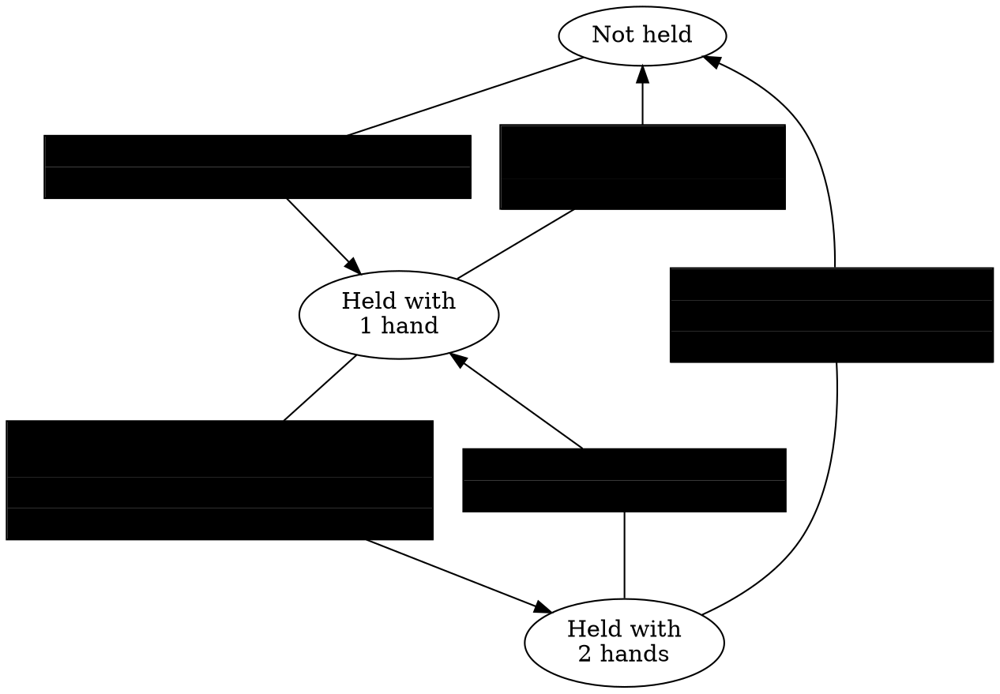

# Horizon Technical Specification {ignore=true}

<!-- @import "[TOC]" {cmd="toc" depthFrom=1 depthTo=6 orderedList=true} -->

<!-- code_chunk_output -->

1. [Overview](#overview)
2. [Worlds](#worlds)
    1. [Metadata and Publishing](#metadata-and-publishing)
    2. [Instances](#instances)
    3. [Doors and Linking](#doors-and-linking)
3. [Scene Graph](#scene-graph)
    1. [Hierarchy](#hierarchy)
        1. [Groups](#groups)
        2. [Empty Objects](#empty-objects)
    2. [Transforms (Local and Global)](#transforms-local-and-global)
    3. [Entity Properties](#entity-properties)
4. [Entities](#entities)
    1. [Overview](#overview-1)
    2. [Docs on each kind of gizmo](#docs-on-each-kind-of-gizmo)
        1. [Audio Gizmo + AI gen](#audio-gizmo--ai-gen)
        2. [Text Gizmo](#text-gizmo)
        3. [Trigger Gizmo](#trigger-gizmo)
    3. [Common Properties](#common-properties)
    4. [Tags](#tags)
5. [Custom Model Import](#custom-model-import)
    1. [Overview](#overview-2)
    2. [SubD vs Custom Models](#subd-vs-custom-models)
    3. [Assets](#assets)
        1. [Uploads](#uploads)
        2. [Errors](#errors)
        3. [Asset Templates](#asset-templates)
        4. [Textures](#textures)
        5. [Materials](#materials)
    4. [Performance](#performance)
        1. [Draw Calls](#draw-calls)
        2. [Vertices, Polygons, and Entities](#vertices-polygons-and-entities)
        3. [Memory](#memory)
    5. [Horizon Lighting](#horizon-lighting)
    6. [General Tips](#general-tips)
6. [Text Importing / Text Assets](#text-importing--text-assets)
7. [Scripting](#scripting)
    1. [Properties](#properties)
    2. [Types](#types)
        1. [Entity Subtypes](#entity-subtypes)
    3. [Components](#components)
        1. [Props (and wiring)](#props-and-wiring)
        2. [Lifecycle](#lifecycle)
        3. [Receiving Events](#receiving-events)
        4. [Components <--> Entities](#components---entities)
    4. [Async (Timers)](#async-timers)
    5. [Local Scripts and Ownership](#local-scripts-and-ownership)
    6. [PrePhysics vs Default Updates](#prephysics-vs-default-updates)
    7. [Events (Sending and Receiving)](#events-sending-and-receiving)
        1. [Code Block Event](#code-block-event)
        2. [Local Events](#local-events)
        3. [Network Events](#network-events)
        4. [Broadcast events](#broadcast-events)
    8. [Frame Sequence](#frame-sequence)
8. [Network](#network)
    1. [Clients (Devices and the Server)](#clients-devices-and-the-server)
    2. [Ownership](#ownership)
    3. [Ownership Transfer](#ownership-transfer)
        1. [Auto-Transfers](#auto-transfers)
    4. [Network Events](#network-events-1)
    5. [Authority and Reconciliation](#authority-and-reconciliation)
9. [Physics](#physics)
    1. [Overview](#overview-3)
    2. [Creating a Physical Entity](#creating-a-physical-entity)
    3. [Collisions and Triggers](#collisions-and-triggers)
        1. [Collidability](#collidability)
        2. [Controlling Collisions](#controlling-collisions)
        3. [Triggers](#triggers)
    4. [PrePhysics vs Defaults Scripts](#prephysics-vs-defaults-scripts)
    5. [Simulated vs Locked Entities](#simulated-vs-locked-entities)
    6. [Projectiles](#projectiles)
    7. [Gravity](#gravity)
    8. [Velocity, Acceleration, Force, Torque](#velocity-acceleration-force-torque)
    9. [Properties: Mass, Drag, Center-of-Mass](#properties-mass-drag-center-of-mass)
    10. [Players](#players)
10. [Players](#players-1)
    1. [Identifying Players](#identifying-players)
        1. [Player ID](#player-id)
        2. [Player Indices](#player-indices)
        3. [Listing All Players](#listing-all-players)
        4. [Server Player](#server-player)
        5. [Local Player](#local-player)
    2. [Player Events and Actions](#player-events-and-actions)
        1. [Entering and Exiting a World](#entering-and-exiting-a-world)
        2. [Grabbable Entities](#grabbable-entities)
            1. [Creating a Grabbable Entity](#creating-a-grabbable-entity)
                1. [Setting Who Can Grab](#setting-who-can-grab)
                2. [Setting Who Can Take From Holder](#setting-who-can-take-from-holder)
            2. [Releasing Objects](#releasing-objects)
            3. [Grab Sequence and Events](#grab-sequence-and-events)
                1. [Hand-off (Switching Hands or Players)](#hand-off-switching-hands-or-players)
            4. [Moving / Locking Held Objects](#moving--locking-held-objects)
        3. [Holstering](#holstering)
        4. [Attaching](#attaching)
        5. [AFK](#afk)
    3. [Player Controls](#player-controls)
11. [Persistence](#persistence)
    1. [Overview](#overview-4)
    2. [Leaderboards](#leaderboards)
    3. [Quests](#quests)
    4. [In-World Purchases (IWP)](#in-world-purchases-iwp)
    5. [Player Persistent Variables (PPV)](#player-persistent-variables-ppv)
12. [Assets and Spawning](#assets-and-spawning)
13. [Custom UI](#custom-ui)
    1. [Bindings technical overview (what *T* is allowed, set, derive, and notes on preventing memory growth - e.g. don't keep deriving)](#bindings-technical-overview-what-t-is-allowed-set-derive-and-notes-on-preventing-memory-growth---eg-dont-keep-deriving)
14. ["Cross Screens" - Mobile vs PC vs VR](#cross-screens---mobile-vs-pc-vs-vr)
15. [Performance Optimization](#performance-optimization)
    1. [Physics](#physics-1)
    2. [Gizmos](#gizmos)
    3. [Bridge calls explanation](#bridge-calls-explanation)
    4. [Draw-call specification](#draw-call-specification)
    5. [Perfetto hints](#perfetto-hints)
    6. [Memory](#memory-1)
16. [List of all desktop editor shortcuts](#list-of-all-desktop-editor-shortcuts)
17. [Glossary](#glossary)

<!-- /code_chunk_output -->

# TODO {ignore=true}
  - Golden path steps of "ramping up" to make a tutorial

# Overview
* General description of what Horizon is and is not capable of.

# Worlds
## Metadata and Publishing
Name, description, comfort setting, player count, etc.
## Instances
## Doors and Linking

# Scene Graph
## Hierarchy
Groups, Parents, Children, and Pivots
What is / isn't mutable
### Groups
### Empty Objects

## Transforms (Local and Global)
## Entity Properties

# Entities
## Overview
Gizmos, as, ...

## Docs on each kind of gizmo
  - Leaderboard, Quests, and IWP should just point to the PPVs section

### Audio Gizmo + AI gen

### Text Gizmo
  - all supported commands

### Trigger Gizmo
Two *secret* `CodeBlockEvents`: `empty` and `occupied`

## Common Properties
*  Motion and Interaction (Animated, Grabbable, Physics, Both)
* Parents and Children
* Visible and Collidable
* Transform (position, rotation, scale, forward, up, right)
* Simulated
## Tags

# Custom Model Import
## Overview
Assets, imports, templates, updates.

## SubD vs Custom Models

## Assets
### Uploads
* Explain collection of FBXs and PNGs.
* Each FBX will be a new asset.
* Texture rules
* Suffix rules
* Pivots
* Limits
* Colliders

###  Errors
List and explanation of all possible errors

### Asset Templates
E.g. only root-level properties and scripts are maintained in an update.
You CAN nest.

### Textures

* Formats: `png`s; Horizon will ingest any valid png and convert it as necessary to its own internal representation
* Any size is allowed but power-of-2 is better for perf
* Does Horizon de-dupe textures for download?
* Horizon does not currently support mipmaps
* Materials can be emissive insofar as they are "unlit" but they don't contribute to the light probes
* Horizon used packed textures for different material attributes; see the materials section
* Can we verify that Horizon uses ASTC 2.0 (Adaptive Scalable Texture Compression)

### Materials

!!! note No post-processing
    Current Horizon has no post-process rendering options which makes things like bloom, motion blur, sepia, etc impossible.

## Performance
### Draw Calls
* Do not rely on Horizon to do any draw call batching. Meaning each instantiated asset is at least 1 draw call.
* Hypothesis / guess: UI Gizmos are rendered into textures on the *CPU* and then rendered as single quads with a texture on the GPU (don't know about batching...). What about name tags?

* Theory: 1 draw call per avatar, 1 draw call per UI Gizmo, 1+ draw calls per instantiated asset, 1 draw call per FX/trail gizmo that is running, 1 draw call per emotes (per player that is emoting), 1+ draw call per NPC
    * In build mode: 1 draw call per gizmo

 | Element  | Draw Call  | Notes |
|---|---|---|
| Player  | 3+ each  |  Avatar, name tag, emotes |
| Entities | 1+ each | Per instantiated asset |
| UI Gizmo | 1 each | back-face / occlusion? |
| Particle / Trail Gizmo | 1 each | occlusion-culled? |
| Text Gizmo | 1 each | THESE MAY BE BATCHED! |
| Door Gizmo | 1 each | occlusion-culled? |
| Leaderboard / Quests / Media Board / Purchase UI | 1 each | occlusion-culled? |
| Mirror Gizmo | 2x total draw call count? |... REALLY?!...
| Pop-ups | 1 per visible | occluded? |
| Projectile Launcher | 1 per visible |

!!! info There are draw calls outside a creator's control
    Things like the sky, personal UI, the wrist UI, teleport visuals, onscreen controls, and many other elements may add to the "base number" of draw-calls.

!!! tip Group objects with the same materials together into an asset when possible
    If you have 50 bricks with the same material all in 1 asset Horizon will batch that to be 1 draw call. If those are instead a single brick duplicated 50 times then that will be at least 50 draw calls.

    If you have an asset with 25 bricks of material A and 25 of material B then this will be 2 draw calls. If instead they were all duplicated then there would be 50 draw calls.

!!! warning Multi-material assets increase draw call count
    If an asset has multiple materials or material textures then the draw call count will increase by the number of them.

### Vertices, Polygons, and Entities
...

### Memory
...


## Horizon Lighting
GI overview and tips.

## General Tips
Triangulate. Normals direction.
Workflows / advice for greyboxing.

# Text Importing / Text Assets

# Scripting
## Properties
## Types
Player, Asset, Entity can be compared by equality. Vec3, Quaternion, Color can be compared approximately; these classes have mutable and immutable versions. There is a special `as` method on Entities.
### Entity Subtypes
## Components
### Props (and wiring)
### Lifecycle
  Construction, preStart, start, dispose
### Receiving Events
a few notes but link to the events section
### Components <--> Entities
## Async (Timers)

## Local Scripts and Ownership
a few sentences and link to Networking
## PrePhysics vs Default Updates
a few sentences and link to Physics

## Events (Sending and Receiving)
### Code Block Event
### Local Events
### Network Events
### Broadcast events
Mention coalescence

## Frame Sequence

# Network
## Clients (Devices and the Server)
## Ownership
!!! danger Ownership does not cascade to children
    When you transfer ownership of an entity the ownership is *not* automatically transferred for the children (nor their children). If you want children to be transferred as well then you must manually transfer ownership of everything you care about.

    !!! example
        ```ts
        anEntity.owner.set(newOwner)
        anEntity.children.get().forEach(c => c.owner.set(newOwner))
        ```
        This transfers ownership of an entity and its children but not their children. Rather than just recursively transferring everything, instead consider what needs to actually be transferred (many objects are not scripted)!
## Ownership Transfer
* API overview of `transferOwnership` and `receiveOwnership` and `SerializableState`.
* Full-details sequencing diagrams.
* Clarify how scripts are instantiated per-owner as part of entity transfer.
### Auto-Transfers
Collisions and Grabbables

## Network Events

## Authority and Reconciliation
What happens if two scripts are setting an object's position at the "same time"?

# Physics
## Overview
High-level framing of what Horizon is capable of. Example: there are no constraints (no hinges, springs, connecting rods, etc)

## Creating a Physical Entity
....

## Collisions and Triggers
* Colliding with dynamic vs static.
* Colliding with player vs objects.
* Collider gizmo.
* Can control if ownership transfer on collision (see the network section!)

### Collidability

Mesh entities an collider gizmos have **colliders** that are used by the physics system (for collisions, trigger detection, grabbing, avatars standing, etc).

A **collider is active** when the following true
   * Its entity has `collidable` set `true`
   * Its `parent` (and all their parents) have `collidable` set to `true`
   * It is not occluded by other colliders in the world

and is otherwise ignored by the physics system. For example if the floor's collider is inactive an avatar will fall through it. If a grabbable entity's collider is inactive you cannot grab it.

!!! info In order for a group to be seen by the physics system it must have at least one active collider within it (however deep).
    For example if all the colliders in a group are inactive then that group cannot be grabbed, it will not been seen by any triggers, it cannot be stood on, etc.

### Controlling Collisions
* Turn collidable on / off
* Control can collide with players, objects, or both

### Triggers

Trigger detection is done at the *collider* level. When a collider enters/leaves a trigger then (if it is an entity-detecting trigger) Horizon starts with the entity and traverse up the ancestor chain until it finds the first entity with a matching tag, send it the event, and then STOPS the traversal.

This means that whenever it seems both a parent and a child could get a trigger event at the same time then the child always gets it first.

## PrePhysics vs Defaults Scripts

## Simulated vs Locked Entities

## Projectiles

## Gravity

## Velocity, Acceleration, Force, Torque
Note: `zeroVelocity` clears out positional and rotational velocity.

## Properties: Mass, Drag, Center-of-Mass

## Players
Velocity, locomotion speed, jump speed

# Players

The `Player` class represents a person in an instance. There is also special `Player` instance that represents the server. `Player` instances are allocated by the system; you should never attempt to allocate them. `Player` instances can be compared referentially `aPlayer === bPlayer` which is the same as `aPlayer.id === bPlayer.id`.

Each `Player` has an `id` and an `index` which serve different purposes (see below). From a `Player` instance you can access `PlayerBodyBart`s, e.g. `aPlayer.leftHand` or get their name `aPlayer.name.get()`. There are many `CodeBlockEvents` associated with players (such as entering/exiting a world, grabbing objects, and much). All aspects of players are described in detail in the next sections.

## Identifying Players

Players in Horizon all have a global "account id". There is no way to access this id directly, although Horizon users it under the hood for persistence (player variables, leaderboards, and quests). Within an instance players can be referenced by the `id` or the `index` they are assigned on entry. Player `index`es are reused when players leave; `id`s are not.

### Player ID

Each `Player` instance has a `readonly id: number` property.

!!! info Entering an instance assigns a new ID (for that instance)
    When a person enters an instance they are assigned an `id` that has not yet been used in that instance. If they leave the instance and later return, they will get yet another `id`.

!!! danger IDs are per-instance. Do not persist them.
    The `id` that a player gets in one instance of a world has nothing to do with the `id` they might get in another instance. If a person gets assigned `id` 42 in one instance then the moment they leave that instance you should no longer associate them with the `id`.

!!! warning IDs should be used rarely
    Since you can compare two `Player` instances directly with `===` and `!==` there is little reason to use the `id` property. You can even use `Player` instances as keys in a `Map`. If you have a reason to use the `id` field, be mindful that the association between a person and their `id` only exists until they leave that instance.

### Player Indices

The `Player` class has the property

```ts
index : ReadonlyHorizonProperty<number>
```

which you access via

```ts
aPlayer.index.get()
```
.

When a player enters a world they are also assigned an `index`. The `index` will be a number between `0` and `n-1`, where `n` is the maximum number of players allowed in an instance. When a player enters an instance they are assigned an `index` value that is not currently used by any other player. When they leave that value becomes available again.

For example: if three players arrive in an instance they may be assigned `index` values of `0`, `1`, and `2`. If they player with `index` `1` leaves then the next player that arrives may get index `1` again.

!!! danger Do not rely on the order indices are assigned
    There are no guarantees that a player gets the *smallest* available `index`. Any available value maybe be assigned to a new player.

!!! example Example: per-player objects
    A common use of `index`es is managing per-player objects. For instance, if you want every player to have a shield when they spawn in. Then you could have an array of shield `Entity`s and when a player enters the world, assign them the shield from that array that matches their `index`.

### Listing All Players

The `World` class has the method:

```ts
getAllPlayers() : Player[]
```

which returns the current list of players in the world. Note that the order of this array should not be relied upon. The order may change between calls and there is no relation to the `index` property described above.

!!! note
    `getAllPlayers` does not include the server player.

TODO: relation to enter and exit

### Server Player

There is a special instance of the `Player` class that represents the *server*. It has an `id` but no meaningful `index`. All APIs work but return defaults (example: the location will return the origin; name will return the empty string).

The `World` class has the method

```ts
getServerPlayer(): Player
```

which can be used to access it. The primary use cases are

1. transferring ownership back to the server:

```ts
anEntity.owner.set(world.getServerPlayer())
```

2. checking if an entity is owned by the server:

```ts
if (anEntity.owner.get() === world.getServerPlayer()) { /* ... */ }
```

3. checking if a script is running locally or not:

```ts
if (world.getLocalPlayer() === world.getServerPlayer()) { /* ... */ }
```

### Local Player

Every script is run on an execution client associated with a `Player` (see the networking section for more info). If the script is set to *default* mode, then it is always running on the server. If the script is set to *local* then is can be transferred to and from the servers and the local devices of players.

If a script is running locally on a human-player's device then that player is the *local player* for that script. If the script is running on the server then the *server player* is the *local player* for that script.

The `World` class has the method

```ts
getLocalPlayer() : Player
```

for determining which `Player`'s device the current script is running one. This method with return a human-player in the world or the *server player*.

## Player Events and Actions

### Entering and Exiting a World
### Grabbable Entities

#### Creating a Grabbable Entity

For an entity to be grabbable it needs:
1. `Motion` to be `Interactive`
1. `Interaction` to be `Grabbable` or `Both`
1. At least one active collider within it

See the Entity Properties section for details on `Motion` and `Interaction`. See the section on `Collidability` for more information on active colliders.

!!! danger Grabbables cannot be inside of Groups
    A grabbable can be inside of an empty object but it cannot be in a group. See the section of groups for more information.

!!! warning Entities must be collidable to be grabbed!
    If a grabbable entity is not `collidable` then it cannot be grabbed. If it is a group and none of the colliders with it are active then it cannot be grabbed, even if the root is collidable!

##### Setting Who Can Grab
    ...

##### Setting Who Can Take From Holder
...


!!! warning Grab Ranges differ between platforms
    For example mobile players can grab entities when much farther away than VR players

!!! tip Controlling grab-distance
    You cannot explicitly control from how far away an entity can be grabbed; however you can use a trigger to control grabbability (for example: make an entity grabbable by a specific play when they are in that trigger).

```ts
// GrabbableEntity
setWhoCanGrab(players: Player[]): void;
```

#### Releasing Objects
Let go, force release, or get too far away

Note: disabling `simulation` on a held object will force release it.

!!! info If a **held object moves too far** from a player's hand, such as via scripting, then that hand **will release** the object. This can go cause the object to be fully released or to go from two-hand to one-hand grab (if one hand is still close enough to stay holding).

#### Grab Sequence and Events

There are a number of events associated with grabbing and holding. The diagram below shows how the state of an object changes with user-actions (highlighted in blue). Actions have associated `CodeBlockEvent`s that are sent. If a box contains multiple events then they are sent in the top-down order shown.



##### Hand-off (Switching Hands or Players)

When an entity is transferred from one hand to another or from one player to another then the entity is *fully released* by the first player before being grabbed by the second player.

!!! warning `OnGrabEnd` is sent during a "hand-off".
    The `OnGrabEnd` event may mean that an entity is about to grabbed by a different hand or player.

#### Moving / Locking Held Objects
Explain how hand.position is human hand (not avatar)
Explain how you can prevent the object from being updated by physics system

### Holstering
### Attaching
### AFK

## Player Controls

# Persistence
## Overview
  - Cloning a world
  - World persistence does not exists
## Leaderboards
  - Overview
    - Kind of data allowed
    - Player opt-out
  - Creation
  - Using the Gizmo
  - APIs
  - Resetting
    - Weekly / Monthly
## Quests
  - Overview
    - Tracked
  - Creation
  - Using the Gizmo
    - Which are visible
  - APIs
  - Resetting
## In-World Purchases (IWP)
  - Overview
  - Creation
    - Types (consumables, durables)
  - Using the Gizmo
  - APIs
    - Events are broadcast `CodeBlockEvent`s and can be subscribed to from anywhere (except maybe local?)
  - Test Purchases
    - Collaborators can but Testers cannot (will be charged)
## Player Persistent Variables (PPV)
  - Overview
    - Groups
    - Types: `number` and JSON-serializable `object`.
  - Creation
  - Read / Write
  - Resetting

# Assets and Spawning

# Custom UI
## Bindings technical overview (what *T* is allowed, set, derive, and notes on preventing memory growth - e.g. don't keep deriving)

# "Cross Screens" - Mobile vs PC vs VR

# Performance Optimization

## Physics
Colliders, triggers,

## Gizmos
* pool FX, sounds,
* limit mirror (1) and dynamic lights (20)

## Bridge calls explanation
## Draw-call specification
## Perfetto hints

## Memory
* UIGizmos have an option to enable mipmaps; this will increase visual quality but also increase memory use

# List of all desktop editor shortcuts
e.g. alt-click to orbit

# Glossary

*[HTML]: Hyper Text Markup Language
*[W3C]: World Wide Web Consortium
*[Player]: A person in an instance (or the server).

# OPEN QUESTIONS {ignore=true}
* does despawn cause grab "release"?
* does "attach" cause "release"?
* does an object colliding with another cause "release" (probably same as moving too far)
* does ownership transfer while held send any events?
* When do entity.owner vs world.getLocalPlayer() change - it seems that in `transferOwnership` that the former has already changed but not the latter?
*inside of `playerExit` callback is the player still in the array? Right after?
