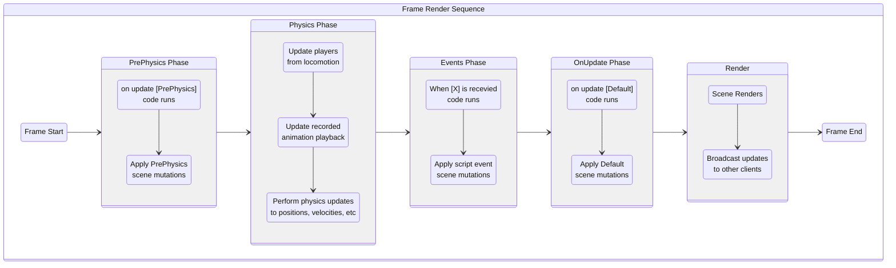
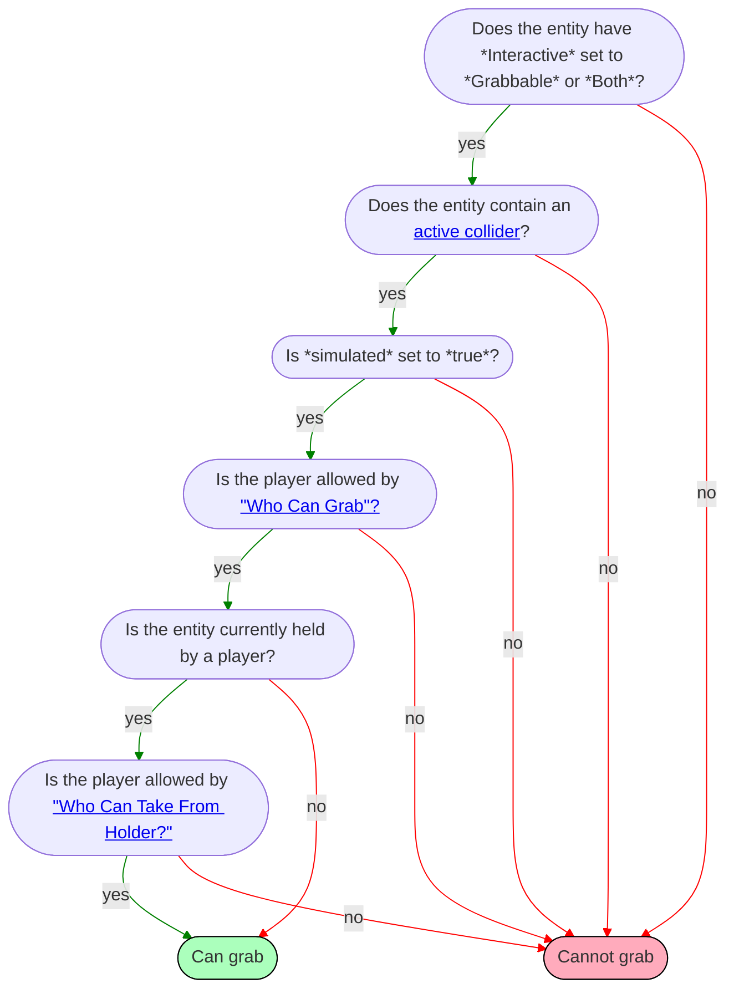

# Horizon Technical Specification {ignore=true}

<div class="print-note">This is an in-development (Jan '25) <b>community-written</b> document. For questions contact <i>wafflecopters</i>.</div>

<!-- @import "[TOC]" {cmd="toc" depthFrom=1 depthTo=6 orderedList=true} -->

<!-- code_chunk_output -->

1. [Overview](#overview)
2. [Worlds](#worlds)
    1. [Metadata and Publishing](#metadata-and-publishing)
    2. [Instances](#instances)
    3. [Doors and Linking](#doors-and-linking)
3. [Scene Graph](#scene-graph)
    1. [Hierarchy](#hierarchy)
    2. [Hierarchy](#hierarchy-1)
        1. [Ancestors](#ancestors)
        2. [Empty Object and Groups](#empty-object-and-groups)
    3. [Coordinates System](#coordinates-system)
    4. [Transforms](#transforms)
        1. [Position](#position)
        2. [Rotation](#rotation)
        3. [Scale](#scale)
        4. [Offsets - Move, Rotate, and Scale](#offsets---move-rotate-and-scale)
        5. [Transform Property](#transform-property)
        6. [Local Transforms](#local-transforms)
        7. [Pivot Points](#pivot-points)
4. [Entities](#entities)
    1. [Overview](#overview-1)
    2. [Static Entities](#static-entities)
    3. [Dynamic Entities](#dynamic-entities)
        1. [Animated Entities](#animated-entities)
        2. [Interactive Entities](#interactive-entities)
    4. [Gizmos](#gizmos)
        1. [Common Properties](#common-properties)
        2. [Custom UI Gizmo](#custom-ui-gizmo)
        3. [Door Gizmo](#door-gizmo)
        4. [Dynamic Light Gizmo](#dynamic-light-gizmo)
        5. [Environment Gizmo](#environment-gizmo)
        6. [ParticleFx Gizmo](#particlefx-gizmo)
        7. [Projectile Launcher Gizmo](#projectile-launcher-gizmo)
        8. [Quests Gizmo](#quests-gizmo)
        9. [Raycast Gizmo](#raycast-gizmo)
        10. [Script Gizmo](#script-gizmo)
        11. [Snap Destination Gizmo](#snap-destination-gizmo)
        12. [Sound Gizmo](#sound-gizmo)
        13. [Sound Recorder Gizmo](#sound-recorder-gizmo)
        14. [Spawn Point Gizmo](#spawn-point-gizmo)
        15. [Text Gizmo](#text-gizmo)
        16. [TrailFx Gizmo](#trailfx-gizmo)
        17. [Trigger Gizmo](#trigger-gizmo)
        18. [World Leaderboard Gizmo](#world-leaderboard-gizmo)
    5. [Tags](#tags)
5. [Custom Model Import](#custom-model-import)
    1. [Overview](#overview-2)
    2. [SubD vs Custom Models](#subd-vs-custom-models)
    3. [Assets](#assets)
        1. [Uploads](#uploads)
        2. [Errors](#errors)
        3. [Asset Templates](#asset-templates)
        4. [Textures](#textures)
        5. [Materials](#materials)
    4. [Performance](#performance)
        1. [Draw Calls](#draw-calls)
        2. [Vertices, Polygons, and Entities](#vertices-polygons-and-entities)
        3. [Memory](#memory)
    5. [Horizon Lighting](#horizon-lighting)
    6. [General Tips](#general-tips)
6. [Text Importing / Text Assets](#text-importing--text-assets)
7. [Scripting](#scripting)
    1. [Horizon Properties](#horizon-properties)
    2. [Types](#types)
        1. [In-Place Mutation](#in-place-mutation)
        2. [Color](#color)
        3. [Vec3](#vec3)
        4. [Quaternion](#quaternion)
        5. [Entity Subtypes](#entity-subtypes)
    3. [Files](#files)
    4. [Components](#components)
        1. [Component Class](#component-class)
        2. [Props (and wiring)](#props-and-wiring)
        3. [Lifecycle](#lifecycle)
        4. [Sending and Receiving Events](#sending-and-receiving-events)
        5. [Converting Between Components and Entities](#converting-between-components-and-entities)
        6. [Subclasses](#subclasses)
    5. [Async (Timers)](#async-timers)
    6. [Local Scripts and Ownership](#local-scripts-and-ownership)
    7. [PrePhysics vs OnUpdate Updates](#prephysics-vs-onupdate-updates)
    8. [Events (Sending and Receiving)](#events-sending-and-receiving)
        1. [Code Block Event](#code-block-event)
        2. [Local Events](#local-events)
        3. [Network Events](#network-events)
        4. [Broadcast events](#broadcast-events)
    9. [Frame Sequence](#frame-sequence)
        1. [PrePhysics Phase](#prephysics-phase)
        2. [Physics Phase](#physics-phase)
        3. [Events Phase](#events-phase)
        4. [OnUpdate Phase](#onupdate-phase)
8. [Network](#network)
    1. [Clients (Devices and the Server)](#clients-devices-and-the-server)
    2. [Ownership](#ownership)
    3. [Ownership Transfer](#ownership-transfer)
        1. [Auto-Transfers](#auto-transfers)
    4. [Network Events](#network-events-1)
    5. [Authority and Reconciliation](#authority-and-reconciliation)
9. [Physics](#physics)
    1. [Overview](#overview-3)
    2. [Creating a Physical Entity](#creating-a-physical-entity)
    3. [Collisions and Triggers](#collisions-and-triggers)
        1. [Collidability](#collidability)
        2. [Controlling Collisions](#controlling-collisions)
        3. [Triggers](#triggers)
    4. [PrePhysics vs Defaults Scripts](#prephysics-vs-defaults-scripts)
    5. [Simulated vs Locked Entities](#simulated-vs-locked-entities)
    6. [Projectiles](#projectiles)
    7. [Gravity](#gravity)
    8. [Velocity, Acceleration, Force, Torque](#velocity-acceleration-force-torque)
    9. [Properties: Mass, Drag, Center-of-Mass](#properties-mass-drag-center-of-mass)
    10. [Players](#players)
10. [Players](#players-1)
    1. [Identifying Players](#identifying-players)
        1. [Player ID](#player-id)
        2. [Player Indices](#player-indices)
        3. [Listing All Players](#listing-all-players)
        4. [Server Player](#server-player)
        5. [Local Player](#local-player)
    2. [Player Events and Actions](#player-events-and-actions)
        1. [Entering and Exiting a World](#entering-and-exiting-a-world)
        2. [AFK](#afk)
11. [Grabbing and Holding Entities](#grabbing-and-holding-entities)
    1. [Creating a Grabbable Entity](#creating-a-grabbable-entity)
    2. [Can Grab](#can-grab)
        1. [Setting "Who Can Grab?"](#setting-who-can-grab)
        2. [Setting "Who Can Take From Holder?"](#setting-who-can-take-from-holder)
        3. [Grab Distance](#grab-distance)
    3. [Grabbing Entities](#grabbing-entities)
        1. [Grab Lock](#grab-lock)
        2. [Force Grab](#force-grab)
    4. [Releasing Entities](#releasing-entities)
        1. [Manual release](#manual-release)
        2. [Force release](#force-release)
    5. [Grab Sequence and Events](#grab-sequence-and-events)
        1. [Hand-off (Switching Hands or Players)](#hand-off-switching-hands-or-players)
        2. [Moving Held Entities](#moving-held-entities)
            1. [Moving a Held Entity Locally in Relation to the Hand](#moving-a-held-entity-locally-in-relation-to-the-hand)
            2. [Moving a Held Entity Globally in Relation to the World](#moving-a-held-entity-globally-in-relation-to-the-world)
12. [Attaching Entities](#attaching-entities)
    1. [Creating an Attachable](#creating-an-attachable)
    2. [Attachable By](#attachable-by)
    3. [Avatar Attachable](#avatar-attachable)
        1. [Scripted Attach](#scripted-attach)
        2. [Sticky](#sticky)
            1. [Stick To](#stick-to)
        3. [Anchor](#anchor)
            1. [Anchor To](#anchor-to)
            2. [Socket Attachment](#socket-attachment)
            3. [Auto Scale to Anchor](#auto-scale-to-anchor)
    4. [Attach to 2D screen](#attach-to-2d-screen)
13. [Holstering Entities](#holstering-entities)
14. [Player Input](#player-input)
15. [Persistence](#persistence)
    1. [Overview](#overview-4)
    2. [Leaderboards](#leaderboards)
    3. [Quests](#quests)
    4. [In-World Purchases (IWP)](#in-world-purchases-iwp)
    5. [Player Persistent Variables (PPV)](#player-persistent-variables-ppv)
16. [Spawning](#spawning)
    1. [Assets](#assets-1)
    2. [Simple Spawning](#simple-spawning)
    3. [Spawn Controller](#spawn-controller)
    4. [Sublevels](#sublevels)
17. [Custom UI](#custom-ui)
    1. [Bindings](#bindings)
18. ["Cross Screens" - Mobile vs PC vs VR](#cross-screens---mobile-vs-pc-vs-vr)
19. [Performance Optimization](#performance-optimization)
    1. [Physics](#physics-1)
    2. [Gizmos](#gizmos-1)
    3. [Bridge calls explanation](#bridge-calls-explanation)
    4. [Draw-call specification](#draw-call-specification)
    5. [Perfetto hints](#perfetto-hints)
    6. [Memory](#memory-1)
20. [List of all desktop editor shortcuts](#list-of-all-desktop-editor-shortcuts)
21. [Common Problems and Troubleshooting](#common-problems-and-troubleshooting)
22. [Glossary](#glossary)

<!-- /code_chunk_output -->

<div style="page-break-after: always;"></div>

# TODO {ignore=true}

- Golden path steps of "ramping up" to make a tutorial

# Overview

- General description of what Horizon is and is not capable of.

# Worlds

## Metadata and Publishing

Name, description, comfort setting, player count, etc.

## Instances

## Doors and Linking

# Scene Graph

## Hierarchy

## Hierarchy

Any entity can be set as the child of another entity. For example, you might make a robot's forearm a Mesh Entity that is a child of the upper arm Mesh Entity. Or you might put a steering wheel inside a car. The main reasons to create parent-child relationships are:

1. To have the transform of one entity impact another (e.g. moving a car also moves the steering wheel within it).
2. To create "layers" or "folders" in the editor (e.g. putting all trees in a ["collection"](#empty-object-and-groups) to make them easier to manage).

When an entity has no parent it is called a **root entity**.

### Ancestors

We call the collection of an entity's parent, grandparent, great-grandparent, etc the entity's **ancestors**. If the entity has no parent, we say it has 0 ancestors. If it has just a parent and then grandparent, it would have 2.

We call the children, and their children, and their children, etc of an entity its **descendants**.

### Empty Object and Groups

Empty Objects and Groups are two methods of "collection" entities together. They are similar in most regards, with only a few differences:

TODO - Label the headers (X = Collection Type, Y = Collection Properties)
|   | Groups | Empty Object |
|---|---|---|
| **Pivots** | Always at the **center of all their children**. Meaning that moving one child will move the [pivot point](#pivot-points). | The **center of the Empty Object** is always the [pivot point](#pivot-points). |
| **[Interactive Entity](#interactive-entities) Children** | Children have their **interaction disabled**. | Children **can be [Interactive Entity](#interactive-entities)**, if the Empty Object's `Motion` is `None`. |
| **Projectile Launcher** | Projectile collisions happen **on the group**. | Projectile collisions happen **on a child**. |
| **Child Count** | **1** or more. | **0** or more. |

Empty Objects and Groups behave identically in regards to collisions and triggers in all cases other than projectiles launched from the projectile gizmo.

TODO - explain how collisions and triggers both do the algorithm of "start with the colliding leaf object and walk up the ancestor chain until you find the first with a matching tag and then immediately stop".

## Coordinates System

**Axes**. Following standard convention, the editor uses *red* for the *<span style="color:red">x-axis</span>*, *green* for the *<span style="color:green">y-axis</span>*, and *blue* for the *<span style="color:blue">z-axis</span>* when displaying "manipulation handles" to move, rotate, or scale an entity.

**Y-up**. The positive-y axis is *up*.

**Left-handed**. The coordinate system is *left-handed*, meaning that if position the camera so that the positive y-axis is pointing up and the positive x-axis is pointing right then the positive z-axis points forward.

TODO - picture

**Meters**. Distances and positions in Horizon are referenced using meters. For example, the position `(0, 1, 0)` is 1 meter (roughly 3.28 feet) up from the center of the world. Avatars in Horizon are approximately 1.8 meter tall (5 feet 11 inches).

**Origin**. The editor has the origin `(0,0,0)` at the center of the grid. The origin cannot be moved.

## Transforms

Entities have three transform properties: position, rotation, and scale. You can use the properties panel or the "manipulation handles" to manipulate these properties. Editing these values determines how entities are transformed when a new instance starts. **Within the Horizon editor you can only configure initial position, rotation, and scale**. If you want these values to change while the world is running, you will need to modifying the values using scripting.

In the desktop editor you can switch quickly between transform tools via the keyboard.
| Manipulation Tool  |  Keyboard Shortcut |
|---|---|
| Move | W |
| Rotate | E |
| Scale | R |

!!! note No Arbitrary Matrix Transforms
    Horizon does not currently allow matrix transforms. You can achieve some skew effects by rotating an entity inside a non-uniformly scaled one. Arbitrary matrix transforms are not exposed to the developer.

### Position

Positions are specified as 3-dimensional vectors, represented as the `Vec3` type in TypeScript. In the editor these are written as a "triple" such as `(0, 0, 0)`.

The `position` property on an entity determines where in 3D space the [pivot point](#pivots) of the entity is, in relation to the origin of the world. Often the pivot is just the center of the entity, and so typically the position of an entity is where its center point is.

!!! example Setting a position
    Position is a [read-write property](#horizon-properties) on the `Entity` class. To get the current position of an entity, do:

    ```td
    entity.position.get()
    ```

    To move an entity to be 3 meters up from the origin and 4 meters forward, do:
    ```ts
    entity.position.set(new Vec3(0, 3, 4))
    ```

Setting the `position` property is not influenced by the position of any [ancestors](#ancestors).
See [local transforms](#local-transforms) for setting position relative to a parent entity.

### Rotation

Rotations are specified using a mathematical object called a `Quaternion`. Whenever you see the word "Quaternion" you can just think it means "rotation". This isn't mathematically true but is sufficient for nearly all uses.

Rotations in the editor are specified using [Euler Angles](https://en.wikipedia.org/wiki/Euler_angles) which are a robust way of specifying yaw, pitch, and roll. The default **Euler Order** order in Horizon is **YXZ** meaning that entity does a *yaw*, then a *pitch*, and then a *roll* (when specifying Euler Angles). Euler angles are specified in **degrees**.

!!! tip Rotations are tricky!
    Rotations, Quaternions, Euler Angles, etc are all rather tricky and subtle concepts. It will take a lot of time to build an intuition for them. Be patient and don't worry if rotations seem complex (they are)!

The `rotation` property on an entity determines how much the entity is rotated around its [pivot point](#pivots). This rotation is specified *globally*, meaning that it is measured with respect to the world. A zero-rotation will have an entity's up-axis align with the world's y-axis, it's right-axis align with the world's x-axis, etc.

!!! example Setting a rotation
    Rotation is a [read-write property](#horizon-properties) on the `Entity` class. To get the current rotation of an entity, do:

    ```td
    entity.rotation.get()
    ```

    To rotate an entity so that it yaws 45 degrees and then rolls 90 degrees, do:
    ```ts
    entity.rotation.set(Quaternion.fromEuler(new Vec3(0, 90, 45)))
    ```

!!! tip Default Rotation ("Not rotated")
    If you want an entity to be "not rotated", set its rotation to be `(0, 0, 0)` in the editor. In Typescript you can use any of these lines (they all do the same thing):

    ```ts
    entity.rotation.set(Quaternion.fromEuler(new Vec3(0, 0, 0)))

    entity.rotation.set(Quaternion.fromEuler(Vec3.zero))

    entity.rotation.set(Quaternion.one)
    ```

Setting the `rotation` property is not influenced by the rotation of any [ancestors](#ancestors).
See [local transforms](#local-transforms) for setting rotation relative to a parent entity.

### Scale

Scales are specified as 3-dimensional vectors, represented as the `Vec3` type in TypeScript. In the editor these are written as a "triple" such as `(0, 0, 0)`.

**Inherent Size**: All entities have their own inherent size. For instance, a SubD cube is inherently 1 meter long on each side. Mesh assets have a size based on how they were authored. The inherent size of an entity is the size it is when it is *unscaled*.

The `scale` property determines the fraction an entity should be of its inherent size. For instance, a SubD cube is inherently 1 meter long on each side. If you set its scale to be `(1, 0.5, 2)` then the cube will be 1 meter long on its right-axis, 0.5 meters long on its up-axis, and 2 meters long on its forward-axis. In this example, the object has been "shrunk" along its up-axis, and "expanded" along its forward-axis.

!!! example Setting a scale
    Scale is a [read-write property](#horizion-properties) on the `Entity` class. To get the current scale of an entity, do:

    ```td
    entity.scale.get()
    ```

    To scale an entity so that it is 3 times bigger on its up axis (than its inherent size), do:
    ```ts
    entity.scale.set(new Vec3(1, 3, 1))
    ```

    Since the default scale is `(1,1,1)`, you can set any part of a scale to `1` to leave the entity "un-scaled" along that axis.

Setting the `scale` property is not influenced by the rotation of any [ancestors](#ancestors).
See [local transforms](#local-transforms) for setting scale relative to a parent entity.

!!! danger Mesh Primitives Have Unexpected Inherent Sizes
    The builtin mesh primitives have an inherent scale of 150 meters on each side (as of Feb 2025). Thus if you wanted to use a builtin mesh cube and have it be 1 meter long on each side, you would need to give it a scale of (1/150, 1/150, 1/150). This is a longstanding bug.

### Offsets - Move, Rotate, and Scale

When you want to set the position of an entity in relation to the current position we call this **offsetting** the position. There is no builtin API for doing this (as of Feb 2025) but it can be accomplished easily with the pattern of *get-modify-set*.

!!! example Offsetting position and scale
    To move an entity up 2 meters from its current location you can do:
    ```ts
    const offset = new Vec3(0, 2, 0)

    const pos = entity.position.get()
    const newPos = pos.add(offset)
    entity.position.set(pos)
    ```
    Offsetting scale works similarly.

!!! example Offsetting rotation
    TODO - Probably want to mention how the rotation is counter-clockwise when facing towards the positive direction of the axis

    To rotate an entity 90 degrees around the world's y-axis, from its current rotation, you can do:
    ```ts
    const offset = Quaternion.fromEuler(new Vec3(0, 90, 0))

    const rot = entity.rotation.get()
    const newRot = offset.mul(rot)
    entity.rotation.set(newRot)
    ```
    Note that `mul()` is used to combine rotations.

    If instead you wanted to rotate an entity 90 degrees around its own up-axis you would do:
    ```ts
    const offset = Quaternion.fromEuler(new Vec3(0, 90, 0))

    const rot = entity.rotation.get()
    const newRot = rot.mul(offset)
    entity.rotation.set(newRot)
    ```
    where the order of the Quaternion multiplication has been flipped. See [Quaternions](#quaternion) for more explanation.

### Transform Property

Each entity has a transform property that can be accessed via `entity.transform`.

```ts
class Entity {
  readonly transform: Transform

  // ...
}
```

Position, rotation, and scale can all be accessed through a `Transform`. The following two lines behave identically.

```
entity.position.set(p)
entity.transform.position.set(p)
```

Additionally, the `Transform` object can be used to access **local** position, rotation, and scale. See the next section for more information.

### Local Transforms

Entities have a `localPosition`, `localRotation`, and `localScale` that can be accessed via the transforms (e.g. `entity.transform.localPosition.get()`). These properties specify values in relation to a parent entity (or to the world if there is no parent).

Throughout this doc, other than this section, we omit the word *global*. When you see "position" it means "global position".

!!! example
    Let `parent` be an entity that has not been rotated nor scaled with `child` as one of its children.

    If `parent`'s **global position** is `(3, 0, 0)` and `child`'s **global position** is `(8, 1, 0)` then `child`'s **local position** will be `(5, 1, 0)`. The `child`'s local position is how much it is moved from its parent.

    Note: if the `parent` were rotated or scaled then you can't just "subtract the positions".

!!! note Global values "cascade down" the hierarchy
    An entity's global position/rotation/scale influences the global position/rotation/scale of its children (which then cascades to their child too!). If you have a plate on a table on a boat  and the boat moves globally then so do the table and the plate; if the table moves then so does the plate (and everything on it!)

!!! warning Local values exist in the transformed coordinate system of the parent
    Rotating and/or scaling an entity causing it axes to rotate and scaled as well. We call these the *transformed axes*.

    A child with local position of `(0, 6, 0)` is moved 6 units **from the global position** of its parent **along the parent's transformed up-axis**. If there is no parent then this is just 6 meters up the world's y-axis.

### Pivot Points

The transformation origin point of an entity is called its **pivot point**. It rotates around its pivot point, it scales around its pivot point, and when you move an entity its pivot point end ups at the position specified.

1. **Mesh entities** have their pivot points specified when they are authored (e.g. in Blender)
1. **Empty objects** have their pivot points at the center of the gizmo (the grey cube)
1. **Group entities** compute their pivot point to be at the center of their "bounding box" **in edit mode**. For example if you move a child in a group in edit mode then when click off the group it will recompute its pivot point to be at the center of all of its children. *This only happens in edit mode. The pivot of a group doesn't auto-change when the world is running (even if its children move around).*
1. **All other entities** (e.g. door, text gizmo, box collider gizmo, etc) have a builtin pivot point (usually at their center).

!!! warning In the desktop editor the manipulator handles don't always render at the pivot points!
    The desktop editor lets you choose to put the "manipulator handlers" at either the `Center` or `Pivot` of entities. Check that dropdown if you aren't seeing the pivots as you expect. This dropdown has no effect on how the world *runs* and is simply there to help with *editing*.

# Entities

## Overview

Every "thing" in the Horizon scene is an _entity_ (an grabbable item, a mesh, a light, a particle effect, a sound, a group of other entities, etc).

!!! info Note Entity and Object mean the same thing (except in TypeScript)
    Horizon calls these **objects** in the Desktop Editor and VR Tools but calls them **entities** in TypeScript. This document tries to consistently call them entities, except when quoting places where Horizon explicitly uses the word "object", but may accidentally call them objects on occasion.

    In TypeScript `Object` is a builtin for managing data, whereas `Entity` is a Horizon-specific class.

Gizmos, as, ...

## Static Entities

## Dynamic Entities

### Animated Entities

### Interactive Entities

When an entity's `Motion` is set to `Interactive` in the Properties panel it can be used for [grabbing](#grabbing-entities), [physics](#physics), or both. We call these **interactive entities**.

!!! warning Be careful putting Interactive Entities inside of hierarchies. Interactivity may be disabled!
    If you want to have an interactive entity be within a hierarchy (e.g. child of another entity) then all of its [ancestors](#ancestors) should be *Empty Objects* or *Mesh Entities*. All ancestors should have `Motion` set to `None`.

    If `Motion` is `Animated` or `Interactive` on any of its [ancestors](#ancestors) then interactivity will be disabled.

    If any of its ancestors are a [Group Entity](#empty-object-and-groups) then interactivity will be disabled.

    If there are any ancestors other than Mesh Entities, Empty Objects, and Group Entities then it is undefined whether or not interaction is disabled.

TODO - GrabbableEntity, PhysicalEntity classes (which should be mentioned in grabbing and physics sections too)

## Gizmos

There are Mesh Entity, Group Entity, Empty Object, Box/Capsule/Sphere Collider, and a bunch of *Gizmos*. TODO is it "Box collider" or "Box collider Gizmo"? In scripting they are *all Entities*.


- [Custom UI Gizmo](#custom-ui-gizmo)
- [Door Gizmo](#door-gizmo)
- [Dynamic Light Gizmo](#dynamic-light-gizmo)
- [Environment Gizmo](#environment-gizmo)
- [ParticleFx Gizmo](#particlefx-gizmo)
- [Projectile Launcher Gizmo](#projectile-launcher-gizmo)
- [Quests Gizmo](#quests-gizmo)
- [Raycast Gizmo](#raycast-gizmo)
- [Script Gizmo](#script-gizmo)
- [Snap Destination Gizmo](#snap-destination-gizmo)
- [Sound Gizmo](#sound-gizmo)
- [Sound Recorder Gizmo](#sound-recorder-gizmo)
- [Spawn Point Gizmo](#spawn-point-gizmo)
- [Text Gizmo](#text-gizmo)
- [TrailFx Gizmo](#trailfx-gizmo)
- [Trigger Gizmo](#trigger-gizmo)
- [World Leaderboard Gizmo](#world-leaderboard-gizmo)

### Common Properties

- Motion and Interaction (Animated, Grabbable, Physics, Both)
- Parents and Children
- Visible and Collidable
- Transform (position, rotation, scale, forward, up, right)
- Simulated

### Custom UI Gizmo
See details in [Custom UI](#custom-ui)

### Door Gizmo
Place in a world to allow players to traverse to other worlds easily

Search for any public worlds in Horizon Worlds

Is very costly to performance if overused due to expensive VFXs

Cannot be transformed. Give it a parent (such as a group), and transform the parent instead, if you want to transform it.

!!! info You can not change or stop the default door animation or sound.

### Dynamic Light Gizmo
Lights that can be attached to animated or interactable objects

Is very costly to performance if overused due to light/shadow per frame processing.

```ts
class DynamicLightGizmo {
    /**
     * Indicates whether the entity has a dynamic light effect on it. true to
     * enable dynamic lighting; otherwise, false.
     */
    enabled: HorizonProperty<boolean>;
    /**
     * The light intensity. 0 for least intense and 10 for most intense.
     */
    intensity: HorizonProperty<number>;
    /**
     * The light falloff distance. 0 for the least distance and 100 for the greatest
     * distance.
     */
    falloffDistance: HorizonProperty<number>;
    /**
     * The light spread. 0 for the least light spread (none) and 100 for the
     * greatest light spread.
     */
    spread: HorizonProperty<number>;
}
```

Max of 20 allowed at once.

### Environment Gizmo
Changes the skybox, lighting, and world voice settings

Multiple allowed in world. Only one can be active at a time.

No current TS APIs (no TS entity).

!!! info You can use asset spawing to change the enviroment dynamically.

### ParticleFx Gizmo
Premade effects to enhance the user experience

Is very costly to performance if overused due to per frame rending calculations. Vary between types of particles.

Be aware there are many premade ones in asset library too!

```ts
/**
 * The settings for {@link ParticleGizmo.start | playing} a particle effect.
 *
 * @remarks
 * fromStart - true to play the effect from the beginning even if already playing.
 * Otherwise, the effect doesn't play if already playing.
 *
 * players - The array of players to apply the change to.
 *
 * oneShot - If true, the effect emits a new particle that plays until its
 * full duration completes. This does not interfere with other play interactions.
 */
type ParticleFXPlayOptions = {
    fromStart?: boolean;
    players?: Array<Player>;
    oneShot?: boolean;
};

class ParticleGizmo extends Entity {
    /**
     * Plays the particle effect.
     *
     * @param options - Controls how the effect is played.
     */
    play(options?: ParticleFXPlayOptions): void;
    /**
     * Stops the particle effect.
     *
     * @param options - The options that control how the effect is stopped.
     */
    stop(options?: ParticleFXStopOptions): void;
}
```

### Projectile Launcher Gizmo
A turnkey way to launch small objects

Heavily uses codeblock actions and events

TODO - list code block events

```ts
/**
 * Options for launching a projectile.
 *
 * @param speed - speed in meters per second. Defaults to 20m/s
 * @param duration - max lifetime of projectile in seconds. Defaults to infinity
 */
type LaunchProjectileOptions = {
    speed: number;
    duration?: number;
};

class ProjectileLauncherGizmo extends Entity {
    /**
     * The gravity applied to the projectile.
     */
    projectileGravity: WritableHorizonProperty<number>;
    /**
     * Launches a projectile.
     *
     * @deprecated use `launch` instead.
     *
     * @param speed - Optional. The speed at which the projectile will launch from the launcher.
     */
    launchProjectile(speed?: number): void;
    /**
     * Launches a projectile with options.
     *
     * @param options - Optional options for launching projectile
     */
    launch(options?: LaunchProjectileOptions): void;
}
```

```ts
// Code block events
OnProjectileLaunched: CodeBlockEvent<[launcher: Entity]>;
    /**
     * The event that is triggered when a projectile hits a player.
     */
    OnProjectileHitPlayer: CodeBlockEvent<[playerHit: Player, position: Vec3, normal: Vec3, headshot: boolean]>;
    /**
     * The event that is triggered when a projectile hits an object.
     */
    OnProjectileHitObject: CodeBlockEvent<[objectHit: Entity, position: Vec3, normal: Vec3]>;
    /**
     * The event that is triggered when a projectile hits something in the world.
     */
    OnProjectileHitWorld: CodeBlockEvent<[position: Vec3, normal: Vec3]>;
    OnProjectileExpired: CodeBlockEvent<[position: Vec3, rotation: Quaternion, velocity: Vec3]>;
```

### Quests Gizmo
TODO- Can be moved to dedicated quest reference
Exactly like achievements on Steam, Xbox, Playstation. Quests help direct visitors around your experience

Must be created in Quest tab in creator menu

Simple means you can complete the quest through an achievement event

Tracked means you can set a player persistent variable to a specified number to complete it

```ts
class AchievementsGizmo extends Entity {
    /**
     * Displays the achievements.
     *
     * @param achievementScriptIDs - List of achievement script IDs.
     */
    displayAchievements(achievementScriptIDs: Array<string>): void;
}
```
```ts
// CodeBlockEvents
    /**
     * The event that is triggered when an achievement is completed.
     */
    OnAchievementComplete: CodeBlockEvent<[player: Player, scriptId: string]>;
```

### Raycast Gizmo
Invisible laser that can be activated in a script to collide with players and/or objects.

Retrieves hit object/player, collision point, and collision normal

```ts
/**
 * The target type during a raycast collision.
 */
enum RaycastTargetType {
    /**
     * A player.
     */
    Player = 0,
    /**
     * An entity.
     */
    Entity = 1,
    /**
     * A static object.
     */
    Static = 2
}
type BaseRaycastHit = {
    /**
     * The distance between the raycast position and the hit point.
     */
    distance: number;
    /**
     * The position of the raycast hit.
     */
    hitPoint: Vec3;
    /**
     * The normal of the raycast hit.
     */
    normal: Vec3;
};
type StaticRaycastHit = BaseRaycastHit & {
    /**
     * The type of target a raycast has hit
     */
    targetType: RaycastTargetType.Static;
};
type EntityRaycastHit = BaseRaycastHit & {
    /**
     * The type of target a raycast has hit
     */
    targetType: RaycastTargetType.Entity;
    /**
     * The actual entity in the world the raycast has hit.
     */
    target: Entity;
};
type PlayerRaycastHit = BaseRaycastHit & {
    /**
     * The type of target a raycast has hit
     */
    targetType: RaycastTargetType.Player;
    /**
     * The actual player in the world the raycast has hit.
     */
    target: Player;
};
/**
 * The result of a {@link RaycastGizmo.raycast | raycast} collision.
 */
type RaycastHit = StaticRaycastHit | EntityRaycastHit | PlayerRaycastHit;

class RaycastGizmo extends Entity {
    /**
     * Casts a ray from the Raycast gizmo using the given origin and direction
     * and then retrieves collision information.
     *
     * @param origin - The starting point of the ray.
     * @param direction - The direction for the ray to travel.
     * @param options - The options for configuring the raycast operation.
     *
     * @returns The collision information.
     */
    raycast(origin: Vec3, direction: Vec3, options?: {
        layerType?: LayerType;
        maxDistance?: number;
    }): RaycastHit | null;
}
```

### Script Gizmo
See FBS or [Script API](#scripting)

### Snap Destination Gizmo
This can be added to a world to help visitors with locomotion easily move into a designated spot

Can be used to attach scripts that manage or communicate with other objects

No TS type.

### Sound Gizmo
AI gen
Many premade sound effects, loops, songs, atmospheric sounds.

Can be stopped and started via scripts

Max distance (in meters) is how far away from the gizmo you can stand before you can no longer hear it
Min distance (in meters) is how close you must be to hear the audio at its max volume

Is very costly to performance if overused due to memory cost of storing audio data and CPU cost of spatial audio processing. General guidance is 10 max audio graphs in scene. Mitigated by spawning in/out.

`CodeBlockEvents.OnAudioCompleted<[]>`

```ts
/**
 * Determines whether sound from an {@link AudioGizmo} is audible to specific
 * players.
 */
enum AudibilityMode {
    /**
     * The sound is audible.
     */
    AudibleTo = 0,
    /**
     * The sound is inaudible.
     */
    InaudibleTo = 1
}
/**
 * Provides {@link AudioGizmo} playback options for a set of players.
 *
 * @param fade - The duration, in seconds, that it takes for the audio to fade in or fade out.
 * @param players - Only plays the audio for the specified players.
 * @param audibilityMode - Indicates whether the audio is audible to the specified players.
 * See {@link AudibilityMode} for more information.
 *
 * @remarks
 * fade - The duration, in seconds, that it takes for the audio to fade in or fade out.
 *
 * players - Only plays the audio for the specified players.
 *
 * audibilityMode - Indicates whether the audio is audible to the specified players.
 * See {@link AudibilityMode} for more information.
 */
type AudioOptions = {
    fade: number;
    players?: Array<Player>;
    audibilityMode?: AudibilityMode;
};
/**
 * Represents an audio gizmo in the world.
 */
class AudioGizmo extends Entity {
    /**
     * The audio volume, which ranges from 0 (no sound) to 1 (full volume).
     */
    volume: WritableHorizonProperty<number, AudioOptions>;
    /**
     * The audio pitch in semitones, which ranges from -12 to 12.
     */
    pitch: WritableHorizonProperty<number>;
    /**
     * Plays an AudioGizmo sound.
     *
     * @param audioOptions - Controls how the audio is played.
     *
     * @example
     * ```
     * const soundGizmo = this.props.sfx.as(hz.AudioGizmo);
     * const audioOptions: AudioOptions = {fade: 1, players: [player1, player2]};
     * soundGizmo.play(audioOptions);
     * ```
     */
    play(audioOptions?: AudioOptions): void;
    /**
     * Pauses an AudioGizmo sound.
     *
     * @param audioOptions - Controls how the audio is paused.
     *
     * @example
     * ```
     * const soundGizmo = this.props.sfx.as(hz.AudioGizmo);
     * const audioOptions: AudioOptions = {fade: 1, players: [player1, player2]};
     * soundGizmo.pause(audioOptions);
     * ```
     */
    pause(audioOptions?: AudioOptions): void;
    /**
     * Stops an AudioGizmo sound.
     *
     * @param audioOptions - Controls how the audio is played.
     *
     * @example
     * ```
     * const soundGizmo = this.props.sfx.as(hz.AudioGizmo);
     * const audioOptions: AudioOptions = {fade: 1, players: [player1, player2]};
     * soundGizmo.stop(audioOptions);
     * ```
     */
    stop(audioOptions?: AudioOptions): void;
}
```

### Sound Recorder Gizmo
Used to record custom audio

Can be stopped and started via scripts

Max distance is how far away from the gizmo you can stand before you can no longer hear it
Min distance is how close you must be to hear the audio at its max volume

Distance in in meters

Is very costly to performance if overused

API is same as previous section [audio gizmo](#audio-gizmo)

!!! info  Each recording can be up to 20 minutes long.

### Spawn Point Gizmo
Use as a predetermined location to send the player when using the “Teleport player” code block

Attach a script with an object variable to a trigger
Open the spawn point properties panel, and drag the reference pill to the object variable on the trigger’s properties panel

```ts
class SpawnPointGizmo extends Entity {
    /**
     * The gravity for players spawned using this gizmo.
     *
     * @remarks
     * Range = (0, 9.81)
     */
    gravity: HorizonProperty<number>;
    /**
     * The speed for players spawned using this gizmo.
     *
     * @remarks
     * Range = (0, 45)
     */
    speed: HorizonProperty<number>;
    /**
     * Teleports a player to the spawn point.
     *
     * @param player - The player to teleport.
     */
    teleportPlayer(player: Player): void;
}
```

### Text Gizmo
- all supported commands
    - TODO: import https://www.horizonhub.info/reference/textGizmo

A way to display numbers and common English letters
Font size can automatically scale when auto fit is on, or set manually when auto fit is off.

Can be used for clever texturing

Is very costly to performance if overused due to draw call cost and lack of batching when rendering

```ts
class TextGizmo extends Entity {
    /**
     * The content to display in the text label.
     *
     * Note: if the content was previously set with `localizableText`, the getter
     * of this property will return the localized string in the language of the
     * local player. Do not use the returned text in attributes shared with other
     * players. Other player might use differnet languages, and only
     * LocalizableText object will be localized.
     */
    text: HorizonProperty<string>;
}
```

### TrailFx Gizmo
Lines that follow the object when moved

Can have a flat or tapered end

Is very costly to performance if overused due to per frame rendering

Same API as [particle gizmo](#particlefx-gizmo)

!!! info Using stop on TrailFX will derender the Trail.

### Trigger Gizmo
Designated area that causes an event to fire in the code

Player Enter
Player Exit

(Triggered by object with tag)
Object Enter
Object Exit

TODO - Enable And disable trigger and note about costly to performance.

Two _secret_ `CodeBlockEvents`: `empty[player/object]` and `occupied[player/object]`

```ts
class TriggerGizmo extends Entity {
    /**
     * Creates a human-readable representation of the entity.
     * @returns A string representation
     */
    toString(): string;
    /**
     * Whether the Trigger is enabled.
     */
    enabled: WritableHorizonProperty<boolean>;
}
```

```ts
/**
 * The event that is triggered when the player enters a trigger zone.
 */
OnPlayerEnterTrigger: CodeBlockEvent<[enteredBy: Player]>;
/**
 * The event that is triggered when a player leaves a trigger zone.
 */
OnPlayerExitTrigger: CodeBlockEvent<[exitedBy: Player]>;
/**
 * The event that is triggered when an entity enters a trigger zone.
 */
OnEntityEnterTrigger: CodeBlockEvent<[enteredBy: Entity]>;
/**
 * The event that is triggered when an entity exits a trigger zone.
 */
OnEntityExitTrigger: CodeBlockEvent<[enteredBy: Entity]>;
```

### World Leaderboard Gizmo
TODO- Can be moved to dedicated quest reference
Used to track score and compare/compete against friends and other visitors

Must be created in Leaderboards tab in creator menu

Can be used to gain insight about how your experience is being used

No TS type, but you can set with `world.leaderboards.setScoreForPlayer`:

```ts
/**
 * Sets the leaderboard score for a player.
 * @param leaderboardName - The name of the leader board.
 * @param player - The player for whom the score is updated.
 * @param score - The new score.
 * @param override - If `true`, overrides the previous score; otherwise the previous score is retained.
 */
setScoreForPlayer(leaderboardName: string, player: Player, score: number, override: boolean): void;
```

## Tags

Getting entities with tags.

Tag uses:
  * Triggers
  * Collisions

# Custom Model Import

## Overview

Assets, imports, templates, updates.

## SubD vs Custom Models

## Assets

### Uploads

- Explain collection of FBXs and PNGs.
- Each FBX will be a new asset.
- Texture rules
- Suffix rules
- Pivots
- Limits
- Colliders

### Errors

List and explanation of all possible errors

### Asset Templates

E.g. only root-level properties and scripts are maintained in an update.
You CAN nest.

### Textures

- Formats: `png`s; Horizon will ingest any valid png and convert it as necessary to its own internal representation
- Any size is allowed but power-of-2 is better for perf
- Does Horizon de-dupe textures for download?
- Horizon does not currently support mipmaps
- Materials can be emissive insofar as they are "unlit" but they don't contribute to the light probes
- Horizon used packed textures for different material attributes; see [Materials](#materials)
- Can we verify that Horizon uses ASTC 2.0 (Adaptive Scalable Texture Compression)

### Materials

!!! note No post-processing
    Current Horizon has no post-process rendering options which makes things like bloom, motion blur, sepia, etc impossible.

## Performance

### Draw Calls

<mark>**Challenge question (for the doc)**: are draw calls really ever the primary issue? Is this information truly used and needed by 1p and 2p? A lot of Horizon's behavior is "like other 3D engines". What specific things (about Horizon) do we actually need to document, assuming that someone is technically savvy (enough) already?</mark>

- Do not rely on Horizon to do any draw call batching. Meaning each instantiated asset is at least 1 draw call.
- Hypothesis / guess: UI Gizmos are rendered into textures on the _CPU_ and then rendered as single quads with a texture on the GPU (don't know about batching...). What about name tags?

- Theory: 1 draw call per avatar, 1 draw call per UI Gizmo, 1+ draw calls per instantiated asset, 1 draw call per FX/trail gizmo that is running, 1 draw call per emotes (per player that is emoting), 1+ draw call per NPC
  - In build mode: 1 draw call per gizmo

| Element                                          | Draw Call                 | Notes                    |
| ------------------------------------------------ | ------------------------- | ------------------------ |
| Player                                           | 3+ each                   | Avatar, name tag, emotes |
| Entities                                         | 1+ each                   | Per instantiated asset   |
| UI Gizmo                                         | 1 each                    | back-face / occlusion?   |
| Particle / Trail Gizmo                           | 1 each                    | occlusion-culled?        |
| Text Gizmo                                       | 1 each                    | THESE MAY BE BATCHED!    |
| Door Gizmo                                       | 1 each                    | occlusion-culled?        |
| Leaderboard / Quests / Media Board / Purchase UI | 1 each                    | occlusion-culled?        |
| Mirror Gizmo                                     | 2x total draw call count? | ... REALLY?!...          |
| Pop-ups                                          | 1 per visible             | occluded?                |
| Projectile Launcher                              | 1 per visible             |

!!! info There are draw calls outside a creator's control
    Things like the sky, personal UI, the wrist UI, teleport visuals, onscreen controls, and many other elements may add to the "base number" of draw-calls.

!!! tip Group entities with the same materials together into an asset when possible
    If you have 50 bricks with the same material all in 1 asset Horizon will batch that to be 1 draw call. If those are instead a single brick duplicated 50 times then that will be at least 50 draw calls.

    If you have an asset with 25 bricks of material A and 25 of material B then this will be 2 draw calls. If instead they were all duplicated then there would be 50 draw calls.

!!! warning Multi-material assets increase draw call count
    If an asset has multiple materials or material textures then the draw call count will increase by the number of them.

### Vertices, Polygons, and Entities

...

### Memory

...

## Horizon Lighting

GI overview and tips.

## General Tips

Triangulate. Normals direction.
Workflows / advice for greyboxing.

# Text Importing / Text Assets

# Scripting

Creating scripting entities in Horizon involves creating [`Components`](#components) classes that you attach to `Entities` in the Desktop editor. In these classes you can specify [properties](#props-and-wiring) that will appear in the Property panel in the Desktop editor.

In the classes you can send and receive [events](#events-sending-and-receiving) to perform actions in the world. The majority of code will interact with the core game types: [Entity](#entities), [Player](#players), and [Asset](#assets), as well as use the core data types: [Vec3](#vec3) (for position and scale), [Color](#color), and [Quaternion](#quaternion) (for rotations).

## Horizon Properties

Note: getting a property returns a copy of

The following code is RISKY.... (you should clone pos before mutate because anyone else who get the position this frame will get a wrong value... mention the per-frame bridge cache).

```ts
// RISKY!
const p = entity.position.get()
p.x += 10
entity.position.set(p)

// OK #1
const p = entity.position.get().clone()
p.x += 10
entity.position.set(p)

// OK #2
const p = entity.position.get()
entity.position.set(new Vec3(p.x, p.y += 10, p.z))
```

## Types

Player, Asset, Entity can be compared by equality. Vec3, Quaternion, Color can be compared approximately; these classes have mutable and immutable versions. There is a special `as` method on Entities.

Put a note here that directly modifying keys (such as `v.x += 4` on a Vec3) risks property coherence if it came from a `.get()` and link to the [Horizon Properties](#horizon-properties).

Accessor mutations beware!

### In-Place Mutation

.*inPlace() methods

### Color

### Vec3

### Quaternion

- Euler Angles default: YXZ

### Entity Subtypes

## Files

## Components

### Component Class

1. extend Component
1. typeof "Name" for generic
1. static propsDefinition
1. start()
1. Component.register
1. [optional] preStart()
1. [optional] initializeUI()
1. [optional] dispose

### Props (and wiring)

Props definition uses an untyped object (be careful).
Keys are prop names. Values are of the form {type: PropsTypes[...], defaultValue?: ... }

Vec3, Quaternion, Color, number, string, boolean have auto-defaults

Entity, Asset are nullable

Player doesn't make sense to use

Array types are unsupported.

### Lifecycle

Is anything other than props unavailable in property initializers?

**DO NOT** implement the constructor, use property initializers instead.

Avoid using anything other than "plain old data" before preStart.

|   | Props | Can send to events |
|---|---|---|
| class property initializers | ❌ are empty | ❌ receiver unlikely listening |
| preStart() | ✅ props are available | ❌ receiver unlikely listening |
| start() | ✅ props are available | ✅ |
| after start, but not disposed | ✅ props are available | ✅ |
| dispose() | ? | ? |
| after dispose() | ? | ? |

Construction, preStart, start, dispose

### Sending and Receiving Events

a few notes but link to the events section

### Converting Between Components and Entities

### Subclasses

## Async (Timers)

## Local Scripts and Ownership

a few sentences and link to Networking

## PrePhysics vs OnUpdate Updates

a few sentences and link to Physics

## Events (Sending and Receiving)

### Code Block Event

### Local Events

### Network Events

### Broadcast events

Mention coalescence

## Frame Sequence



### PrePhysics Phase

### Physics Phase

### Events Phase

### OnUpdate Phase

# Network

## Clients (Devices and the Server)

## Ownership

!!! danger Ownership does not cascade to children
    When you transfer ownership of an entity the ownership is _not_ automatically transferred for the children (nor their children). If you want children to be transferred as well then you must manually transfer ownership of everything you care about.

    !!! example
        ```ts
        anEntity.owner.set(newOwner)
        anEntity.children.get().forEach(c => c.owner.set(newOwner))
        ```
        This transfers ownership of an entity and its children but not their children. Rather than just recursively transferring everything, instead consider what needs to actually be transferred (many entities are not scripted)!

## Ownership Transfer

- API overview of `transferOwnership` and `receiveOwnership` and `SerializableState`.
- Full-details sequencing diagrams.
- Clarify how scripts are instantiated per-owner as part of entity transfer.

### Auto-Transfers

Collisions and Grabbables

## Network Events

## Authority and Reconciliation

What happens if two scripts are setting an entity's position at the "same time"?

# Physics

## Overview

High-level framing of what Horizon is capable of. Example: there are no constraints (no hinges, springs, connecting rods, etc)

## Creating a Physical Entity

....

## Collisions and Triggers

- Colliding with dynamic vs static.
- Colliding with player vs entities.
- Collider gizmo.
- Can control if ownership transfer on collision (see [Network](#network)!)

- collision events: need to change "Collision Events From" since the default value is `Nothing`. You need to set a `Object Tag` or you won't get any events either.

TODO: CodeBlockEvents
```ts
/**
 * The event that is triggered when a player collides with something.
 */
OnPlayerCollision: CodeBlockEvent<[collidedWith: Player, collisionAt: Vec3, normal: Vec3, relativeVelocity: Vec3, localColliderName: string, OtherColliderName: string]>;
/**
 * The event that is triggered when an entity collides with something.
 */
OnEntityCollision: CodeBlockEvent<[collidedWith: Entity, collisionAt: Vec3, normal: Vec3, relativeVelocity: Vec3, localColliderName: string, OtherColliderName: string]>;
```

### Collidability

Mesh entities an collider gizmos have **colliders** that are used by the physics system (for collisions, trigger detection, grabbing, avatars standing, etc).

A **collider is active** when the following true

1. Its entity has `collidable` set `true`
1. Its `parent` (and all their parents) have `collidable` set to `true`
1. It is not occluded by other colliders in the world. *Occlusion is typically from a specific direction*. Example: if you want to grab an object but it is behind a wall then the wall's collider will occlude the object (from the vantage point of the player trying to grab it).

and is otherwise ignored by the physics system. For example if the floor's collider is inactive an avatar will fall through it. If a grabbable entity's collider is inactive you cannot grab it.

!!! info In order for a group to be seen by the physics system it must have at least one active collider within it (however deep).
    For example if all the colliders in a group are inactive then that group cannot be grabbed, it will not been seen by any triggers, it cannot be stood on, etc.

### Controlling Collisions

- Turn collidable on / off
- Control can collide with players, entities, or both

### Triggers

Trigger detection is done at the _collider_ level. When a collider enters/leaves a trigger then (if it is an entity-detecting trigger) Horizon starts with the entity and traverse up the ancestor chain until it finds the first entity with a matching tag, send it the event, and then STOPS the traversal.

This means that whenever it seems both a parent and a child could get a trigger event at the same time then the child always gets it first.

## PrePhysics vs Defaults Scripts

## Simulated vs Locked Entities

## Projectiles

## Gravity

## Velocity, Acceleration, Force, Torque

Note: `zeroVelocity` clears out positional and rotational velocity.

## Properties: Mass, Drag, Center-of-Mass

## Players

Velocity, locomotion speed, jump speed

# Players

The `Player` class represents a person in an instance. There is also special `Player` instance that represents the server. `Player` instances are allocated by the system; you should never attempt to allocate them. `Player` instances can be compared referentially `aPlayer === bPlayer` which is the same as `aPlayer.id === bPlayer.id`.

Each `Player` has an `id` and an `index` which serve different purposes (see below). From a `Player` instance you can access `PlayerBodyBart`s, e.g. `aPlayer.leftHand` or get their name `aPlayer.name.get()`. There are many `CodeBlockEvents` associated with players (such as entering/exiting a world, grabbing entities, and much). All aspects of players are described in detail in the next sections.

## Identifying Players

Players in Horizon all have a global "account id". There is no way to access this id directly, although Horizon uses it under the hood for persistence (player variables, leaderboards, and quests). Within an instance players can be referenced by the `id` or the `index` they are assigned on entry. Player `index`es are reused when players leave; `id`s are not.

### Player ID

Each `Player` instance has a `readonly id: number` property.

!!! info Entering an instance assigns a new ID (for that instance)
    When a person enters an instance they are assigned an `id` that has not yet been used in that instance. If they leave the instance and later return, they will get yet another `id`.

!!! danger IDs are per-instance. Do not persist them.
    The `id` that a player gets in one instance of a world has nothing to do with the `id` they might get in another instance. If a person gets assigned `id` 42 in one instance then the moment they leave that instance you should no longer associate them with the `id`.

!!! warning IDs should be used rarely
    Since you can compare two `Player` instances directly with `===` and `!==` there is little reason to use the `id` property. You can even use `Player` instances as keys in a `Map`. If you have a reason to use the `id` field, be mindful that the association between a person and their `id` only exists until they leave that instance.

### Player Indices

The `Player` class has the property

```ts
index: ReadonlyHorizonProperty<number>;
```

which you access via

```ts
aPlayer.index.get();
```

.

When a player enters a world they are also assigned an `index`. The `index` will be a number between `0` and `n-1`, where `n` is the maximum number of players allowed in an instance. When a player enters an instance they are assigned an `index` value that is not currently used by any other player. When they leave that value becomes available again.

For example: if three players arrive in an instance they may be assigned `index` values of `0`, `1`, and `2`. If they player with `index` `1` leaves then the next player that arrives may get index `1` again.

!!! danger Do not rely on the order indices are assigned
    There are no guarantees that a player gets the _smallest_ available `index`. Any available value maybe be assigned to a new player.

!!! example Example: per-player entities
    A common use of `index`es is managing per-player entities. For instance, if you want every player to have a shield when they spawn in. Then you could have an array of shield `Entity`s and when a player enters the world, assign them the shield from that array that matches their `index`.

### Listing All Players

The `World` class has the method:

```ts
getPlayers() : Player[]
```

which returns the current list of players in the world. Note that the order of this array should not be relied upon. The order may change between calls and there is no relation to the `index` property described above.

!!! note
    `getPlayers` does not include the server player.

TODO: relation to enter and exit

### Server Player

There is a special instance of the `Player` class that represents the _server_. It has an `id` but no meaningful `index`. All APIs work but return defaults (example: the location will return the origin; name will return the empty string).

The `World` class has the method

```ts
getServerPlayer(): Player
```

which can be used to access it. The primary use cases are

1. transferring ownership back to the server:

```ts
anEntity.owner.set(world.getServerPlayer());
```

2. checking if an entity is owned by the server:

```ts
if (anEntity.owner.get() === world.getServerPlayer()) {
  /* ... */
}
```

3. checking if a script is running locally or not:

```ts
if (world.getLocalPlayer() === world.getServerPlayer()) {
  /* ... */
}
```

### Local Player

Every script is run on an execution client associated with a `Player` (see [Network](#network) for more info). If the script is set to _default_ mode, then it is always running on the server. If the script is set to _local_ then is can be transferred to and from the servers and the local devices of players.

If a script is running locally on a human-player's device then that player is the _local player_ for that script. If the script is running on the server then the _server player_ is the _local player_ for that script.

The `World` class has the method

```ts
getLocalPlayer() : Player
```

for determining which `Player`'s device the current script is running one. This method with return a human-player in the world or the _server player_.

## Player Events and Actions

### Entering and Exiting a World

### AFK

```ts
// CodeBlockEvents
/**
 * The event that is triggered when a player goes AFK (opens the Oculus menu, takes their headset off, etc)
 */
OnPlayerEnterAFK: CodeBlockEvent<[player: Player]>;
/**
 * The event that is triggered when a player comes back from being AFK.
 */
OnPlayerExitAFK: CodeBlockEvent<[player: Player]>;
```

# Grabbing and Holding Entities

## Creating a Grabbable Entity

Select an entity and then in the Properties panel set its `Motion` to `Interactive` and `Interaction` to `Grabbable` or `Both`. The entity _must_ be a root entity or it will not actually be allowed to be grabbed. Ensure that `collidable` is `true` and that (if it is a group) there is an [active collider](#collidability) within it.

!!! danger Grabbables cannot be inside dynamic objects
    A grabbable entity must be a [root entity](#root-entities) (it can only have [Static Objects](#dynamic-vs-static-entities) in its ancestor chain).

!!! warning Entities must be collidable to be grabbed!
    If a grabbable entity is not `collidable` then it cannot be grabbed. If it is a group and none of the colliders within it are active then it cannot be grabbed, even if the root is collidable!

## Can Grab

For an entity to be grabbable it needs:

1. To be a grabbable entity
   1. `Motion` to be `Interactive`
   1. `Interaction` to be `Grabbable` or `Both`
   1. [All ancestors, if any, are Meshes and Empty Objects with Motion set to None](#interactive-entities).
1. To be currently grabbable
   1. `simulated` set to `true`
   1. At least one [active collider](#collidability) within it (which is not occluded from the perspective of the player)
1. To be grabbable by this player
   1. Match the rules of ["Who Can Grab"](#setting-who-can-grab)
   1. If it is currently held, match the rules of ["Who Can Take From Holder"](#setting-who-can-take-from-holder)



### Setting "Who Can Grab?"

`Interactive` entities have a setting in the Property panel called "Who Can Grab?" with the following options controlling who can grab the entity.

|                        | Behavior                                                                                                                                                                                 |
| ---------------------- | ---------------------------------------------------------------------------------------------------------------------------------------------------------------------------------------- |
| **Anyone**             | Any player is eligible to grab the entity.                                                                                                                                               |
| **First To Grab Only** | If the entity has never been grabbed then any player is eligible to grab it. Once it is grabbed then only that player can ever grab it again (unless the grabbing is reset - see below). |
| **Script Assignee(s)** | A player is only eligible to grab the entity if they are in the list of allowed players.                                                                                                 |

Use the API

```ts
// GrabbableEntity
setWhoCanGrab(players: Player[]): void;
```

to change the list of players that are allowed to grab the entity. Until you call the API the first time it behaves as (TODO - everyone? no one?).

!!! note setWhoCanGrab does not auto-update
    There is no way to have it auto-update when new players join the instance (example: everyone except one player can grab the entity). If you want to include a newly-joined player in the list then you must call the API again.

    There is no way to set an entity back to its "default behavior" (before the API is first called - TODO verify).

### Setting "Who Can Take From Holder?"

`Interactive` entities have a setting in the Property panel called "Who Can Taken From Holder?" with the following options controlling what can happen to the entity while it is held.

| Setting      | Can the holder grab it out of their own hand using their other hand? | Can another player take it from the player that is holding it? |
| ------------ | -------------------------------------------------------------------- | -------------------------------------------------------------- |
| **No One**   | No                                                                   | No                                                             |
| **Only You** | Yes                                                                  | No                                                             |
| **Anyone**   | Yes                                                                  | Yes (_if_ the person can grab the entity)                      |

### Grab Distance

!!! warning Grab distance varies between platforms
    For example mobile players can grab entities when much farther away than VR players

!!! tip Controlling grab-distance
    You cannot explicitly control from how far away an entity can be grabbed; however you can use a trigger to control grabbability (for example: make an entity grabbable by a specific play when they are in that trigger).

## Grabbing Entities

When a VR player grabs an entity is stays grabbed until they release the trigger. The entity is only held as long as they are holding the entity.

A screen-based player uses an onscreen button to grab and then (later) a different onscreen button to release.

### Grab Lock

When an entity is [grabbable](#creating-a-grabbable-entity) there is a setting its Properties called `Grab Lock`. When it is enabled a VR player no longer needs to keep the trigger (on their VR controller) pressed to hold the entity (which gets tiring after a while!). When `Grab lock` is enabled a VR player presses (and releases) the trigger to grab. When they release the trigger the entity _stays held_. When they later again press and release the trigger again, the entity is released.

### Force Grab

An entity can be forced into the hand of a player used the TypeScript API:

```ts
// GrabbableEntity
forceHold(player: Player, hand: Handedness, allowRelease: boolean): void;
```

It allows you to specify which player to have hold it, which hand they should hold it in, and whether or not that can _manually_ release it. If `allowRelease` is `false` then the entity can only be released by [force release](#force-release) or by [distance-based release](#distance-based-release). When `allowRelease` is set to `true` a VR player can release the entity by pressing the trigger on their VR controller; a screen-based player can release it using the onscreen release button.

!!! example Giving players a weapon when the game starts
    A common use case for force-grabbing is a game where every player has a sword, for example. When the round starts, you given all players a weapon by force-grabbing it. If you don't want them to let go then set `allowRelease` to `false`. Then you can [force release](#force-release) the entities at the end of the game.

    !!! danger A force-held item can be released "accidentally"
        Even if an entity is force-grabbed with `allowRelease` set to `false`, it is possible for the entity to be released by [distance-based release](#distance-based-release). If you want to ensure that players are always holding an entity during a game, then you should listen for the [grab-release](#grab-sequence-and-events) event and have the player force-hold the entity again.

## Releasing Entities

### Manual release

If an entity was manually grabbed or it was [force-grabbed](#force-grab) with `allowRelease` set to `true`, then a player can manually release it. If an entity was [force-grabbed](#force-grab) with `allowRelease` set to `false` then a player will not be able to manually release the entity and instead must wait on it (eventually) being done for them.

### Force release

A held entity can be forced out of a player's hand at any time by calling

```ts
entity.forceRelease();
```

on the held object. If the entity was **force held** then this is how you remove the entity from their hand.

!!! info Some actions automatically force release.
    There are a number of ways in which a grabbable entity can be "automatically" force released:
    1. **`Simulated` is set to `false`** - the entity is force released and then remains ungrabbable until `simulated` is set to `true` again.
    1. **Entity is [attached](#attaching-entities).** When an entity is attached to a player it is forced released (after attaching to the player, meaning that it is momentarily held *and* attached at the same time).
    1. **Entity moves too far away** - either via scripting, animation, or physics "knocking it out of the hand".

!!! danger Despawning a held object does not send a grab release event!
    This is a bug that may be fixed in the future. Be mindful of despawning assets that contain grabbable entities (you may need to clean up manually).

## Grab Sequence and Events

There are a number of events associated with grabbing and holding. The diagram below shows how the state of an entity changes with user-actions (highlighted in blue). Actions have associated `CodeBlockEvent`s that are sent. If a box contains multiple events then they are sent in the top-down order shown.


### Hand-off (Switching Hands or Players)

When an entity is transferred from one hand to another or from one player to another then the entity is _fully released_ by the first player before being grabbed by the second player. This means there is a moment where the entity is held by no one. An entity is never held by 2 players (not even momentarily); and if it is not a multi-grab entity then it is never held by 2 hands (not even momentarily).

!!! warning `OnGrabEnd` is sent during a "hand-off".
    The `OnGrabEnd` event may mean that an entity is about to grabbed by a different hand or player.

### Moving Held Entities

Normally the position and rotation of a held object is determined by the position and orientation of the player hand that is holding it (during the [physics stage](#frame-sequence) of the frame).

It is some times useful to invert that and instead have __the position and rotation of the held entity influence the position and rotation of the hand that is holding it__.

This can be achieved due to the fact that
```ts
player.leftHand.position.get()
```
returns where the _player's hand is __supposed__ to be_, but not where the _avatar's_ hand is. That means that you can move a held entity, which will move the avatar hand holding it, but can still check where the hand is supposed to be (if you hadn't moved it).

There are two approaches for moving a held entity:

#### Moving a Held Entity Locally in Relation to the Hand
In a gun-recoil animation you want the player hand to be able to move freely, yet have the gun apply an additional local rotation "on top of it". If you set the position / rotation of the entity when a user takes an action (such as firing the gun) then that change will only last for one frame (which might be ok for a quick recoil effect) because the entity's position / rotation will be immediately updated the next frame from the avatar's hand.

If you want a multi-frame or ongoing effect then you need to set the position / rotation of the entity repeatedly in an [OnUpdate](#onupdate-phase) handler. In summary: **every frame in which you want the entity change from where the avatar want it, you must set it yourself**.

#### Moving a Held Entity Globally in Relation to the World
When building a lever, for example, you want the avatar hand to "lock onto" the lever. In this case you want to completely control the position of the avatar hand. To do this,  set `locked` to `true` on the grabbable entity. This will prevent the entity from being moved by physics or by the avatar. Then you can move the entity by setting its `position` and `rotation`. The avatar hand will then be moved to match.

In this lever example, you could get `player.leftHand.position.get()` every frame to identify where the avatar's hand is _supposed_ to be, constrain that position to a "valid position" and then rotate the level according. This is an advanced use case that likely requires trigonometry.

Note that if the grabbed entity gets too far away from the avatar hand you will get a [force release](#force-release).

Here is a simple example of a grabbable entity that is constrained to move along the y-axis (you can only move it up and down).

![[ horizonScripts/axisYConstrainedGrabbable.ts ]]

# Attaching Entities
Entites can be attached to players.
Entity must be an [interactive entity](#interactive-entities) and have an [active collider](#collidability).
Entity must have `Avatar Attachable` set to `Sticky` or `Anchor` in properties panel.

## Creating an Attachable

## Attachable By
This setting defines the permissions of who the entity can attach to.

**Owner**
    Only the person holding the attachable entity is permitted to attach it to themselves.

**Everyone**
    Anyone holding the attachable entity is permitted to attach it to themselves or anyone else.

TODO - When set to owner, can I attach thru code to a rando in the world?

## Avatar Attachable
Attaching an entity to player can be done by the following:

- Via release:
    Upon releasing the held entity, the entity checks if collision has occured between the active collider and the body part of the [Attachable By](#attachable-by) permitted player.

- Via code:
    See code API.

TODO - Explain what happens when multiple attached


!!! info Transitioning between Held and Attached results in being both at the same time.
    An entity goes *from being held to being attached* when `attachToPlayer` is called. An entity goes *from being attached to held* when a player [grabs](#can-grab) or when `forceGrab` is called. In both of these cases the entity is **momentarily held and attached at the same time**.

    **Events ordering**:
    * From Held to Attached: the `OnAttachStart` is sent and then `OnGrabEnd`.
    * From Attached to Held: the `OnGrabStart` is sent and then `OnAttachEnd`.

### Scripted Attach

TODO

### Sticky
Whereas attachable entities may have their `Motion` set to `Animated`, `Sticky` entites work best when set to `Grabbable`. Upon releasing the held entity, it will attach to where the collision occurs between the active collider and the [Attachable By](#attachable-by) permitted player.

#### Stick To
The following is a list of player body parts that the attachable entity may stick to.

**Head**
    This option allows the attachable entity to stick to the player's head.

**Torso**
    This option allows the attachable entity to stick to the player's torso.

!!! warning Using code to attach a sticky entity does not set the entity's position and rotation to match the body part.
    Set `Avatar Attachable` to [Anchor](#anchor) to attach to the body part's position and rotation.

### Anchor
When attached, an anchored entity will position its [pivot point](#pivot-points) at a specified anchor position.

The anchor position is a body part specified in [Anchor To](#anchor-to). Anchor position can be altered by setting a offset values in [Socket Attachment](#socket-attachment).

By default an anchored entity's [rotation](#rotation) is as follows:
    - Z+ pointing from the center to the player's head towards the player's facing direction
    - Y+ pointing from the center of the player's head towards the top player's head.

!!! note Once attached, the entity will be affixed to the body part defined in `Anchor To` until [detached](#detach) from player.

TODO - Explain detach via a grab by a ["Who Can Grab?"](#setting-who-can-grab) permitted player and detach via [code](#detach).

#### Anchor To
The following is a list of player body parts that the attachable entity may anchor to.

| Body Part Setting | Sets the attachment point to |
|---|---|
| *Head* | center of the player's head.|
| *Torso* | center of the player's torso. |
| *Left/Right Hip* | the side (left or right) of the player's waist. |

!!! warning As of 1/15, `Left Hip` or `Right Hip` are not available as a `AttachablePlayerAnchor`
    Use `socketAttachmentPosition.set()` and `socketAttachmentRotation.set()` with `AttachablePlayerAnchor.Torso` to get around this.

#### Socket Attachment
Allows you to set a position and rotation offset from the selected anchor

Can be set in properties panel.
Can be overridden programatically.


#### Auto Scale to Anchor

## Attach to 2D screen

# Holstering Entities

# Player Input

# Persistence

## Overview

- Cloning a world
- World persistence does not exists

## Leaderboards

- Overview
  - Kind of data allowed
  - Player opt-out
- Creation
- Using the Gizmo
- APIs
- Resetting
  - Weekly / Monthly

## Quests

- Overview
  - Tracked
- Creation
- Using the Gizmo
  - Which are visible
- APIs
- Resetting

## In-World Purchases (IWP)

- Overview
- Creation
  - Types (consumables, durables)
- Using the Gizmo
- APIs
  - Events are broadcast `CodeBlockEvent`s and can be subscribed to from anywhere (except maybe local?)
- Test Purchases
  - Collaborators can but Testers cannot (will be charged)

## Player Persistent Variables (PPV)

- Overview
  - Variable Groups
  - Types: `number` and JSON-serializable `object`.
- Creation
- Read / Write
- Resetting

# Spawning

## Assets

## Simple Spawning

## Spawn Controller

## Sublevels

# Custom UI

## Bindings
Technical overview (what _T_ is allowed, set, derive, and notes on preventing memory growth - e.g. don't keep deriving)

# "Cross Screens" - Mobile vs PC vs VR

# Performance Optimization

## Physics

Colliders, triggers,

## Gizmos

- pool FX, sounds,
- limit mirror (1) and dynamic lights (20)

## Bridge calls explanation

## Draw-call specification

## Perfetto hints

## Memory

- UIGizmos have an option to enable mipmaps; this will increase visual quality but also increase memory use

# List of all desktop editor shortcuts

e.g. alt-click to orbit

# Common Problems and Troubleshooting
- leave and come back
- stop, reset, play (don't just hit escape)

# Glossary

*[ancestor]: An entity's parent, grandparent, great-grandparent, etc.

# OPEN QUESTIONS - TODO {ignore=true}

- does despawn cause grab "release"?

- does "attach" cause "release"?
**Yes, this triggers a release. On both in VR attach and programatic attach**
**Demo code**
![[ horizonScripts/testAttachReleaseEvent.ts ]]
- does ownership transfer while held send any events?
- When do entity.owner vs world.getLocalPlayer() change - it seems that in `transferOwnership` that the former has already changed but not the latter?
  \*inside of `playerExit` callback is the player still in the array? Right after?
- What is the initial behavior for "Script Assignee(s)" for grabbing? Can you ever reset it back?
- Does simulation=false disable a collision (e.g. can something still hit it or go through a trigger)? The answer should be yes!

