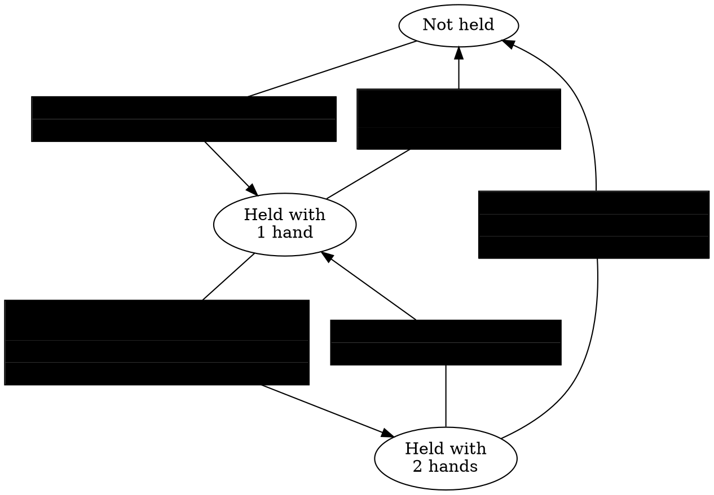

# Horizon Technical Specification {ignore=true}

<!-- @import "[TOC]" {cmd="toc" depthFrom=1 depthTo=6 orderedList=true} -->

<!-- code_chunk_output -->

1. [Overview](#overview)
2. [World Metadata](#world-metadata)
3. [Scene Graph](#scene-graph)
    1. [Hierarchy](#hierarchy)
    2. [Transforms (Local and Global)](#transforms-local-and-global)
    3. [Entity Properties](#entity-properties)
4. [Entities](#entities)
    1. [Overview](#overview-1)
    2. [Docs on each kind of gizmo](#docs-on-each-kind-of-gizmo)
    3. [Audio Gizmo + AI gen](#audio-gizmo--ai-gen)
5. [Custom Model Import](#custom-model-import)
    1. [Overview](#overview-2)
    2. [Uploads](#uploads)
    3. [Errors](#errors)
    4. [Asset Templates](#asset-templates)
    5. [Performance](#performance)
    6. [Horizon Lighting](#horizon-lighting)
    7. [General Tips](#general-tips)
6. [Scripting](#scripting)
    1. [Properties](#properties)
    2. [Types](#types)
    3. [Components](#components)
        1. [Props](#props)
        2. [Lifecycle](#lifecycle)
        3. [Events Registration](#events-registration)
    4. [Async (Timers)](#async-timers)
    5. [Persistence](#persistence)
    6. [Overview of core types (Player, Entity, Asset, Vec3, etc)](#overview-of-core-types-player-entity-asset-vec3-etc)
    7. [Properties](#properties-1)
    8. [Wiring](#wiring)
    9. [Local Scripts and Ownership](#local-scripts-and-ownership)
7. [Events (Sending and Receiving)](#events-sending-and-receiving)
    1. [Code Block Event](#code-block-event)
    2. [Local Events](#local-events)
    3. [Network Events](#network-events)
    4. [Broadcast events](#broadcast-events)
8. [Network](#network)
9. [Physics](#physics)
    1. [Overview of all physics properties and their interactions](#overview-of-all-physics-properties-and-their-interactions)
10. [Players](#players)
    1. [Identifying Players](#identifying-players)
        1. [Player ID](#player-id)
        2. [Player Indices](#player-indices)
        3. [Listing All Players](#listing-all-players)
        4. [Server Player](#server-player)
        5. [Local Player](#local-player)
    2. [Player Events and Actions](#player-events-and-actions)
        1. [Entering and Exiting a World](#entering-and-exiting-a-world)
        2. [Grabbing and Releasing](#grabbing-and-releasing)
            1. [Can Grab?](#can-grab)
            2. [Releasing Objects](#releasing-objects)
            3. [Grab Sequence and Events](#grab-sequence-and-events)
                1. [Hand-off (Switching Hands or Players)](#hand-off-switching-hands-or-players)
            4. [Moving / Locking Held Objects](#moving--locking-held-objects)
        3. [Holstering](#holstering)
        4. [Attaching](#attaching)
        5. [AFK](#afk)
    3. [Player Controls](#player-controls)
11. [Frame sequencing](#frame-sequencing)
12. [Assets and Spawning](#assets-and-spawning)
13. [Custom UI](#custom-ui)
    1. [Bindings technical overview (what *T* is allowed, set, derive, and notes on preventing memory growth - e.g. don't keep deriving)](#bindings-technical-overview-what-t-is-allowed-set-derive-and-notes-on-preventing-memory-growth---eg-dont-keep-deriving)
14. ["Cross Screens" - Mobile vs PC vs VR](#cross-screens---mobile-vs-pc-vs-vr)
15. [IWP](#iwp)
16. [Performance Optimization](#performance-optimization)
    1. [Physics](#physics-1)
    2. [Gizmos](#gizmos)
    3. [Bridge calls explanation](#bridge-calls-explanation)
    4. [Draw-call specification](#draw-call-specification)
    5. [Perfetto hints](#perfetto-hints)
17. [List of all desktop editor shortcuts](#list-of-all-desktop-editor-shortcuts)
18. [Glossary](#glossary)

<!-- /code_chunk_output -->

# TODO {ignore=true}
  - Golden path steps of "ramping up" to make a tutorial

# Overview
* General description of what Horizon is and is not capable of.

# World Metadata
Name, description, comfort setting, player count, etc.

# Scene Graph
## Hierarchy
Groups, Parents, Children, and Pivots
What is / isn't mutable

## Transforms (Local and Global)
## Entity Properties

# Entities
## Overview
Gizmos, as, ...
## Docs on each kind of gizmo
## Audio Gizmo + AI gen

# Custom Model Import
## Overview
Assets, imports, templates, updates.

## Uploads
* Explain collection of FBXs and PNGs.
* Each FBX will be a new asset.
* Texture rules
* Suffix rules
* Pivots
* Limits
* Colliders

##  Errors
List and explanation of all possible errors

## Asset Templates
E.g. only root-level properties and scripts are maintained in an update.
You CAN nest.
## Performance
Draw calls, verts, textures, etc.

## Horizon Lighting
GI overview and tips.

## General Tips
Triangulate. Normals direction.
Workflows / advice for greyboxing.

# Scripting
## Properties
## Types
Player, Asset, Entity can be compared by equality. Vec3, Quaternion, Color can be compared approximately; these classes have mutable and immutable versions. There is a special `as` method on Entities.
## Components
### Props
### Lifecycle
  Construction, preStart, start, dispose
### Events Registration
## Async (Timers)
## Persistence
Leaderboards, PPVs
## Overview of core types (Player, Entity, Asset, Vec3, etc)
## Properties
## Wiring
## Local Scripts and Ownership

# Events (Sending and Receiving)
## Code Block Event
## Local Events
## Network Events
## Broadcast events
Mention coalescence

# Network
Clients, transfer, reconciliation

# Physics
## Overview of all physics properties and their interactions
* Collidable
* Simulated
* Locked
* Gravity
* Physical velocity
* Velocity
* Angular Velocity
* Forces, Acceleration, and Torque
* Spring Push and Spin

# Players

The `Player` class represents a person in an instance. There is also special `Player` instance that represents the server. `Player` instances are allocated by the system; you should never attempt to allocate them. `Player` instances can be compared referentially `aPlayer === bPlayer` which is the same as `aPlayer.id === bPlayer.id`.

Each `Player` has an `id` and an `index` which serve different purposes (see below). From a `Player` instance you can access `PlayerBodyBart`s, e.g. `aPlayer.leftHand` or get their name `aPlayer.name.get()`. There are many `CodeBlockEvents` associated with players (such as entering/exiting a world, grabbing objects, and much). All aspects of players are described in detail in the next sections.

## Identifying Players

### Player ID

Each `Player` instance has a `readonly id: number` property.

!!! info Entering an instance assigns a new ID (for that instance)
    When a person enters an instance they are assigned an `id` that has not yet been used in that instance. If they leave the instance and later return, they will get yet another `id`.

!!! danger IDs are per-instance. Do not persist them.
    The `id` that a player gets in one instance of a world has nothing to do with the `id` they might get in another instance. If a person gets assigned `id` 42 in one instance then the moment they leave that instance you should no longer associate them with the `id`.

!!! warning IDs should be used rarely
    Since you can compare two `Player` instances directly with `===` and `!==` there is little reason to use the `id` property. You can even use `Player` instances as keys in a `Map`. If you have a reason to use the `id` field, be mindful that the association between a person and their `id` only exists until they leave that instance.

### Player Indices

The `Player` class has the property

```ts
index : ReadonlyHorizonProperty<number>
```

which you access via

```ts
aPlayer.index.get()
```
.

When a player enters a world they are also assigned an `index`. The `index` will be a number between `0` and `n-1`, where `n` is the maximum number of players allowed in an instance. When a player enters an instance they are assigned an `index` value that is not currently used by any other player. When they leave that value becomes available again.

For example: if three players arrive in an instance they may be assigned `index` values of `0`, `1`, and `2`. If they player with `index` `1` leaves then the next player that arrives may get index `1` again.

!!! danger Do not rely on the order indices are assigned
    There are no guarantees that a player gets the *smallest* available `index`. Any available value maybe be assigned to a new player.

!!! example Example: per-player objects
    A common use of `index`es is managing per-player objects. For instance, if you want every player to have a shield when they spawn in. Then you could have an array of shield `Entity`s and when a player enters the world, assign them the shield from that array that matches their `index`.

### Listing All Players

The `World` class has the method:

```ts
getAllPlayers() : Player[]
```

which returns the current list of players in the world. Note that the order of this array should not be relied upon. The order may change between calls and there is no relation to the `index` property described above.

!!! note
    `getAllPlayers` does not include the server player.

TODO: relation to enter and exit

### Server Player

There is a special instance of the `Player` class that represents the *server*. It has an `id` but no meaningful `index`. All APIs work but return defaults (example: the location will return the origin; name will return the empty string).

The `World` class has the method

```ts
getServerPlayer(): Player
```

which can be used to access it. The primary use cases are

1. transferring ownership back to the server:

```ts
anEntity.owner.set(world.getServerPlayer())
```

2. checking if an entity is owned by the server:

```ts
if (anEntity.owner.get() === world.getServerPlayer()) { /* ... */ }
```

3. checking if a script is running locally or not:

```ts
if (world.getLocalPlayer() === world.getServerPlayer()) { /* ... */ }
```

### Local Player

Every script is run on an execution client associated with a `Player` (see the networking section for more info). If the script is set to *default* mode, then it is always running on the server. If the script is set to *local* then is can be transferred to and from the servers and the local devices of players.

If a script is running locally on a human-player's device then that player is the *local player* for that script. If the script is running on the server then the *server player* is the *local player* for that script.

The `World` class has the method

```ts
getLocalPlayer() : Player
```

for determining which `Player`'s device the current script is running one. This method with return a human-player in the world or the *server player*.

## Player Events and Actions

### Entering and Exiting a World
### Grabbing and Releasing

#### Can Grab?

Collidable
Not-held OR hand-off
Set-who-can-grab
```ts
// GrabbableEntity
setWhoCanGrab(players: Player[]): void;
```

#### Releasing Objects
Let go, force release, or get too far away

!!! info If a **held object moves too far** from a player's hand, such as via scripting, then that hand **will release** the object. This can go cause the object to be fully released or to go from two-hand to one-hand grab (if one hand is still close enough to stay holding).

#### Grab Sequence and Events

There are a number of events associated with grabbing and holding. The diagram below shows how the state of an object changes with user-actions (highlighted in blue). Actions have associated `CodeBlockEvent`s that are sent. If a box contains multiple events then they are sent in the top-down order shown.



##### Hand-off (Switching Hands or Players)

When an entity is transferred from one hand to another or from one player to another then the entity is *fully released* by the first player before being grabbed by the second player.

!!! warning `OnGrabEnd` is sent during a "hand-off".
    The `OnGrabEnd` event may mean that an entity is about to grabbed by a different hand or player.

#### Moving / Locking Held Objects
Explain how hand.position is human hand (not avatar)
Explain how you can prevent the object from being updated by physics system

### Holstering
### Attaching
### AFK

## Player Controls

# Frame sequencing

# Assets and Spawning

# Custom UI
## Bindings technical overview (what *T* is allowed, set, derive, and notes on preventing memory growth - e.g. don't keep deriving)

# "Cross Screens" - Mobile vs PC vs VR

# IWP

# Performance Optimization

## Physics
Colliders, triggers,

## Gizmos
* pool FX, sounds,
* limit mirror (1) and dynamic lights (20)

## Bridge calls explanation
## Draw-call specification
## Perfetto hints

# List of all desktop editor shortcuts
e.g. alt-click to orbit

# Glossary

*[HTML]: Hyper Text Markup Language
*[W3C]: World Wide Web Consortium
*[Player]: A person in an instance (or the server).

# OPEN QUESTIONS {ignore=true}
* does despawn cause grab "release"?
* does "attach" cause "release"?
* does an object colliding with another cause "release" (probably same as moving too far)
* does ownership transfer while held send any events?
* When do entity.owner vs world.getLocalPlayer() change - it seems that in `transferOwnership` that the former has already changed but not the latter?
*inside of `playerExit` callback is the player still in the array? Right after?
