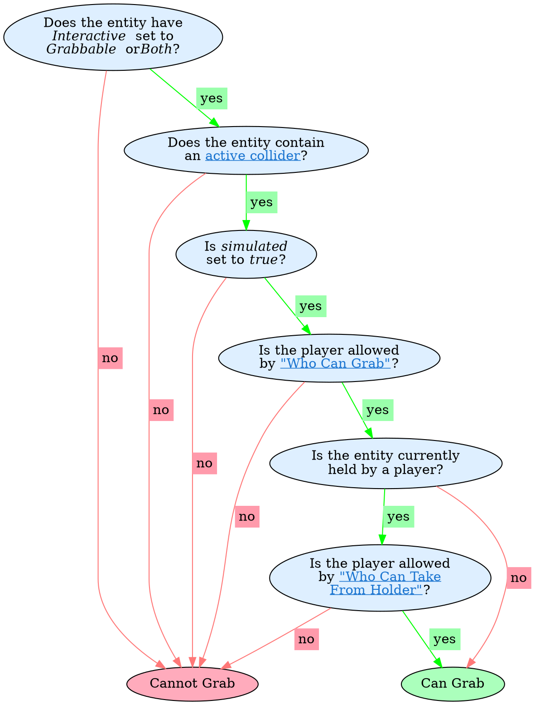
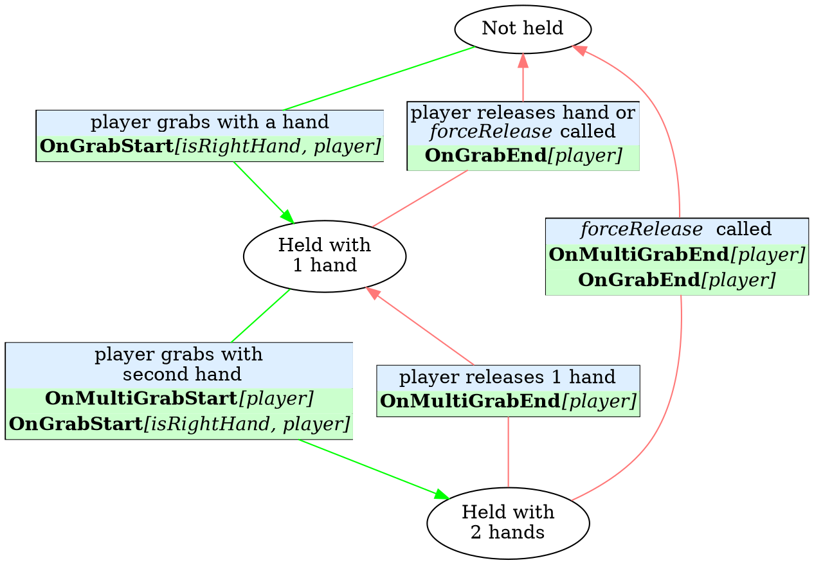

# Horizon Technical Specification {ignore=true}

<!-- @import "[TOC]" {cmd="toc" depthFrom=1 depthTo=6 orderedList=true} -->

<!-- code_chunk_output -->

1. [Overview](#overview)
2. [Worlds](#worlds)
    1. [Metadata and Publishing](#metadata-and-publishing)
    2. [Instances](#instances)
    3. [Doors and Linking](#doors-and-linking)
3. [Scene Graph](#scene-graph)
    1. [Hierarchy](#hierarchy)
        1. [Groups](#groups)
        2. [Empty Objects](#empty-objects)
        3. [Root Entities](#root-entities)
    2. [Transforms (Local and Global)](#transforms-local-and-global)
        1. [Pivots](#pivots)
    3. [Entity Properties](#entity-properties)
4. [Entities](#entities)
    1. [Overview](#overview-1)
    2. [Docs on each kind of gizmo](#docs-on-each-kind-of-gizmo)
        1. [Audio Gizmo + AI gen](#audio-gizmo--ai-gen)
        2. [Text Gizmo](#text-gizmo)
        3. [Trigger Gizmo](#trigger-gizmo)
    3. [Common Properties](#common-properties)
    4. [Tags](#tags)
5. [Custom Model Import](#custom-model-import)
    1. [Overview](#overview-2)
    2. [SubD vs Custom Models](#subd-vs-custom-models)
    3. [Assets](#assets)
        1. [Uploads](#uploads)
        2. [Errors](#errors)
        3. [Asset Templates](#asset-templates)
        4. [Textures](#textures)
        5. [Materials](#materials)
    4. [Performance](#performance)
        1. [Draw Calls](#draw-calls)
        2. [Vertices, Polygons, and Entities](#vertices-polygons-and-entities)
        3. [Memory](#memory)
    5. [Horizon Lighting](#horizon-lighting)
    6. [General Tips](#general-tips)
6. [Text Importing / Text Assets](#text-importing--text-assets)
7. [Scripting](#scripting)
    1. [Properties](#properties)
    2. [Types](#types)
        1. [Quaternion](#quaternion)
        2. [Entity Subtypes](#entity-subtypes)
    3. [Components](#components)
        1. [Props (and wiring)](#props-and-wiring)
        2. [Lifecycle](#lifecycle)
        3. [Receiving Events](#receiving-events)
        4. [Components <--> Entities](#components---entities)
    4. [Async (Timers)](#async-timers)
    5. [Local Scripts and Ownership](#local-scripts-and-ownership)
    6. [PrePhysics vs OnUpdate Updates](#prephysics-vs-onupdate-updates)
    7. [Events (Sending and Receiving)](#events-sending-and-receiving)
        1. [Code Block Event](#code-block-event)
        2. [Local Events](#local-events)
        3. [Network Events](#network-events)
        4. [Broadcast events](#broadcast-events)
    8. [Frame Sequence](#frame-sequence)
    9. [Events Phase](#events-phase)
    10. [OnUpdate Phase](#onupdate-phase)
    11. [PrePhysics Phase](#prephysics-phase)
    12. [Physics Phase](#physics-phase)
8. [Network](#network)
    1. [Clients (Devices and the Server)](#clients-devices-and-the-server)
    2. [Ownership](#ownership)
    3. [Ownership Transfer](#ownership-transfer)
        1. [Auto-Transfers](#auto-transfers)
    4. [Network Events](#network-events-1)
    5. [Authority and Reconciliation](#authority-and-reconciliation)
9. [Physics](#physics)
    1. [Overview](#overview-3)
    2. [Creating a Physical Entity](#creating-a-physical-entity)
    3. [Collisions and Triggers](#collisions-and-triggers)
        1. [Collidability](#collidability)
        2. [Controlling Collisions](#controlling-collisions)
        3. [Triggers](#triggers)
    4. [PrePhysics vs Defaults Scripts](#prephysics-vs-defaults-scripts)
    5. [Simulated vs Locked Entities](#simulated-vs-locked-entities)
    6. [Projectiles](#projectiles)
    7. [Gravity](#gravity)
    8. [Velocity, Acceleration, Force, Torque](#velocity-acceleration-force-torque)
    9. [Properties: Mass, Drag, Center-of-Mass](#properties-mass-drag-center-of-mass)
    10. [Players](#players)
10. [Players](#players-1)
    1. [Identifying Players](#identifying-players)
        1. [Player ID](#player-id)
        2. [Player Indices](#player-indices)
        3. [Listing All Players](#listing-all-players)
        4. [Server Player](#server-player)
        5. [Local Player](#local-player)
    2. [Player Events and Actions](#player-events-and-actions)
        1. [Entering and Exiting a World](#entering-and-exiting-a-world)
        2. [AFK](#afk)
11. [Grabbing and Holding Entities](#grabbing-and-holding-entities)
    1. [Creating a Grabbable Entity](#creating-a-grabbable-entity)
    2. [Can Grab](#can-grab)
        1. [Setting "Who Can Grab?"](#setting-who-can-grab)
        2. [Setting "Who Can Take From Holder?"](#setting-who-can-take-from-holder)
        3. [Grab Distance](#grab-distance)
    3. [Grabbing Entities](#grabbing-entities)
            1. [Grab Lock](#grab-lock)
            1. [Force Grab](#force-grab)
        2. [Releasing Entities](#releasing-entities)
            1. [Manual release](#manual-release)
            2. [Force release](#force-release)
            3. [Distance-based release](#distance-based-release)
        3. [Grab Sequence and Events](#grab-sequence-and-events)
        4. [Hand-off (Switching Hands or Players)](#hand-off-switching-hands-or-players)
        5. [Moving Held Entities](#moving-held-entities)
            1. [Moving a Held Entity Locally in Relation to the Hand](#moving-a-held-entity-locally-in-relation-to-the-hand)
            2. [Moving a Held Entity Globally in Relation to the World](#moving-a-held-entity-globally-in-relation-to-the-world)
12. [Attaching Entities](#attaching-entities)
13. [Holstering Entities](#holstering-entities)
14. [Player Input](#player-input)
15. [Persistence](#persistence)
    1. [Overview](#overview-4)
    2. [Leaderboards](#leaderboards)
    3. [Quests](#quests)
    4. [In-World Purchases (IWP)](#in-world-purchases-iwp)
    5. [Player Persistent Variables (PPV)](#player-persistent-variables-ppv)
16. [Assets and Spawning](#assets-and-spawning)
17. [Custom UI](#custom-ui)
    1. [Bindings technical overview (what _T_ is allowed, set, derive, and notes on preventing memory growth - e.g. don't keep deriving)](#bindings-technical-overview-what-t-is-allowed-set-derive-and-notes-on-preventing-memory-growth---eg-dont-keep-deriving)
18. ["Cross Screens" - Mobile vs PC vs VR](#cross-screens---mobile-vs-pc-vs-vr)
19. [Performance Optimization](#performance-optimization)
    1. [Physics](#physics-1)
    2. [Gizmos](#gizmos)
    3. [Bridge calls explanation](#bridge-calls-explanation)
    4. [Draw-call specification](#draw-call-specification)
    5. [Perfetto hints](#perfetto-hints)
    6. [Memory](#memory-1)
20. [List of all desktop editor shortcuts](#list-of-all-desktop-editor-shortcuts)
21. [Common Problems and Troubleshooting](#common-problems-and-troubleshooting)
22. [Glossary](#glossary)

<!-- /code_chunk_output -->

<div style="page-break-after: always;"></div>

# TODO {ignore=true}

- Golden path steps of "ramping up" to make a tutorial

# Overview

- General description of what Horizon is and is not capable of.

# Worlds

## Metadata and Publishing

Name, description, comfort setting, player count, etc.

## Instances

## Doors and Linking

# Scene Graph

## Hierarchy

Groups, Parents, Children, and Pivots
What is / isn't mutable

### Groups

### Empty Objects

### Root Entities

An entity is a **root entity** if it has no parent or if its ancestor chain (parent, grandparent, etc) consists solely of Empty Objects. A root entity cannot be inside a group, its parent cannot be inside a group, etc.

!!! danger Grabbable and Physics settings are ignored if the entity is not a root entity!
    If you configure a _non-root entity_ to be [Grabbable](#creating-a-grabbable-entity) or to have [Physics](#creating-a-physical-entity) on it then Horizon will ignore those settings!

    Non-root objects can be moved by modifying their transforms (such as changing the position) but cannot be moved by the playing grabbing them or by the physics system (you cannot apply forces to them, cannot have them collide with other objects, etc).

## Transforms (Local and Global)

### Pivots

## Entity Properties

# Entities

## Overview

Every thing in the Horizon scene is an _entity_ (an grabbable item, a mesh, a light, a particle effect, a sound, a group of other entities, etc).

!!! info Note Entity and Object mean the same thing (except in TypeScript)
    Horizon calls these **objects** in the Desktop Editor and VR Tools but calls them **entities** in TypeScript. This document tries to consistently call them entities, except when quoting places where Horizon explicitly uses the word "object", but may accidentally call them objects on occasion.

    In TypeScript `Object` is a builtin for managing data, whereas `Entity` is a Horizon-specific class.

Gizmos, as, ...

## Docs on each kind of gizmo

- Leaderboard, Quests, and IWP should just point to the PPVs section

### Audio Gizmo + AI gen

### Text Gizmo

- all supported commands

### Trigger Gizmo

Two _secret_ `CodeBlockEvents`: `empty` and `occupied`

## Common Properties

- Motion and Interaction (Animated, Grabbable, Physics, Both)
- Parents and Children
- Visible and Collidable
- Transform (position, rotation, scale, forward, up, right)
- Simulated

## Tags

# Custom Model Import

## Overview

Assets, imports, templates, updates.

## SubD vs Custom Models

## Assets

### Uploads

- Explain collection of FBXs and PNGs.
- Each FBX will be a new asset.
- Texture rules
- Suffix rules
- Pivots
- Limits
- Colliders

### Errors

List and explanation of all possible errors

### Asset Templates

E.g. only root-level properties and scripts are maintained in an update.
You CAN nest.

### Textures

- Formats: `png`s; Horizon will ingest any valid png and convert it as necessary to its own internal representation
- Any size is allowed but power-of-2 is better for perf
- Does Horizon de-dupe textures for download?
- Horizon does not currently support mipmaps
- Materials can be emissive insofar as they are "unlit" but they don't contribute to the light probes
- Horizon used packed textures for different material attributes; see [Materials](#materials)
- Can we verify that Horizon uses ASTC 2.0 (Adaptive Scalable Texture Compression)

### Materials

!!! note No post-processing
    Current Horizon has no post-process rendering options which makes things like bloom, motion blur, sepia, etc impossible.

## Performance

### Draw Calls

- Do not rely on Horizon to do any draw call batching. Meaning each instantiated asset is at least 1 draw call.
- Hypothesis / guess: UI Gizmos are rendered into textures on the _CPU_ and then rendered as single quads with a texture on the GPU (don't know about batching...). What about name tags?

- Theory: 1 draw call per avatar, 1 draw call per UI Gizmo, 1+ draw calls per instantiated asset, 1 draw call per FX/trail gizmo that is running, 1 draw call per emotes (per player that is emoting), 1+ draw call per NPC
  - In build mode: 1 draw call per gizmo

| Element                                          | Draw Call                 | Notes                    |
| ------------------------------------------------ | ------------------------- | ------------------------ |
| Player                                           | 3+ each                   | Avatar, name tag, emotes |
| Entities                                         | 1+ each                   | Per instantiated asset   |
| UI Gizmo                                         | 1 each                    | back-face / occlusion?   |
| Particle / Trail Gizmo                           | 1 each                    | occlusion-culled?        |
| Text Gizmo                                       | 1 each                    | THESE MAY BE BATCHED!    |
| Door Gizmo                                       | 1 each                    | occlusion-culled?        |
| Leaderboard / Quests / Media Board / Purchase UI | 1 each                    | occlusion-culled?        |
| Mirror Gizmo                                     | 2x total draw call count? | ... REALLY?!...          |
| Pop-ups                                          | 1 per visible             | occluded?                |
| Projectile Launcher                              | 1 per visible             |

!!! info There are draw calls outside a creator's control
    Things like the sky, personal UI, the wrist UI, teleport visuals, onscreen controls, and many other elements may add to the "base number" of draw-calls.

!!! tip Group entities with the same materials together into an asset when possible
    If you have 50 bricks with the same material all in 1 asset Horizon will batch that to be 1 draw call. If those are instead a single brick duplicated 50 times then that will be at least 50 draw calls.

    If you have an asset with 25 bricks of material A and 25 of material B then this will be 2 draw calls. If instead they were all duplicated then there would be 50 draw calls.

!!! warning Multi-material assets increase draw call count
    If an asset has multiple materials or material textures then the draw call count will increase by the number of them.

### Vertices, Polygons, and Entities

...

### Memory

...

## Horizon Lighting

GI overview and tips.

## General Tips

Triangulate. Normals direction.
Workflows / advice for greyboxing.

# Text Importing / Text Assets

# Scripting

## Properties

## Types

Player, Asset, Entity can be compared by equality. Vec3, Quaternion, Color can be compared approximately; these classes have mutable and immutable versions. There is a special `as` method on Entities.

### Quaternion

- Euler Angles default: YXZ

### Entity Subtypes

## Components

### Props (and wiring)

### Lifecycle

Construction, preStart, start, dispose

### Receiving Events

a few notes but link to the events section

### Components <--> Entities

## Async (Timers)

## Local Scripts and Ownership

a few sentences and link to Networking

## PrePhysics vs OnUpdate Updates

a few sentences and link to Physics

## Events (Sending and Receiving)

### Code Block Event

### Local Events

### Network Events

### Broadcast events

Mention coalescence

## Frame Sequence


## Events Phase

## OnUpdate Phase

## PrePhysics Phase

## Physics Phase

# Network

## Clients (Devices and the Server)

## Ownership

!!! danger Ownership does not cascade to children
    When you transfer ownership of an entity the ownership is _not_ automatically transferred for the children (nor their children). If you want children to be transferred as well then you must manually transfer ownership of everything you care about.

    !!! example
        ```ts
        anEntity.owner.set(newOwner)
        anEntity.children.get().forEach(c => c.owner.set(newOwner))
        ```
        This transfers ownership of an entity and its children but not their children. Rather than just recursively transferring everything, instead consider what needs to actually be transferred (many entities are not scripted)!

## Ownership Transfer

- API overview of `transferOwnership` and `receiveOwnership` and `SerializableState`.
- Full-details sequencing diagrams.
- Clarify how scripts are instantiated per-owner as part of entity transfer.

### Auto-Transfers

Collisions and Grabbables

## Network Events

## Authority and Reconciliation

What happens if two scripts are setting an entity's position at the "same time"?

# Physics

## Overview

High-level framing of what Horizon is capable of. Example: there are no constraints (no hinges, springs, connecting rods, etc)

## Creating a Physical Entity

....

## Collisions and Triggers

- Colliding with dynamic vs static.
- Colliding with player vs entities.
- Collider gizmo.
- Can control if ownership transfer on collision (see [Network](#network)!)

### Collidability

Mesh entities an collider gizmos have **colliders** that are used by the physics system (for collisions, trigger detection, grabbing, avatars standing, etc).

A **collider is active** when the following true

- Its entity has `collidable` set `true`
- Its `parent` (and all their parents) have `collidable` set to `true`
- It is not occluded by other colliders in the world

and is otherwise ignored by the physics system. For example if the floor's collider is inactive an avatar will fall through it. If a grabbable entity's collider is inactive you cannot grab it.

!!! info In order for a group to be seen by the physics system it must have at least one active collider within it (however deep).
    For example if all the colliders in a group are inactive then that group cannot be grabbed, it will not been seen by any triggers, it cannot be stood on, etc.

### Controlling Collisions

- Turn collidable on / off
- Control can collide with players, entities, or both

### Triggers

Trigger detection is done at the _collider_ level. When a collider enters/leaves a trigger then (if it is an entity-detecting trigger) Horizon starts with the entity and traverse up the ancestor chain until it finds the first entity with a matching tag, send it the event, and then STOPS the traversal.

This means that whenever it seems both a parent and a child could get a trigger event at the same time then the child always gets it first.

## PrePhysics vs Defaults Scripts

## Simulated vs Locked Entities

## Projectiles

## Gravity

## Velocity, Acceleration, Force, Torque

Note: `zeroVelocity` clears out positional and rotational velocity.

## Properties: Mass, Drag, Center-of-Mass

## Players

Velocity, locomotion speed, jump speed

# Players

The `Player` class represents a person in an instance. There is also special `Player` instance that represents the server. `Player` instances are allocated by the system; you should never attempt to allocate them. `Player` instances can be compared referentially `aPlayer === bPlayer` which is the same as `aPlayer.id === bPlayer.id`.

Each `Player` has an `id` and an `index` which serve different purposes (see below). From a `Player` instance you can access `PlayerBodyBart`s, e.g. `aPlayer.leftHand` or get their name `aPlayer.name.get()`. There are many `CodeBlockEvents` associated with players (such as entering/exiting a world, grabbing entities, and much). All aspects of players are described in detail in the next sections.

## Identifying Players

Players in Horizon all have a global "account id". There is no way to access this id directly, although Horizon users it under the hood for persistence (player variables, leaderboards, and quests). Within an instance players can be referenced by the `id` or the `index` they are assigned on entry. Player `index`es are reused when players leave; `id`s are not.

### Player ID

Each `Player` instance has a `readonly id: number` property.

!!! info Entering an instance assigns a new ID (for that instance)
    When a person enters an instance they are assigned an `id` that has not yet been used in that instance. If they leave the instance and later return, they will get yet another `id`.

!!! danger IDs are per-instance. Do not persist them.
    The `id` that a player gets in one instance of a world has nothing to do with the `id` they might get in another instance. If a person gets assigned `id` 42 in one instance then the moment they leave that instance you should no longer associate them with the `id`.

!!! warning IDs should be used rarely
    Since you can compare two `Player` instances directly with `===` and `!==` there is little reason to use the `id` property. You can even use `Player` instances as keys in a `Map`. If you have a reason to use the `id` field, be mindful that the association between a person and their `id` only exists until they leave that instance.

### Player Indices

The `Player` class has the property

```ts
index: ReadonlyHorizonProperty<number>;
```

which you access via

```ts
aPlayer.index.get();
```

.

When a player enters a world they are also assigned an `index`. The `index` will be a number between `0` and `n-1`, where `n` is the maximum number of players allowed in an instance. When a player enters an instance they are assigned an `index` value that is not currently used by any other player. When they leave that value becomes available again.

For example: if three players arrive in an instance they may be assigned `index` values of `0`, `1`, and `2`. If they player with `index` `1` leaves then the next player that arrives may get index `1` again.

!!! danger Do not rely on the order indices are assigned
    There are no guarantees that a player gets the _smallest_ available `index`. Any available value maybe be assigned to a new player.

!!! example Example: per-player entities
    A common use of `index`es is managing per-player entities. For instance, if you want every player to have a shield when they spawn in. Then you could have an array of shield `Entity`s and when a player enters the world, assign them the shield from that array that matches their `index`.

### Listing All Players

The `World` class has the method:

```ts
getAllPlayers() : Player[]
```

which returns the current list of players in the world. Note that the order of this array should not be relied upon. The order may change between calls and there is no relation to the `index` property described above.

!!! note
    `getAllPlayers` does not include the server player.

TODO: relation to enter and exit

### Server Player

There is a special instance of the `Player` class that represents the _server_. It has an `id` but no meaningful `index`. All APIs work but return defaults (example: the location will return the origin; name will return the empty string).

The `World` class has the method

```ts
getServerPlayer(): Player
```

which can be used to access it. The primary use cases are

1. transferring ownership back to the server:

```ts
anEntity.owner.set(world.getServerPlayer());
```

2. checking if an entity is owned by the server:

```ts
if (anEntity.owner.get() === world.getServerPlayer()) {
  /* ... */
}
```

3. checking if a script is running locally or not:

```ts
if (world.getLocalPlayer() === world.getServerPlayer()) {
  /* ... */
}
```

### Local Player

Every script is run on an execution client associated with a `Player` (see [Network](#network) for more info). If the script is set to _default_ mode, then it is always running on the server. If the script is set to _local_ then is can be transferred to and from the servers and the local devices of players.

If a script is running locally on a human-player's device then that player is the _local player_ for that script. If the script is running on the server then the _server player_ is the _local player_ for that script.

The `World` class has the method

```ts
getLocalPlayer() : Player
```

for determining which `Player`'s device the current script is running one. This method with return a human-player in the world or the _server player_.

## Player Events and Actions

### Entering and Exiting a World

### AFK

# Grabbing and Holding Entities

## Creating a Grabbable Entity

Select an entity and then in the Properties panel set its `Motion` to `Interactive` and `Interaction` to `Grabbable` or `Both`. The entity _must_ be a root entity or it will not actually be allowed to be grabbed. Ensure that `collidable` is `true` and that (if it is a group) there is an [active collider](#collidability) within it.

!!! danger Grabbables cannot be inside of Groups
    A grabbable entity must be a [root entity](#root-entities) (it can only have [Empty Objects](#empty-objects) in its ancestor chain).

!!! warning Entities must be collidable to be grabbed!
    If a grabbable entity is not `collidable` then it cannot be grabbed. If it is a group and none of the colliders within it are active then it cannot be grabbed, even if the root is collidable!

## Can Grab

For an entity to be grabbable it needs:

1. To be a grabbable entity
   1. `Motion` to be `Interactive`
   1. `Interaction` to be `Grabbable` or `Both`
1. To be currently grabbable
   1. `simulated` set to `true`
   1. At least one [active collider](#collidability) within it (which is not occluded from the perspective of the player)
1. To be grabbable by this player
   1. Match the rules of ["Who Can Grab"](#setting-who-can-grab)
   1. If it is currently held, match the rules of ["Who Can Take From Holder"](#setting-who-can-take-from-holder)



### Setting "Who Can Grab?"

`Interactive` entities have a setting in the Property panel called "Who Can Grab?" with the following options controlling who can grab the entity.

|                        | Behavior                                                                                                                                                                                 |
| ---------------------- | ---------------------------------------------------------------------------------------------------------------------------------------------------------------------------------------- |
| **Anyone**             | Any player is eligible to grab the entity.                                                                                                                                               |
| **First To Grab Only** | If the entity has never been grabbed then any player is eligible to grab it. Once it is grabbed then only that player can ever grab it again (unless the grabbing is reset - see below). |
| **Script Assignee(s)** | A player is only eligible to grab the entity if they are in the list of allowed players.                                                                                                 |

Use the API

```ts
// GrabbableEntity
setWhoCanGrab(players: Player[]): void;
```

to change the list of players that are allowed to grab the entity. Until you call the API the first time it behaves as (TODO - everyone? no one?).

!!! note setWhoCanGrab does not auto-update
    There is no way to have it auto-update when new players join the instance (example: everyone except one player can grab the entity). If you want to include a newly-joined player in the list then you must call the API again.

    There is no way to set an entity back to its "default behavior" (before the API is first called - TODO verify).

### Setting "Who Can Take From Holder?"

`Interactive` entities have a setting in the Property panel called "Who Can Taken From Holder?" with the following options controlling what can happen to the entity while it is held.

| Setting      | Can the holder grab it out of their own hand using their other hand? | Can another player take it from the player that is holding it? |
| ------------ | -------------------------------------------------------------------- | -------------------------------------------------------------- |
| **No One**   | No                                                                   | No                                                             |
| **Only You** | Yes                                                                  | No                                                             |
| **Anyone**   | Yes                                                                  | Yes (_if_ the person can grab the entity)                      |

### Grab Distance

!!! warning Grab distance varies between platforms
    For example mobile players can grab entities when much farther away than VR players

!!! tip Controlling grab-distance
    You cannot explicitly control from how far away an entity can be grabbed; however you can use a trigger to control grabbability (for example: make an entity grabbable by a specific play when they are in that trigger).

## Grabbing Entities

When a VR player grabs an entity is stays grabbed until they release the trigger. The entity is only held as long as they are holding the entity.

A screen-based player uses an onscreen button to grab and then (later) a different onscreen button to release.

#### Grab Lock

When an entity is [grabbable](#creating-a-grabbable-entity) there is a setting its Properties called `Grab Lock`. When it is enabled a VR player no longer needs to keep the trigger (on their VR controller) pressed to hold the entity (which gets tiring after a while!). When `Grab lock` is enabled a VR player presses (and releases) the trigger to grab. When they release the trigger the entity _stays held_. When they later again press and release the trigger again, the entity is released.

#### Force Grab

An entity can be forced into the hand of a player used the TypeScript API:

```ts
// GrabbableEntity
forceHold(player: Player, hand: Handedness, allowRelease: boolean): void;
```

It allows you to specify which player to have hold it, which hand they should hold it in, and whether or not that can _manually_ release it. If `allowRelease` is `false` then the entity can only be released by [force release](#force-release) or by [distance-based release](#distance-based-release). When `allowRelease` is set to `true` a VR player can release the entity by pressing the trigger on their VR controller; a screen-based player can release it using the onscreen release button.

!!! example Giving players a weapon when the game starts
    A common use case for force-grabbing is a game where every player has a sword, for example. When the round starts, you given all players a weapon by force-grabbing it. If you don't want them to let go then set `allowRelease` to `false`. Then you can [force release](#force-release) the entities at the end of the game.

    !!! danger A force-held item can be released "accidentally"
        Even if an entity is force-grabbed with `allowRelease` set to `false`, it is possible for the entity to be released by [distance-based release](#distance-based-release). If you want to ensure that players are always holding an entity during a game, then you should listen for the [grab-release](#grab-sequence-and-events) event and have the player force-hold the entity again.

### Releasing Entities

#### Manual release

If an entity was manually grabbed or it was [force-grabbed](#force-grab) with `allowRelease` set to `true`, then a player can manually release it. If an entity was [force-grabbed](#force-grab) with `allowRelease` set to `false` then a player will not be able to manually release the entity and instead must wait on it (eventually) being done for them.

#### Force release

A held entity can be forced out of a player's hand at any time by calling

```ts
entity.forceRelease();
```

on the held object. If the entity was **force held** then this is how you remove the entity from their hand.

!!! warning Setting `simulated` to `false` on a held entity will act just like force release. It will then no longer be grabbable until `simulated` is set to `true` again.

#### Distance-based release

If a **held entity moves too far** from a player holding it then will be **force released**. This can occur if the entity has scripted movement on it that moves it foo far from player. This can also happen if the physics system moves the object too far from the player (simple example is that if you run into a wall while holding an entity it might get flung out of your hand).

### Grab Sequence and Events

There are a number of events associated with grabbing and holding. The diagram below shows how the state of an entity changes with user-actions (highlighted in blue). Actions have associated `CodeBlockEvent`s that are sent. If a box contains multiple events then they are sent in the top-down order shown.



### Hand-off (Switching Hands or Players)

When an entity is transferred from one hand to another or from one player to another then the entity is _fully released_ by the first player before being grabbed by the second player.

!!! warning `OnGrabEnd` is sent during a "hand-off".
    The `OnGrabEnd` event may mean that an entity is about to grabbed by a different hand or player.

### Moving Held Entities

Normally the position and rotation of a held object is determined by the position and orientation of the player hand that is holding it (during the [physics stage](#frame-sequence) of the frame).

It is some times useful to invert that and instead have __the position and rotation of the held entity influence the position and rotation of the hand that is holding it__.

This can be achieved due to the fact that
```ts
player.leftHand.position.get()
```
returns where the _player's hand is __supposed__ to be_, but not where the _avatar's_ hand is. That means that you can move a held entity, which will move the avatar hand holding it, but can still check where the hand is supposed to be (if you hadn't moved it).

There are two approaches for moving a held entity:

#### Moving a Held Entity Locally in Relation to the Hand
In a gun-recoil animation you want the player hand to be able to move freely, yet have the gun apply an additional local rotation "on top of it". If you set the position / rotation of the entity when a user takes an action (such as firing the gun) then that change will only last for one frame (which might be ok for a quick recoil effect) because the entity's position / rotation will be immediately updated the next frame from the avatar's hand.

If you want a multi-frame or ongoing effect then you need to set the position / rotation of the entity repeatedly in an [OnUpdate](#onupdate-phase) handler. In summary: **every frame in which you want the entity change from where the avatar want it, you must set it yourself**.

#### Moving a Held Entity Globally in Relation to the World
When building a lever, for example, you want the avatar hand to "lock onto" the lever. In this case you want to completely control the position of the avatar hand. To do this,  set `locked` to `true` on the grabbable entity. This will prevent the entity from being moved by physics or by the avatar. Then you can move the entity by setting its `position` and `rotation`. The avatar hand will then be moved to match.

In this lever example, you could get `player.leftHand.position.get()` every frame to identify where the avatar's hand is _supposed_ to be, constrain that position to a "valid position" and then rotate the level according. This is an advanced use case that likely requires trigonometry.

Note that if the grabbed entity gets too far away from the avatar hand you will get a [distance-based release](#distance-based-release).

Here is a simple example of a grabbable entity that is constrained to move along the y-axis (you can only move it up and down).

![[ horizonScripts/axisYConstrainedGrabbable.ts ]]

# Attaching Entities

# Holstering Entities

# Player Input

# Persistence

## Overview

- Cloning a world
- World persistence does not exists

## Leaderboards

- Overview
  - Kind of data allowed
  - Player opt-out
- Creation
- Using the Gizmo
- APIs
- Resetting
  - Weekly / Monthly

## Quests

- Overview
  - Tracked
- Creation
- Using the Gizmo
  - Which are visible
- APIs
- Resetting

## In-World Purchases (IWP)

- Overview
- Creation
  - Types (consumables, durables)
- Using the Gizmo
- APIs
  - Events are broadcast `CodeBlockEvent`s and can be subscribed to from anywhere (except maybe local?)
- Test Purchases
  - Collaborators can but Testers cannot (will be charged)

## Player Persistent Variables (PPV)

- Overview
  - Groups
  - Types: `number` and JSON-serializable `object`.
- Creation
- Read / Write
- Resetting

# Assets and Spawning

# Custom UI

## Bindings technical overview (what _T_ is allowed, set, derive, and notes on preventing memory growth - e.g. don't keep deriving)

# "Cross Screens" - Mobile vs PC vs VR

# Performance Optimization

## Physics

Colliders, triggers,

## Gizmos

- pool FX, sounds,
- limit mirror (1) and dynamic lights (20)

## Bridge calls explanation

## Draw-call specification

## Perfetto hints

## Memory

- UIGizmos have an option to enable mipmaps; this will increase visual quality but also increase memory use

# List of all desktop editor shortcuts

e.g. alt-click to orbit

# Common Problems and Troubleshooting
- leave and come back
- stop, reset, play (don't just hit escape)

# Glossary

_[HTML]: Hyper Text Markup Language
_[W3C]: World Wide Web Consortium \*[Player]: A person in an instance (or the server).

# OPEN QUESTIONS - TODO {ignore=true}

- does despawn cause grab "release"?
- does "attach" cause "release"?
- does ownership transfer while held send any events?
- When do entity.owner vs world.getLocalPlayer() change - it seems that in `transferOwnership` that the former has already changed but not the latter?
  \*inside of `playerExit` callback is the player still in the array? Right after?
- What is the initial behavior for "Script Assignee(s)" for grabbing? Can you ever reset it back?
- Does simulation=false disable a collision (e.g. can something still hit it or go through a trigger)? The answer should be yes!
